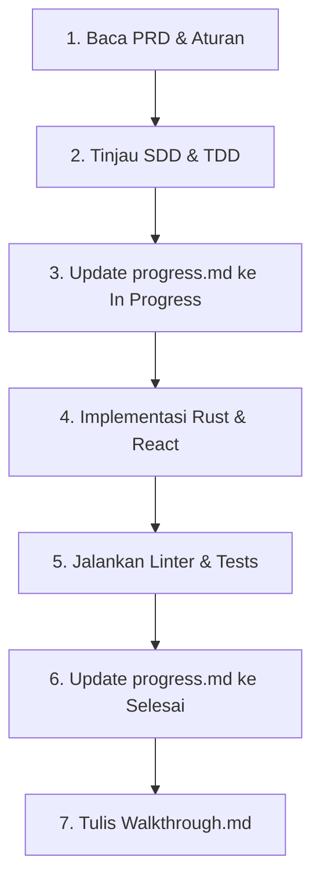

# Skill: Nonaterm SDLC Workflow Manager (AG & OpenCode Compatible)

Skill ini menetapkan alur kerja (workflow) pengembangan software standar untuk proyek Nonaterm agar AI agent (termasuk model murah / non-thinking) dan pengembang junior tidak salah langkah atau merusak arsitektur yang sudah direncanakan.

## 🔄 Siklus Hidup Pengembangan Nonaterm (SDLC)

Untuk setiap fitur baru atau perbaikan bug besar, ikuti siklus ini:

### 1. Requirements & Design Alignment
*   **Wajib**: Selalu periksa [prd.md](file:///D:/production/Nonaterm/prd.md) untuk memastikan fitur yang dibuat sesuai dengan spesifikasi bisnis.
*   **Wajib**: Ikuti pola arsitektur di [sdd.md](file:///D:/production/Nonaterm/sdd.md) dan detail teknis di [tdd.md](file:///D:/production/Nonaterm/tdd.md). Jangan membuat route IPC baru atau skema tabel database baru tanpa memperbarui dokumen-dokumen tersebut terlebih dahulu.

### 2. Status Tracking & Coordination
*   Sebelum mulai menulis kode, buka [progress.md](file:///D:/production/Nonaterm/progress.md).
*   Ubah status tugas yang akan Anda kerjakan menjadi `⏳ In Progress`.
*   Jika Anda menggunakan subagent (Multi-Brain), tugaskan subagent tersebut pada file spesifik agar tidak tabrakan (*file stomping*).

### 3. Coding Standards (AG & OpenCode Rules)
*   Ikuti instruksi gaya bahasa di [AGENTS.md](file:///D:/production/Nonaterm/AGENTS.md).
*   Gunakan absolute imports `@/` untuk React frontend.
*   Pastikan semua IPC Tauri Command terdaftar di `src-tauri/src/lib.rs` (tauri builder setup) dan dideklarasikan di type definition frontend.
*   Jangan pernah menggunakan `unsafe` Rust untuk PTY I/O, gunakan wrapper aman yang disediakan oleh `portable-pty`.

### 4. Verification & Clean-up
Sebelum menyatakan tugas `✅ Selesai`:
1.  Jalankan `cargo clippy --all-targets -- -D warnings` di folder `src-tauri`.
2.  Jalankan `cargo test` untuk memastikan backend aman.
3.  Jalankan `npm run typecheck` dan `npm run lint` untuk React app.
4.  Perbarui baris tugas Anda di [progress.md](file:///D:/production/Nonaterm/progress.md) menjadi `✅ Selesai`.
5.  Catat aktivitas Anda di bagian `# 📝 Log Aktivitas` di [progress.md](file:///D:/production/Nonaterm/progress.md).
