# Software Design Document (SDD)

## Nonaterm — Terminal Workspace Manager untuk Vibecoder

| Metadata        | Nilai                                      |
| --------------- | ------------------------------------------ |
| **Versi**       | 0.1.0-draft                                |
| **Tanggal**     | 18 Juni 2026                               |
| **Status**      | Draft                                      |
| **Platform**    | Windows 10/11 (x86_64)                     |
| **Tech Stack**  | Rust + Tauri 2.x · React + TypeScript · xterm.js |
| **Referensi**   | PRD Nonaterm v0.1 (18 Juni 2026)             |

---

## Daftar Isi

1. [Pendahuluan](#1-pendahuluan)
2. [Deskripsi Arsitektur](#2-deskripsi-arsitektur)
3. [Desain Komponen](#3-desain-komponen)
4. [Desain Interface](#4-desain-interface)
5. [Desain Data](#5-desain-data)
6. [Desain Keamanan](#6-desain-keamanan)
7. [Strategi Error Handling](#7-strategi-error-handling)
8. [Pertimbangan Performa](#8-pertimbangan-performa)
9. [Dependency & Versi](#9-dependency--versi)
10. [Glossary](#10-glossary)

---

## 1. Pendahuluan

### 1.1 Tujuan Dokumen

Dokumen ini menjabarkan desain teknis lengkap untuk **Nonaterm** — aplikasi desktop native Windows yang mengorganisir banyak sesi terminal ke dalam unit bernama *workspace*. Dokumen ini ditujukan untuk:

- **Developer** yang akan mengimplementasikan sistem
- **Reviewer** yang melakukan code review dan arsitektur review
- **QA Engineer** yang menyusun test plan berdasarkan desain komponen
- **Future maintainer** yang butuh pemahaman mendalam tentang keputusan arsitektur

### 1.2 Scope

SDD ini mencakup keseluruhan desain untuk **MVP** dan **V1** sebagaimana didefinisikan di PRD, dengan catatan arsitektural untuk fitur **V2** (Attention Inbox, Broadcast Input, Token Meter, Agent Edit Diff, Workspace Health Strip) agar fondasi yang dibangun tidak perlu refaktor besar saat V2 dikerjakan.

**Dalam scope:**
- Arsitektur backend Rust (PTY management, state persistence, IPC)
- Arsitektur frontend React + xterm.js (terminal rendering, workspace UI)
- Data layer (SQLite schema, JSON config, autosave mechanism)
- IPC contract antara Rust backend dan React frontend
- Strategi error handling dan crash recovery
- Performance engineering dan rendering pipeline

**Di luar scope:**
- Cross-platform support (Mac/Linux)
- SSH/remote terminal
- Plugin marketplace
- Cloud sync
- Enterprise features (SSO, audit log)

### 1.3 Definisi & Akronim

| Term              | Definisi                                                                 |
| ----------------- | ------------------------------------------------------------------------ |
| **PTY**           | Pseudo-Terminal — interface OS yang mengemulasi hardware terminal         |
| **ConPTY**        | Windows Console Pseudo Terminal API (Windows 10 1809+)                    |
| **IPC**           | Inter-Process Communication — komunikasi antara Rust backend dan webview  |
| **Workspace**     | Unit organisasi yang mengelompokkan 1–9 terminal dengan identitas visual  |
| **Pane**          | Satu slot terminal individual di dalam grid workspace                    |
| **Grid Layout**   | Tata letak pane dalam workspace (preset: 1, 2, 4, 6, 9)                 |
| **Scrollback**    | Buffer histori output terminal yang bisa di-scroll ke atas               |
| **Passthrough**   | Mode di mana semua keyboard input diteruskan langsung ke PTY             |
| **Vibecoder**     | Target persona — solo developer yang melakukan AI-assisted coding        |
| **Worktree**      | Git worktree — direktori kerja terpisah yang terikat ke satu branch      |
| **WebGL Addon**   | xterm.js addon untuk GPU-accelerated terminal rendering                  |
| **Debounce**      | Teknik menunda eksekusi sampai tidak ada trigger baru dalam interval N    |

### 1.4 Referensi

| Dokumen / Resource                      | Keterangan                                      |
| --------------------------------------- | ----------------------------------------------- |
| PRD Nonaterm v0.1                         | Product Requirements Document, 18 Juni 2026     |
| Tauri 2.x Documentation                 | https://tauri.app/start/                        |
| portable-pty crate                      | https://docs.rs/portable-pty                    |
| xterm.js Documentation                  | https://xtermjs.org/docs/                       |
| IEEE 1016-2009                          | Standard for Software Design Descriptions       |
| Windows ConPTY API                      | Microsoft Docs — Creating a Pseudoconsole       |
| tauri-plugin-sql                        | https://github.com/nicepkg/tauri-plugin-sql     |

---

## 2. Deskripsi Arsitektur

### 2.1 Arsitektur Overview

Nonaterm mengikuti pola **Tauri 2.x architecture**: sebuah Rust backend process yang mengelola satu atau lebih webview window. Komunikasi antara backend dan frontend menggunakan IPC channel bawaan Tauri (commands untuk request-response, events untuk streaming).

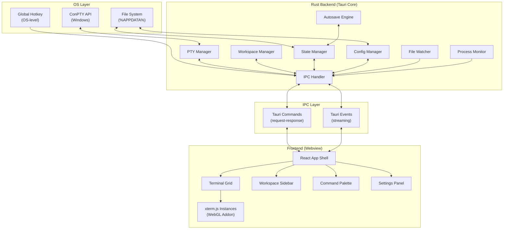
```mermaid
graph TB
    subgraph "OS Layer"
        ConPTY["ConPTY API<br/>(Windows)"]
        FS["File System<br/>(%APPDATA%)"]
        GlobalHotkey["Global Hotkey<br/>(OS-level)"]
    end

    subgraph "Rust Backend (Tauri Core)"
        PTYMgr["PTY Manager"]
        WSMgr["Workspace Manager"]
        StateMgr["State Manager"]
        ConfigMgr["Config Manager"]
        IPCHandler["IPC Handler"]
        FileWatcher["File Watcher"]
        ProcMon["Process Monitor"]
        AutoSave["Autosave Engine"]
    end

    subgraph "IPC Layer"
        TauriCmd["Tauri Commands<br/>(request-response)"]
        TauriEvt["Tauri Events<br/>(streaming)"]
    end

    subgraph "Frontend (Webview)"
        AppShell["React App Shell"]
        TermGrid["Terminal Grid"]
        Sidebar["Workspace Sidebar"]
        CmdPalette["Command Palette"]
        Settings["Settings Panel"]
        XTermJS["xterm.js Instances<br/>(WebGL Addon)"]
    end

    ConPTY <--> PTYMgr
    FS <--> StateMgr
    FS <--> ConfigMgr
    GlobalHotkey --> IPCHandler

    PTYMgr <--> IPCHandler
    WSMgr <--> IPCHandler
    StateMgr <--> IPCHandler
    ConfigMgr <--> IPCHandler
    FileWatcher --> IPCHandler
    ProcMon --> IPCHandler
    AutoSave <--> StateMgr

    IPCHandler <--> TauriCmd
    IPCHandler <--> TauriEvt

    TauriCmd <--> AppShell
    TauriEvt <--> AppShell

    AppShell --> TermGrid
    AppShell --> Sidebar
    AppShell --> CmdPalette
    AppShell --> Settings
    TermGrid --> XTermJS
```

### 2.2 Layer Architecture

Arsitektur Nonaterm terdiri dari **empat layer** dengan separation of concerns yang jelas:

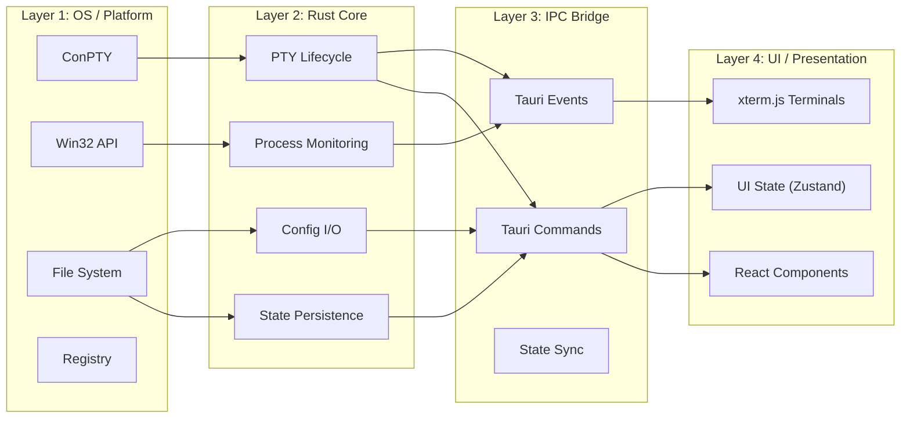
```mermaid
graph LR
    subgraph "Layer 1: OS / Platform"
        A1["ConPTY"]
        A2["Win32 API"]
        A3["File System"]
        A4["Registry"]
    end

    subgraph "Layer 2: Rust Core"
        B1["PTY Lifecycle"]
        B2["State Persistence"]
        B3["Config I/O"]
        B4["Process Monitoring"]
    end

    subgraph "Layer 3: IPC Bridge"
        C1["Tauri Commands"]
        C2["Tauri Events"]
        C3["State Sync"]
    end

    subgraph "Layer 4: UI / Presentation"
        D1["React Components"]
        D2["xterm.js Terminals"]
        D3["UI State (Zustand)"]
    end

    A1 --> B1
    A3 --> B2
    A3 --> B3
    A2 --> B4

    B1 --> C1
    B1 --> C2
    B2 --> C1
    B3 --> C1
    B4 --> C2

    C1 --> D1
    C2 --> D2
    C1 --> D3
```

### 2.3 Prinsip Arsitektur

| Prinsip                         | Penerapan                                                                                     |
| ------------------------------- | --------------------------------------------------------------------------------------------- |
| **Separation of Concerns**      | PTY I/O, state management, dan UI rendering di layer terpisah                                 |
| **Backend-Driven State**        | Rust backend adalah single source of truth untuk workspace/terminal state                     |
| **Event-Driven PTY I/O**        | Output PTY di-stream via events, bukan polling dari frontend                                  |
| **Fail-Safe Persistence**       | Autosave debounced + lockfile untuk crash recovery                                            |
| **Passthrough by Default**      | Keyboard input diteruskan ke PTY kecuali cocok dengan app-level shortcut (Layer 2 priority)   |
| **Lazy Resource Allocation**    | PTY dan xterm.js instance hanya dibuat saat pane visible/aktif                                |
| **Minimal IPC Payload**         | Batching PTY output, diff-based state sync — hindari overhead per-byte/per-line                |

### 2.4 Multi-Window Architecture (V1)

Tauri 2.x mendukung multiple window via `WindowBuilder`. Setiap window memiliki webview instance sendiri, tetapi berbagi satu Rust backend process.

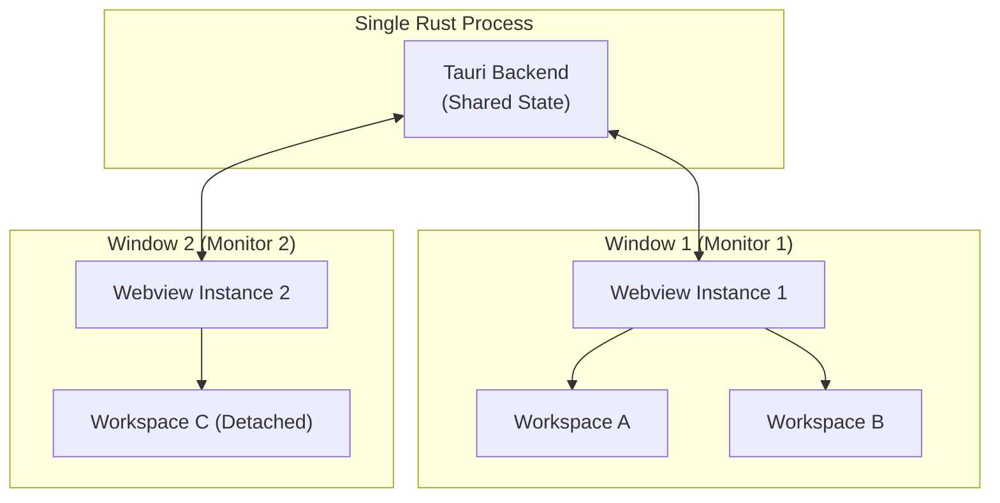
```mermaid
graph TB
    subgraph "Single Rust Process"
        Backend["Tauri Backend<br/>(Shared State)"]
    end

    subgraph "Window 1 (Monitor 1)"
        WV1["Webview Instance 1"]
        WS_A["Workspace A"]
        WS_B["Workspace B"]
    end

    subgraph "Window 2 (Monitor 2)"
        WV2["Webview Instance 2"]
        WS_C["Workspace C (Detached)"]
    end

    Backend <--> WV1
    Backend <--> WV2
    WV1 --> WS_A
    WV1 --> WS_B
    WV2 --> WS_C
```

**Aturan kunci:**
- Satu workspace hanya bisa ada di satu window pada satu waktu (tidak duplikasi)
- Drag workspace ke luar window → buat window baru via `WindowBuilder`
- Drag workspace kembali → merge ke window target, destroy window kosong
- Backend menjaga mapping `workspace_id → window_label` untuk routing events

### 2.5 Thread Model

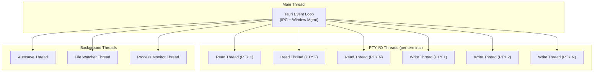
```mermaid
graph TB
    subgraph "Main Thread"
        TauriMain["Tauri Event Loop<br/>(IPC + Window Mgmt)"]
    end

    subgraph "PTY I/O Threads (per terminal)"
        ReadT1["Read Thread (PTY 1)"]
        ReadT2["Read Thread (PTY 2)"]
        ReadTN["Read Thread (PTY N)"]
        WriteT1["Write Thread (PTY 1)"]
        WriteT2["Write Thread (PTY 2)"]
        WriteTN["Write Thread (PTY N)"]
    end

    subgraph "Background Threads"
        AutoSaveT["Autosave Thread"]
        FileWatchT["File Watcher Thread"]
        ProcMonT["Process Monitor Thread"]
    end

    TauriMain --> ReadT1
    TauriMain --> ReadT2
    TauriMain --> ReadTN
    TauriMain --> WriteT1
    TauriMain --> WriteT2
    TauriMain --> WriteTN
    TauriMain --> AutoSaveT
    TauriMain --> FileWatchT
    TauriMain --> ProcMonT
```

**Rationale:**
- `portable-pty` melakukan synchronous blocking I/O — setiap PTY membutuhkan dedicated read thread dan write thread
- Read thread membaca output dari PTY, batching data sebelum emit via Tauri event
- Write thread menerima input dari frontend via channel, menulis ke PTY
- Autosave, file watcher, dan process monitor berjalan di background thread terpisah
- Untuk 9 terminal: **18 I/O threads + 3 background threads + 1 main thread = 22 threads total** (masih well within OS limits)

---

## 3. Desain Komponen

### 3.1 Rust Backend Components

#### 3.1.1 PTY Manager (`pty_manager.rs`)

**Tanggung jawab:** Lifecycle management untuk semua PTY instance — create, read, write, resize, destroy.

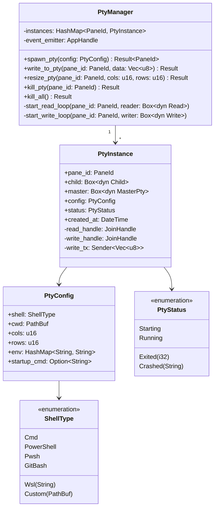
```mermaid
classDiagram
    class PtyManager {
        -instances: HashMap~PaneId, PtyInstance~
        -event_emitter: AppHandle
        +spawn_pty(config: PtyConfig) Result~PaneId~
        +write_to_pty(pane_id: PaneId, data: Vec~u8~) Result
        +resize_pty(pane_id: PaneId, cols: u16, rows: u16) Result
        +kill_pty(pane_id: PaneId) Result
        +kill_all() Result
        -start_read_loop(pane_id: PaneId, reader: Box~dyn Read~)
        -start_write_loop(pane_id: PaneId, writer: Box~dyn Write~)
    }

    class PtyInstance {
        +pane_id: PaneId
        +child: Box~dyn Child~
        +master: Box~dyn MasterPty~
        +config: PtyConfig
        +status: PtyStatus
        +created_at: DateTime
        -read_handle: JoinHandle
        -write_handle: JoinHandle
        -write_tx: Sender~Vec~u8~~
    }

    class PtyConfig {
        +shell: ShellType
        +cwd: PathBuf
        +cols: u16
        +rows: u16
        +env: HashMap~String, String~
        +startup_cmd: Option~String~
    }

    class PtyStatus {
        <<enumeration>>
        Starting
        Running
        Exited(i32)
        Crashed(String)
    }

    class ShellType {
        <<enumeration>>
        Cmd
        PowerShell
        Pwsh
        GitBash
        Wsl(String)
        Custom(PathBuf)
    }

    PtyManager "1" --> "*" PtyInstance
    PtyInstance --> PtyConfig
    PtyInstance --> PtyStatus
    PtyConfig --> ShellType
```

**Detail implementasi read loop:**

```rust
// Pseudocode — PTY read loop dengan batching
fn start_read_loop(pane_id: PaneId, reader: Box<dyn Read>, app: AppHandle) {
    std::thread::spawn(move || {
        let mut buf = [0u8; 8192]; // 8KB buffer
        let mut batch = Vec::with_capacity(32768); // 32KB batch
        let mut last_emit = Instant::now();
        const BATCH_INTERVAL: Duration = Duration::from_millis(16); // ~60fps

        loop {
            match reader.read(&mut buf) {
                Ok(0) => break, // PTY closed
                Ok(n) => {
                    batch.extend_from_slice(&buf[..n]);
                    let elapsed = last_emit.elapsed();
                    if elapsed >= BATCH_INTERVAL || batch.len() >= 32768 {
                        app.emit(&format!("pty-output-{}", pane_id), &batch).ok();
                        batch.clear();
                        last_emit = Instant::now();
                    }
                }
                Err(e) => {
                    app.emit(&format!("pty-error-{}", pane_id), e.to_string()).ok();
                    break;
                }
            }
        }
        // Flush remaining batch
        if !batch.is_empty() {
            app.emit(&format!("pty-output-{}", pane_id), &batch).ok();
        }
        // Emit exit event
        app.emit(&format!("pty-exit-{}", pane_id), ()).ok();
    });
}
```

**Keputusan desain:**
- Batch interval 16ms (~60fps) menjaga balance antara latency dan CPU usage
- Buffer 8KB per read sesuai dengan typical ConPTY output chunk size
- Batch cap 32KB mencegah memory spike saat output deras (npm install, build log)

#### 3.1.2 Workspace Manager (`workspace_manager.rs`)

**Tanggung jawab:** CRUD workspace, ordering, pane management di dalam workspace, layout assignment.

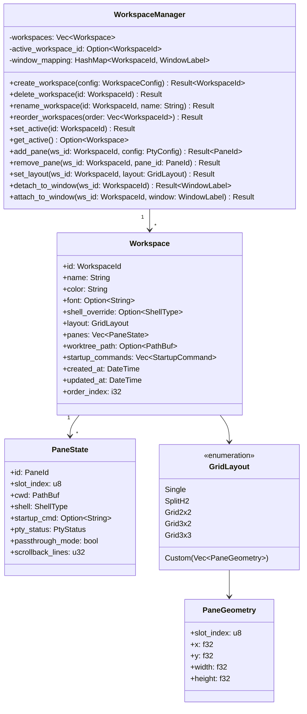
```mermaid
classDiagram
    class WorkspaceManager {
        -workspaces: Vec~Workspace~
        -active_workspace_id: Option~WorkspaceId~
        -window_mapping: HashMap~WorkspaceId, WindowLabel~
        +create_workspace(config: WorkspaceConfig) Result~WorkspaceId~
        +delete_workspace(id: WorkspaceId) Result
        +rename_workspace(id: WorkspaceId, name: String) Result
        +reorder_workspaces(order: Vec~WorkspaceId~) Result
        +set_active(id: WorkspaceId) Result
        +get_active() Option~Workspace~
        +add_pane(ws_id: WorkspaceId, config: PtyConfig) Result~PaneId~
        +remove_pane(ws_id: WorkspaceId, pane_id: PaneId) Result
        +set_layout(ws_id: WorkspaceId, layout: GridLayout) Result
        +detach_to_window(ws_id: WorkspaceId) Result~WindowLabel~
        +attach_to_window(ws_id: WorkspaceId, window: WindowLabel) Result
    }

    class Workspace {
        +id: WorkspaceId
        +name: String
        +color: String
        +font: Option~String~
        +shell_override: Option~ShellType~
        +layout: GridLayout
        +panes: Vec~PaneState~
        +worktree_path: Option~PathBuf~
        +startup_commands: Vec~StartupCommand~
        +created_at: DateTime
        +updated_at: DateTime
        +order_index: i32
    }

    class PaneState {
        +id: PaneId
        +slot_index: u8
        +cwd: PathBuf
        +shell: ShellType
        +startup_cmd: Option~String~
        +pty_status: PtyStatus
        +passthrough_mode: bool
        +scrollback_lines: u32
    }

    class GridLayout {
        <<enumeration>>
        Single
        SplitH2
        Grid2x2
        Grid3x2
        Grid3x3
        Custom(Vec~PaneGeometry~)
    }

    class PaneGeometry {
        +slot_index: u8
        +x: f32
        +y: f32
        +width: f32
        +height: f32
    }

    WorkspaceManager "1" --> "*" Workspace
    Workspace "1" --> "*" PaneState
    Workspace --> GridLayout
    GridLayout --> PaneGeometry
```

**Layout presets dan geometry (dalam persentase):**

| Layout     | Panes | Geometri (x, y, w, h sebagai %)                                      |
| ---------- | ----- | --------------------------------------------------------------------- |
| `Single`   | 1     | `(0, 0, 100, 100)`                                                   |
| `SplitH2`  | 2     | `(0,0,50,100)` `(50,0,50,100)`                                       |
| `Grid2x2`  | 4     | `(0,0,50,50)` `(50,0,50,50)` `(0,50,50,50)` `(50,50,50,50)`         |
| `Grid3x2`  | 6     | 3 kolom × 2 baris, masing-masing `(33.33%, 50%)`                     |
| `Grid3x3`  | 9     | 3 kolom × 3 baris, masing-masing `(33.33%, 33.33%)`                  |
| `Custom`   | 1–9   | User-defined via drag divider (V1)                                    |

#### 3.1.3 State Manager (`state_manager.rs`)

**Tanggung jawab:** Persistence state ke SQLite, autosave mechanism, crash recovery, lockfile management.

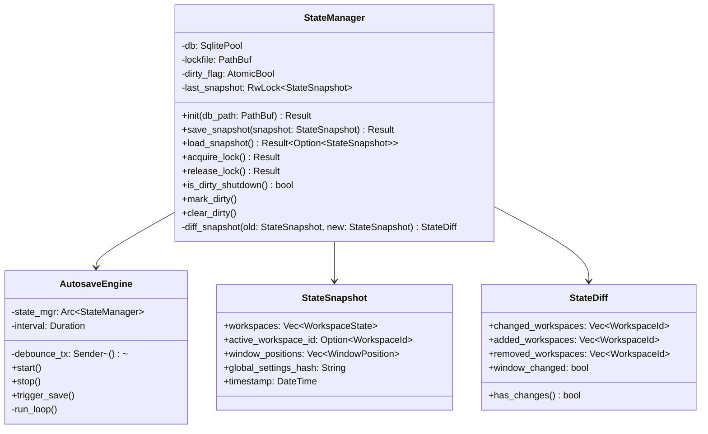
```mermaid
classDiagram
    class StateManager {
        -db: SqlitePool
        -lockfile: PathBuf
        -dirty_flag: AtomicBool
        -last_snapshot: RwLock~StateSnapshot~
        +init(db_path: PathBuf) Result
        +save_snapshot(snapshot: StateSnapshot) Result
        +load_snapshot() Result~Option~StateSnapshot~~
        +acquire_lock() Result
        +release_lock() Result
        +is_dirty_shutdown() bool
        +mark_dirty()
        +clear_dirty()
        -diff_snapshot(old: StateSnapshot, new: StateSnapshot) StateDiff
    }

    class AutosaveEngine {
        -state_mgr: Arc~StateManager~
        -interval: Duration
        -debounce_tx: Sender~()~
        +start()
        +stop()
        +trigger_save()
        -run_loop()
    }

    class StateSnapshot {
        +workspaces: Vec~WorkspaceState~
        +active_workspace_id: Option~WorkspaceId~
        +window_positions: Vec~WindowPosition~
        +global_settings_hash: String
        +timestamp: DateTime
    }

    class StateDiff {
        +changed_workspaces: Vec~WorkspaceId~
        +added_workspaces: Vec~WorkspaceId~
        +removed_workspaces: Vec~WorkspaceId~
        +window_changed: bool
        +has_changes() bool
    }

    StateManager --> AutosaveEngine
    StateManager --> StateSnapshot
    StateManager --> StateDiff
```

**Autosave mechanism (debounced, diff-based):**

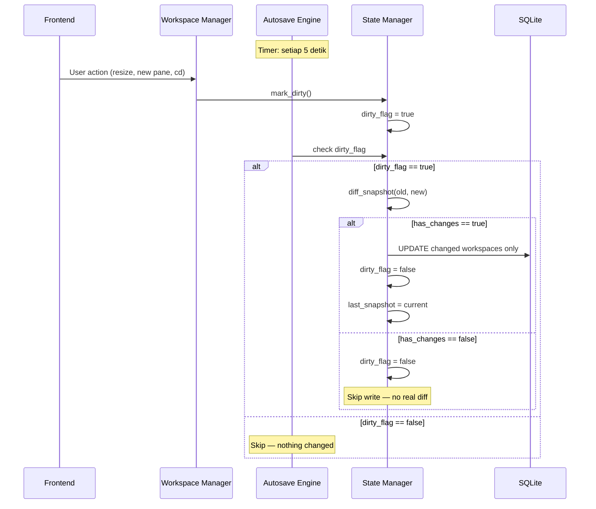
```mermaid
sequenceDiagram
    participant UI as Frontend
    participant WM as Workspace Manager
    participant AE as Autosave Engine
    participant SM as State Manager
    participant DB as SQLite

    Note over AE: Timer: setiap 5 detik

    UI->>WM: User action (resize, new pane, cd)
    WM->>SM: mark_dirty()
    SM->>SM: dirty_flag = true

    AE->>SM: check dirty_flag
    alt dirty_flag == true
        SM->>SM: diff_snapshot(old, new)
        alt has_changes == true
            SM->>DB: UPDATE changed workspaces only
            SM->>SM: dirty_flag = false
            SM->>SM: last_snapshot = current
        else has_changes == false
            SM->>SM: dirty_flag = false
            Note over SM: Skip write — no real diff
        end
    else dirty_flag == false
        Note over AE: Skip — nothing changed
    end
```

#### 3.1.4 Config Manager (`config_manager.rs`)

**Tanggung jawab:** Membaca dan menulis user preferences dari JSON files di `%APPDATA%/Nonaterm/`.

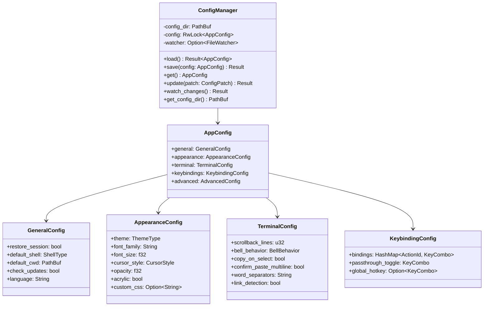
```mermaid
classDiagram
    class ConfigManager {
        -config_dir: PathBuf
        -config: RwLock~AppConfig~
        -watcher: Option~FileWatcher~
        +load() Result~AppConfig~
        +save(config: AppConfig) Result
        +get() AppConfig
        +update(patch: ConfigPatch) Result
        +watch_changes() Result
        +get_config_dir() PathBuf
    }

    class AppConfig {
        +general: GeneralConfig
        +appearance: AppearanceConfig
        +terminal: TerminalConfig
        +keybindings: KeybindingConfig
        +advanced: AdvancedConfig
    }

    class GeneralConfig {
        +restore_session: bool
        +default_shell: ShellType
        +default_cwd: PathBuf
        +check_updates: bool
        +language: String
    }

    class AppearanceConfig {
        +theme: ThemeType
        +font_family: String
        +font_size: f32
        +cursor_style: CursorStyle
        +opacity: f32
        +acrylic: bool
        +custom_css: Option~String~
    }

    class TerminalConfig {
        +scrollback_lines: u32
        +bell_behavior: BellBehavior
        +copy_on_select: bool
        +confirm_paste_multiline: bool
        +word_separators: String
        +link_detection: bool
    }

    class KeybindingConfig {
        +bindings: HashMap~ActionId, KeyCombo~
        +passthrough_toggle: KeyCombo
        +global_hotkey: Option~KeyCombo~
    }

    ConfigManager --> AppConfig
    AppConfig --> GeneralConfig
    AppConfig --> AppearanceConfig
    AppConfig --> TerminalConfig
    AppConfig --> KeybindingConfig
```

**Lokasi file config:**
```
%APPDATA%/Nonaterm/
├── config.json          # AppConfig — user preferences
├── state.db             # SQLite — workspace state & snapshots
├── state.db-wal         # SQLite WAL file
├── state.lock           # Lockfile untuk crash detection
├── themes/              # Custom theme files
│   └── custom.json
├── templates/           # Workspace templates (V1)
│   └── fullstack.json
└── logs/                # Application logs
    └── Nonaterm.log
```

#### 3.1.5 IPC Handler (`ipc_handler.rs`)

**Tanggung jawab:** Mendefinisikan semua Tauri commands dan event channels yang menjadi kontrak antara frontend dan backend.

Detil lengkap Tauri commands dan events ada di [Section 4 — Desain Interface](#4-desain-interface).

#### 3.1.6 File Watcher (`file_watcher.rs`) — V2 Foundation

**Tanggung jawab:** Memantau perubahan file di working directory pane untuk fitur Agent Edit Diff Strip (V2).

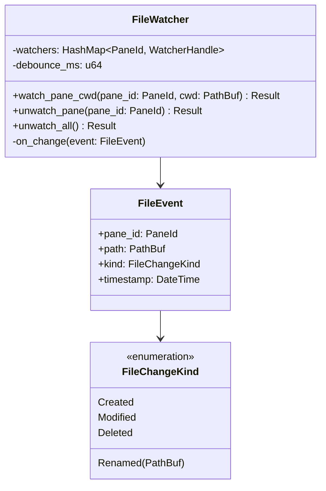
```mermaid
classDiagram
    class FileWatcher {
        -watchers: HashMap~PaneId, WatcherHandle~
        -debounce_ms: u64
        +watch_pane_cwd(pane_id: PaneId, cwd: PathBuf) Result
        +unwatch_pane(pane_id: PaneId) Result
        +unwatch_all() Result
        -on_change(event: FileEvent)
    }

    class FileEvent {
        +pane_id: PaneId
        +path: PathBuf
        +kind: FileChangeKind
        +timestamp: DateTime
    }

    class FileChangeKind {
        <<enumeration>>
        Created
        Modified
        Deleted
        Renamed(PathBuf)
    }

    FileWatcher --> FileEvent
    FileEvent --> FileChangeKind
```

> [!NOTE]
> File Watcher menggunakan crate `notify` untuk OS-native file system events (ReadDirectoryChangesW pada Windows). Di MVP, komponen ini hanya di-scaffold; implementasi penuh di V2 saat Agent Edit Diff Strip dibangun.

#### 3.1.7 Process Monitor (`process_monitor.rs`)

**Tanggung jawab:** Memantau status proses di dalam PTY — running, idle, exited, exit code. Menjadi data source untuk Workspace Health Strip (V2) dan Attention Inbox (V2).

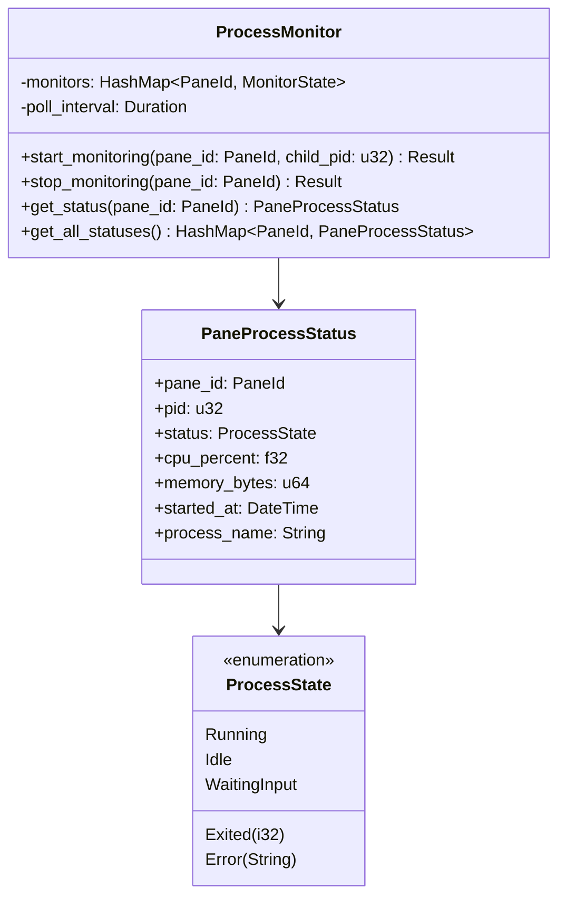
```mermaid
classDiagram
    class ProcessMonitor {
        -monitors: HashMap~PaneId, MonitorState~
        -poll_interval: Duration
        +start_monitoring(pane_id: PaneId, child_pid: u32) Result
        +stop_monitoring(pane_id: PaneId) Result
        +get_status(pane_id: PaneId) PaneProcessStatus
        +get_all_statuses() HashMap~PaneId, PaneProcessStatus~
    }

    class PaneProcessStatus {
        +pane_id: PaneId
        +pid: u32
        +status: ProcessState
        +cpu_percent: f32
        +memory_bytes: u64
        +started_at: DateTime
        +process_name: String
    }

    class ProcessState {
        <<enumeration>>
        Running
        Idle
        Exited(i32)
        WaitingInput
        Error(String)
    }

    ProcessMonitor --> PaneProcessStatus
    PaneProcessStatus --> ProcessState
```

**Status detection logic:**
- `Running` → proses aktif, CPU > 0% dalam 2 detik terakhir
- `Idle` → proses ada tapi shell menunggu input (prompt state)
- `Exited(code)` → proses sudah exit, kode disimpan
- `WaitingInput` → (V2) deteksi pola prompt seperti `[y/N]`, `Continue?` dari output stream
- `Error` → exit code ≠ 0 atau crash terdeteksi

---

### 3.2 Frontend Components

#### 3.2.1 Komponen Hirarki

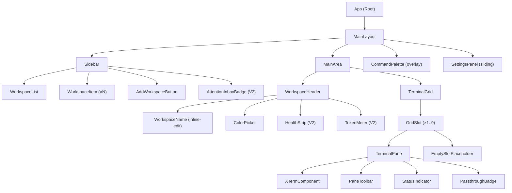
```mermaid
graph TB
    App["App (Root)"]
    App --> Layout["MainLayout"]
    Layout --> SB["Sidebar"]
    Layout --> MainArea["MainArea"]
    Layout --> CmdP["CommandPalette (overlay)"]
    Layout --> SettingsP["SettingsPanel (sliding)"]

    SB --> WSList["WorkspaceList"]
    SB --> WSItem["WorkspaceItem (×N)"]
    SB --> AddWSBtn["AddWorkspaceButton"]
    SB --> InboxBadge["AttentionInboxBadge (V2)"]

    MainArea --> WSHeader["WorkspaceHeader"]
    MainArea --> TermGrid["TerminalGrid"]

    WSHeader --> WSName["WorkspaceName (inline-edit)"]
    WSHeader --> WSColor["ColorPicker"]
    WSHeader --> HealthStrip["HealthStrip (V2)"]
    WSHeader --> TokenMeter["TokenMeter (V2)"]

    TermGrid --> GridSlot["GridSlot (×1..9)"]
    GridSlot --> TermPane["TerminalPane"]
    GridSlot --> EmptySlot["EmptySlotPlaceholder"]

    TermPane --> XTerm["XTermComponent"]
    TermPane --> PaneToolbar["PaneToolbar"]
    TermPane --> StatusIndicator["StatusIndicator"]
    TermPane --> PassthroughBadge["PassthroughBadge"]
```

#### 3.2.2 React App Shell (`App.tsx`)

**Tanggung jawab:** Root component, global state provider, keybinding handler Layer 2, tema management.

```typescript
// Struktur komponen utama
interface AppState {
  workspaces: Workspace[];
  activeWorkspaceId: string | null;
  isSettingsOpen: boolean;
  isCommandPaletteOpen: boolean;
  theme: Theme;
  windowId: string;
}

// Global keybinding handler — Layer 2
// HANYA intercept shortcut yang didefinisikan di keybinding config
// SEMUA input lain diteruskan ke terminal aktif (passthrough default)
```

**Keybinding architecture (3-layer priority):**

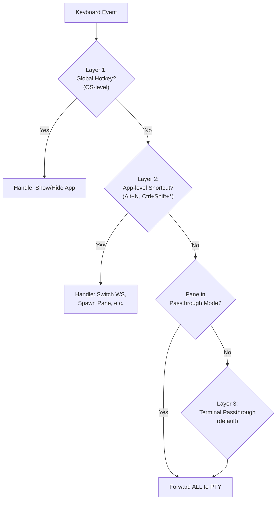
```mermaid
flowchart TD
    KE["Keyboard Event"] --> L1{"Layer 1:<br/>Global Hotkey?<br/>(OS-level)"}
    L1 -->|Yes| GH["Handle: Show/Hide App"]
    L1 -->|No| L2{"Layer 2:<br/>App-level Shortcut?<br/>(Alt+N, Ctrl+Shift+*)"}
    L2 -->|Yes| AppAction["Handle: Switch WS,<br/>Spawn Pane, etc."]
    L2 -->|No| PM{"Pane in<br/>Passthrough Mode?"}
    PM -->|Yes| PTY["Forward ALL to PTY"]
    PM -->|No| L3{"Layer 3:<br/>Terminal Passthrough<br/>(default)"}
    L3 --> PTY
```

#### 3.2.3 Terminal Grid (`TerminalGrid.tsx`)

**Tanggung jawab:** Menata pane dalam grid layout sesuai preset atau custom geometry. Menangani resize divider (V1).

```typescript
interface TerminalGridProps {
  layout: GridLayout;
  panes: PaneState[];
  onPaneResize?: (paneId: string, geometry: PaneGeometry) => void;
  onPaneFocus: (paneId: string) => void;
  onPaneClose: (paneId: string) => void;
  onPaneSpawn: (slotIndex: number) => void;
}

// CSS Grid digunakan untuk layout preset
// Untuk Custom layout, gunakan absolute positioning dengan percentage-based coordinates
// Resize divider (V1) menggunakan pointer events + requestAnimationFrame untuk 60fps
```

**Grid rendering strategy:**

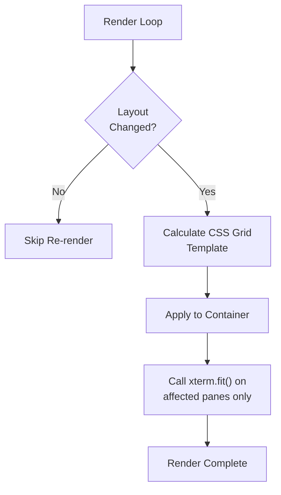
```mermaid
flowchart TD
    RL["Render Loop"] --> Check{"Layout<br/>Changed?"}
    Check -->|No| Skip["Skip Re-render"]
    Check -->|Yes| Calc["Calculate CSS Grid<br/>Template"]
    Calc --> Apply["Apply to Container"]
    Apply --> FitAddon["Call xterm.fit() on<br/>affected panes only"]
    FitAddon --> Done["Render Complete"]
```

#### 3.2.4 XTerm Component (`XTermComponent.tsx`)

**Tanggung jawab:** Wrapper React di sekitar xterm.js instance. Mengelola lifecycle terminal, addon loading, event binding ke Tauri.

```typescript
interface XTermComponentProps {
  paneId: string;
  onData: (data: string) => void;     // User keyboard input → PTY
  onResize: (cols: number, rows: number) => void;
  onTitleChange: (title: string) => void;
  fontSize: number;
  fontFamily: string;
  theme: ITheme;
  scrollbackLines: number;
  cursorStyle: 'block' | 'underline' | 'bar';
}

// Addons yang di-load:
// 1. WebglAddon     — GPU-accelerated rendering (primary)
// 2. CanvasAddon    — Fallback jika WebGL tidak tersedia
// 3. FitAddon       — Auto-resize terminal ke container
// 4. SearchAddon    — Search scrollback (V1)
// 5. WebLinksAddon  — Clickable URLs
// 6. Unicode11Addon — Unicode support
```

**xterm.js lifecycle per pane:**

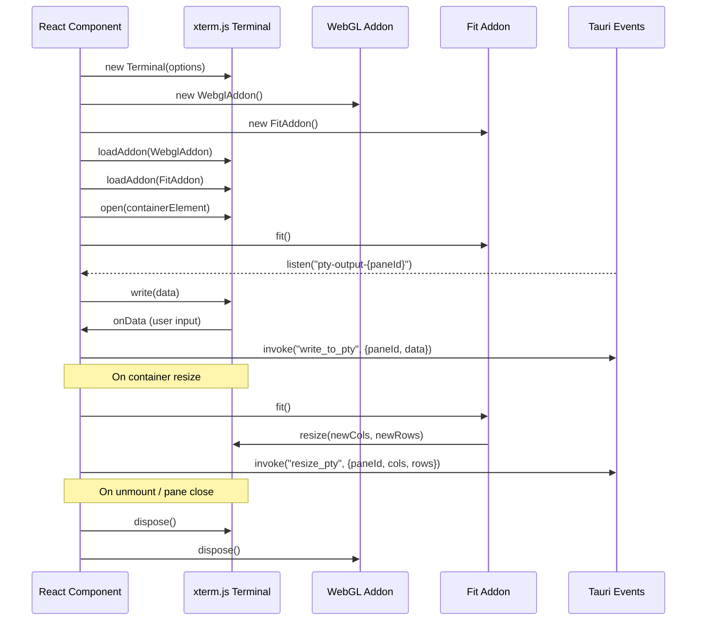
```mermaid
sequenceDiagram
    participant React as React Component
    participant XT as xterm.js Terminal
    participant WGL as WebGL Addon
    participant Fit as Fit Addon
    participant Tauri as Tauri Events

    React->>XT: new Terminal(options)
    React->>WGL: new WebglAddon()
    React->>Fit: new FitAddon()
    React->>XT: loadAddon(WebglAddon)
    React->>XT: loadAddon(FitAddon)
    React->>XT: open(containerElement)
    React->>Fit: fit()

    Tauri-->>React: listen("pty-output-{paneId}")
    React->>XT: write(data)

    XT->>React: onData (user input)
    React->>Tauri: invoke("write_to_pty", {paneId, data})

    Note over React,XT: On container resize
    React->>Fit: fit()
    Fit->>XT: resize(newCols, newRows)
    React->>Tauri: invoke("resize_pty", {paneId, cols, rows})

    Note over React,XT: On unmount / pane close
    React->>XT: dispose()
    React->>WGL: dispose()
```

#### 3.2.5 Workspace Sidebar (`Sidebar.tsx`)

**Tanggung jawab:** Daftar workspace, navigasi, drag-to-reorder, visual identity (nama + warna swatch).

```typescript
interface SidebarProps {
  workspaces: WorkspaceSummary[];
  activeWorkspaceId: string | null;
  onSelect: (id: string) => void;
  onReorder: (ids: string[]) => void;
  onCreateNew: () => void;
  onDelete: (id: string) => void;
  onDetach: (id: string) => void;  // Drag to new window
  attentionCount: number;          // V2: Attention Inbox badge
}

interface WorkspaceSummary {
  id: string;
  name: string;
  color: string;
  paneCount: number;
  hasErrors: boolean;              // Tab color change jika ada error
  hasWaitingInput: boolean;        // V2: Attention Inbox
}
```

#### 3.2.6 Command Palette (`CommandPalette.tsx`)

**Tanggung jawab:** Fuzzy-search overlay untuk aksi cepat — jump workspace, spawn terminal, run snippet.

```typescript
interface CommandPaletteAction {
  id: string;
  label: string;
  category: 'workspace' | 'terminal' | 'settings' | 'snippet';
  shortcut?: string;
  execute: () => void | Promise<void>;
}

// Implementasi:
// - Trigger: Ctrl+Shift+P
// - Fuzzy matching library: fuse.js
// - Max visible items: 10 (virtualized list)
// - Keyboard navigation: Arrow up/down, Enter to execute, Esc to close
// - Recently used items muncul di atas
```

#### 3.2.7 Settings Panel (`SettingsPanel.tsx`)

**Tanggung jawab:** Panel sliding dari samping (bukan modal/window terpisah) untuk semua user preferences. Live preview, hot-reload tanpa restart.

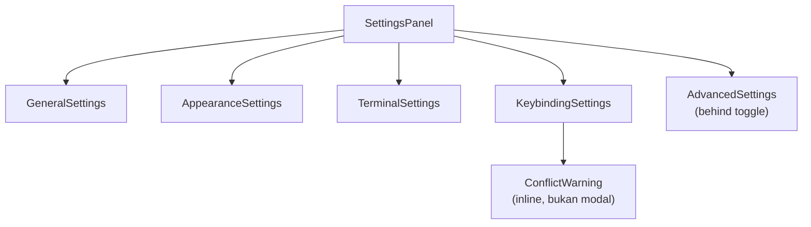
```mermaid
graph TB
    SP["SettingsPanel"]
    SP --> Gen["GeneralSettings"]
    SP --> App["AppearanceSettings"]
    SP --> Term["TerminalSettings"]
    SP --> KB["KeybindingSettings"]
    SP --> Adv["AdvancedSettings<br/>(behind toggle)"]

    KB --> ConflictWarning["ConflictWarning<br/>(inline, bukan modal)"]
```

#### 3.2.8 Frontend State Management

**Library:** Zustand (lightweight, TypeScript-first, no boilerplate)

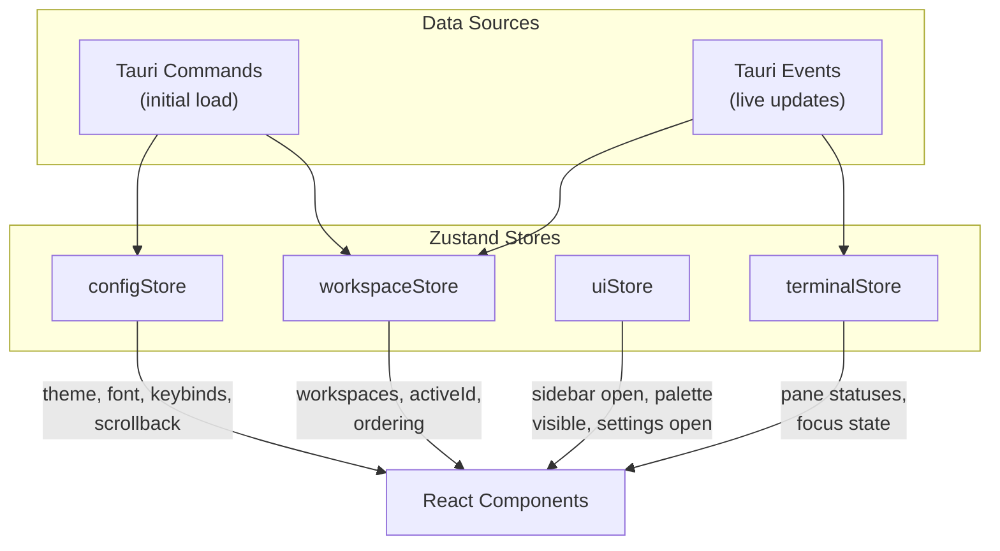
```mermaid
graph TB
    subgraph "Zustand Stores"
        WS["workspaceStore"]
        TS["terminalStore"]
        US["uiStore"]
        CS["configStore"]
    end

    subgraph "Data Sources"
        Tauri["Tauri Commands<br/>(initial load)"]
        Events["Tauri Events<br/>(live updates)"]
    end

    Tauri --> WS
    Tauri --> CS
    Events --> TS
    Events --> WS

    WS --> |"workspaces, activeId,<br/>ordering"| Components["React Components"]
    TS --> |"pane statuses,<br/>focus state"| Components
    US --> |"sidebar open, palette<br/>visible, settings open"| Components
    CS --> |"theme, font, keybinds,<br/>scrollback"| Components
```

**Store definitions:**

```typescript
// workspaceStore.ts
interface WorkspaceStore {
  workspaces: Workspace[];
  activeWorkspaceId: string | null;
  recentlyClosed: Workspace[];      // Undo close support
  
  setActive: (id: string) => void;
  create: (config?: Partial<WorkspaceConfig>) => Promise<string>;
  remove: (id: string) => Promise<void>;
  rename: (id: string, name: string) => Promise<void>;
  reorder: (ids: string[]) => void;
  undoClose: () => Promise<void>;
}

// terminalStore.ts
interface TerminalStore {
  paneStatuses: Record<string, PaneProcessStatus>;
  focusedPaneId: string | null;
  passthroughPanes: Set<string>;   // Panes in passthrough mode
  
  setFocused: (paneId: string) => void;
  togglePassthrough: (paneId: string) => void;
  updateStatus: (paneId: string, status: PaneProcessStatus) => void;
}

// uiStore.ts
interface UIStore {
  sidebarCollapsed: boolean;
  settingsOpen: boolean;
  commandPaletteOpen: boolean;
  activeSettingsTab: string;
  
  toggleSidebar: () => void;
  toggleSettings: () => void;
  toggleCommandPalette: () => void;
}

// configStore.ts
interface ConfigStore {
  config: AppConfig;
  
  load: () => Promise<void>;
  update: (patch: Partial<AppConfig>) => Promise<void>;
}
```

---

### 3.3 Data Layer

#### 3.3.1 SQLite Schema

Database file: `%APPDATA%/Nonaterm/state.db`

```sql
-- ============================================================
-- Schema Version Management
-- ============================================================
CREATE TABLE schema_version (
    version     INTEGER PRIMARY KEY,
    applied_at  TEXT NOT NULL DEFAULT (datetime('now')),
    description TEXT
);

INSERT INTO schema_version (version, description)
VALUES (1, 'Initial schema — MVP');

-- ============================================================
-- Workspaces
-- ============================================================
CREATE TABLE workspaces (
    id              TEXT PRIMARY KEY,           -- UUID v4
    name            TEXT NOT NULL DEFAULT 'Workspace',
    color           TEXT NOT NULL DEFAULT '#5B8DEF',
    font_family     TEXT,                       -- NULL = use global default
    shell_override  TEXT,                       -- NULL = use global default
    layout          TEXT NOT NULL DEFAULT 'Single', -- GridLayout enum
    worktree_path   TEXT,                       -- Git worktree path (V1)
    order_index     INTEGER NOT NULL DEFAULT 0,
    is_active       INTEGER NOT NULL DEFAULT 0, -- Boolean: currently active
    created_at      TEXT NOT NULL DEFAULT (datetime('now')),
    updated_at      TEXT NOT NULL DEFAULT (datetime('now'))
);

CREATE INDEX idx_workspaces_order ON workspaces(order_index);

-- ============================================================
-- Panes (terminal slots within a workspace)
-- ============================================================
CREATE TABLE panes (
    id              TEXT PRIMARY KEY,           -- UUID v4
    workspace_id    TEXT NOT NULL REFERENCES workspaces(id) ON DELETE CASCADE,
    slot_index      INTEGER NOT NULL,           -- 0-8 position in grid
    cwd             TEXT NOT NULL,
    shell           TEXT NOT NULL DEFAULT 'pwsh',
    startup_cmd     TEXT,                       -- Auto-run command on spawn
    passthrough     INTEGER NOT NULL DEFAULT 0, -- Boolean
    cols            INTEGER NOT NULL DEFAULT 120,
    rows            INTEGER NOT NULL DEFAULT 30,
    created_at      TEXT NOT NULL DEFAULT (datetime('now')),
    UNIQUE(workspace_id, slot_index)
);

CREATE INDEX idx_panes_workspace ON panes(workspace_id);

-- ============================================================
-- Custom Pane Geometry (V1 — manual resize)
-- ============================================================
CREATE TABLE pane_geometry (
    pane_id     TEXT PRIMARY KEY REFERENCES panes(id) ON DELETE CASCADE,
    x_percent   REAL NOT NULL,
    y_percent   REAL NOT NULL,
    w_percent   REAL NOT NULL,
    h_percent   REAL NOT NULL
);

-- ============================================================
-- Window Positions (multi-window, V1)
-- ============================================================
CREATE TABLE window_positions (
    window_label    TEXT PRIMARY KEY,
    x               INTEGER NOT NULL,
    y               INTEGER NOT NULL,
    width           INTEGER NOT NULL,
    height          INTEGER NOT NULL,
    is_maximized    INTEGER NOT NULL DEFAULT 0,
    monitor_id      TEXT,                       -- Monitor identifier
    updated_at      TEXT NOT NULL DEFAULT (datetime('now'))
);

-- ============================================================
-- Workspace Templates (V1)
-- ============================================================
CREATE TABLE workspace_templates (
    id              TEXT PRIMARY KEY,
    name            TEXT NOT NULL UNIQUE,
    description     TEXT,
    layout          TEXT NOT NULL,
    pane_configs    TEXT NOT NULL,               -- JSON: [{shell, cwd_pattern, startup_cmd}]
    color           TEXT,
    font_family     TEXT,
    created_at      TEXT NOT NULL DEFAULT (datetime('now'))
);

-- ============================================================
-- Scrollback Snapshots (crash recovery)
-- ============================================================
CREATE TABLE scrollback_snapshots (
    pane_id         TEXT PRIMARY KEY REFERENCES panes(id) ON DELETE CASCADE,
    content         BLOB,                       -- Compressed (zstd) last N lines
    line_count      INTEGER NOT NULL DEFAULT 0,
    updated_at      TEXT NOT NULL DEFAULT (datetime('now'))
);

-- ============================================================
-- Recently Closed Workspaces (undo support)
-- ============================================================
CREATE TABLE recently_closed (
    id              TEXT PRIMARY KEY,
    workspace_data  TEXT NOT NULL,               -- Full JSON snapshot
    closed_at       TEXT NOT NULL DEFAULT (datetime('now'))
);

-- ============================================================
-- Snippet Library (Section 8 — utility feature)
-- ============================================================
CREATE TABLE snippets (
    id              TEXT PRIMARY KEY,
    name            TEXT NOT NULL,
    command         TEXT NOT NULL,
    category        TEXT,
    usage_count     INTEGER NOT NULL DEFAULT 0,
    created_at      TEXT NOT NULL DEFAULT (datetime('now'))
);
```

#### 3.3.2 JSON Config Structure

File: `%APPDATA%/Nonaterm/config.json`

```json
{
  "$schema": "Nonaterm-config-v1",
  "general": {
    "restore_session": true,
    "default_shell": "pwsh",
    "default_cwd": "~",
    "check_updates": true,
    "language": "id"
  },
  "appearance": {
    "theme": "dark",
    "font_family": "Cascadia Code",
    "font_size": 14,
    "cursor_style": "block",
    "cursor_blink": true,
    "opacity": 1.0,
    "acrylic": false,
    "line_height": 1.2,
    "letter_spacing": 0
  },
  "terminal": {
    "scrollback_lines": 5000,
    "bell_behavior": "none",
    "copy_on_select": false,
    "confirm_paste_multiline": true,
    "word_separators": " ()[]{}',\"`",
    "link_detection": true,
    "auto_restart_shell": true,
    "right_click_paste": true
  },
  "keybindings": {
    "switch_workspace_1": "Alt+1",
    "switch_workspace_2": "Alt+2",
    "switch_workspace_3": "Alt+3",
    "switch_workspace_4": "Alt+4",
    "switch_workspace_5": "Alt+5",
    "switch_workspace_6": "Alt+6",
    "switch_workspace_7": "Alt+7",
    "switch_workspace_8": "Alt+8",
    "switch_workspace_9": "Alt+9",
    "new_workspace": "Ctrl+Shift+T",
    "close_pane": "Ctrl+Shift+W",
    "command_palette": "Ctrl+Shift+P",
    "toggle_passthrough": "Ctrl+Shift+Escape",
    "new_pane": "Ctrl+Shift+N",
    "next_pane": "Ctrl+Shift+]",
    "prev_pane": "Ctrl+Shift+[",
    "toggle_sidebar": "Ctrl+Shift+B",
    "toggle_settings": "Ctrl+,",
    "search_scrollback": "Ctrl+Shift+F",
    "global_hotkey": null
  },
  "advanced": {
    "autosave_interval_ms": 5000,
    "pty_read_buffer_size": 8192,
    "pty_batch_interval_ms": 16,
    "scrollback_snapshot_lines": 1000,
    "max_recently_closed": 10,
    "log_level": "info",
    "gpu_acceleration": true,
    "enable_file_watcher": false
  }
}
```

#### 3.3.3 Workspace Template Structure (V1)

File: `%APPDATA%/Nonaterm/templates/fullstack.json`

```json
{
  "name": "Fullstack Project",
  "description": "Frontend dev server + Backend + AI Agent + Tests",
  "layout": "Grid2x2",
  "color": "#10B981",
  "panes": [
    {
      "slot_index": 0,
      "shell": "pwsh",
      "cwd_pattern": "{project_root}",
      "startup_cmd": "npm run dev",
      "label": "Frontend"
    },
    {
      "slot_index": 1,
      "shell": "pwsh",
      "cwd_pattern": "{project_root}/backend",
      "startup_cmd": "cargo watch -x run",
      "label": "Backend"
    },
    {
      "slot_index": 2,
      "shell": "pwsh",
      "cwd_pattern": "{project_root}",
      "startup_cmd": "claude code",
      "label": "AI Agent"
    },
    {
      "slot_index": 3,
      "shell": "pwsh",
      "cwd_pattern": "{project_root}",
      "startup_cmd": "npm run test:watch",
      "label": "Tests"
    }
  ]
}
```

---

## 4. Desain Interface

### 4.1 Tauri Commands (Request-Response)

Semua Tauri commands di-invoke dari frontend via `invoke()` dan mengembalikan `Result<T, String>`.

#### 4.1.1 PTY Commands

| Command                  | Parameters                                        | Return Type      | Deskripsi                                        |
| ------------------------ | ------------------------------------------------- | ---------------- | ------------------------------------------------ |
| `spawn_pty`              | `workspace_id: String, config: PtyConfig`         | `String` (PaneId)| Membuat PTY baru di workspace                    |
| `write_to_pty`           | `pane_id: String, data: Vec<u8>`                  | `()`             | Menulis input ke PTY                             |
| `resize_pty`             | `pane_id: String, cols: u16, rows: u16`           | `()`             | Mengubah ukuran PTY                              |
| `kill_pty`               | `pane_id: String`                                 | `()`             | Menutup PTY dan membersihkan resources            |
| `get_pty_status`         | `pane_id: String`                                 | `PtyStatus`      | Mendapatkan status PTY saat ini                  |
| `restart_pty`            | `pane_id: String`                                 | `()`             | Restart shell di pane yang sama                  |

#### 4.1.2 Workspace Commands

| Command                  | Parameters                                        | Return Type            | Deskripsi                                   |
| ------------------------ | ------------------------------------------------- | ---------------------- | ------------------------------------------- |
| `create_workspace`       | `config: Option<WorkspaceConfig>`                 | `Workspace`            | Membuat workspace baru                      |
| `delete_workspace`       | `workspace_id: String`                            | `()`                   | Menghapus workspace (dengan konfirmasi)     |
| `rename_workspace`       | `workspace_id: String, name: String`              | `()`                   | Mengubah nama workspace                     |
| `set_workspace_color`    | `workspace_id: String, color: String`             | `()`                   | Mengubah warna workspace                    |
| `set_workspace_font`     | `workspace_id: String, font: Option<String>`      | `()`                   | Mengubah font workspace                     |
| `reorder_workspaces`     | `ids: Vec<String>`                                | `()`                   | Set urutan workspace                        |
| `switch_workspace`       | `workspace_id: String`                            | `Workspace`            | Pindah ke workspace lain                    |
| `get_all_workspaces`     | —                                                 | `Vec<WorkspaceSummary>`| Daftar semua workspace                      |
| `get_workspace`          | `workspace_id: String`                            | `Workspace`            | Detail satu workspace                       |
| `set_layout`             | `workspace_id: String, layout: GridLayout`        | `()`                   | Mengubah layout grid                        |
| `detach_workspace`       | `workspace_id: String`                            | `String` (WindowLabel) | Pindahkan ke window baru (V1)               |
| `attach_workspace`       | `workspace_id: String, window: String`            | `()`                   | Gabungkan kembali ke window (V1)            |
| `undo_close_workspace`   | —                                                 | `Option<Workspace>`    | Pulihkan workspace terakhir yang ditutup    |

#### 4.1.3 Config Commands

| Command                  | Parameters                                        | Return Type      | Deskripsi                                        |
| ------------------------ | ------------------------------------------------- | ---------------- | ------------------------------------------------ |
| `get_config`             | —                                                 | `AppConfig`      | Mendapatkan seluruh konfigurasi                  |
| `update_config`          | `patch: ConfigPatch`                              | `()`             | Update konfigurasi (partial/patch)               |
| `reset_config`           | —                                                 | `AppConfig`      | Reset ke default                                 |
| `get_available_shells`   | —                                                 | `Vec<ShellInfo>` | Daftar shell yang tersedia di sistem             |
| `export_config`          | `path: String`                                    | `()`             | Export config ke file (backup)                   |
| `import_config`          | `path: String`                                    | `AppConfig`      | Import config dari file                          |

#### 4.1.4 Template Commands (V1)

| Command                  | Parameters                                        | Return Type             | Deskripsi                                 |
| ------------------------ | ------------------------------------------------- | ----------------------- | ----------------------------------------- |
| `list_templates`         | —                                                 | `Vec<WorkspaceTemplate>`| Daftar template yang tersedia             |
| `create_from_template`   | `template_id: String, name: String, cwd: String`  | `Workspace`             | Buat workspace dari template              |
| `save_as_template`       | `workspace_id: String, name: String`              | `String` (TemplateId)   | Simpan workspace sebagai template         |
| `delete_template`        | `template_id: String`                             | `()`                    | Hapus template                            |

#### 4.1.5 State Commands

| Command                  | Parameters                                        | Return Type               | Deskripsi                              |
| ------------------------ | ------------------------------------------------- | ------------------------- | -------------------------------------- |
| `get_initial_state`      | —                                                 | `InitialState`            | Load state saat app startup            |
| `is_dirty_shutdown`      | —                                                 | `bool`                    | Cek apakah shutdown terakhir abnormal  |
| `restore_from_snapshot`  | —                                                 | `StateSnapshot`           | Pulihkan dari snapshot terakhir        |
| `force_save`             | —                                                 | `()`                      | Paksa simpan state sekarang            |

### 4.2 Tauri Events (Streaming/Push)

Events di-emit dari backend ke frontend. Frontend me-listen events menggunakan `listen()` API.

#### 4.2.1 PTY Events (per-pane)

| Event Name                     | Payload Type       | Deskripsi                                           |
| ------------------------------ | ------------------ | --------------------------------------------------- |
| `pty-output-{paneId}`          | `Vec<u8>`          | Batched output dari PTY (16ms interval)             |
| `pty-exit-{paneId}`            | `ExitPayload`      | PTY process exited                                  |
| `pty-error-{paneId}`           | `String`           | Error pada PTY (I/O error, spawn failure)           |
| `pty-title-{paneId}`           | `String`           | Terminal title berubah (dari escape sequence)        |

```typescript
interface ExitPayload {
  pane_id: string;
  exit_code: number | null;  // null jika killed/crashed
  signal: string | null;
}
```

#### 4.2.2 Workspace Events (global)

| Event Name                     | Payload Type              | Deskripsi                                      |
| ------------------------------ | ------------------------- | ---------------------------------------------- |
| `workspace-created`            | `Workspace`               | Workspace baru dibuat (dari window lain)       |
| `workspace-deleted`            | `{ id: string }`          | Workspace dihapus (dari window lain)           |
| `workspace-updated`            | `WorkspaceUpdate`         | Property workspace berubah                     |
| `workspace-reordered`          | `Vec<String>`             | Urutan workspace berubah                       |
| `workspace-detached`           | `DetachPayload`           | Workspace pindah ke window lain                |
| `workspace-attached`           | `AttachPayload`           | Workspace kembali ke window ini                |

#### 4.2.3 System Events

| Event Name                     | Payload Type              | Deskripsi                                      |
| ------------------------------ | ------------------------- | ---------------------------------------------- |
| `state-saved`                  | `{ timestamp: string }`   | Autosave berhasil                              |
| `config-changed`               | `ConfigPatch`             | Config berubah (hot-reload)                    |
| `process-status-changed`       | `PaneProcessStatus`       | Status proses di pane berubah                  |
| `file-changed`                 | `FileEvent`               | File berubah di cwd pane (V2)                  |
| `attention-item`               | `AttentionItem`           | (V2) Item baru di Attention Inbox              |
| `app-update-available`         | `{ version: string }`     | Update tersedia                                |

### 4.3 IPC Data Flow Diagram

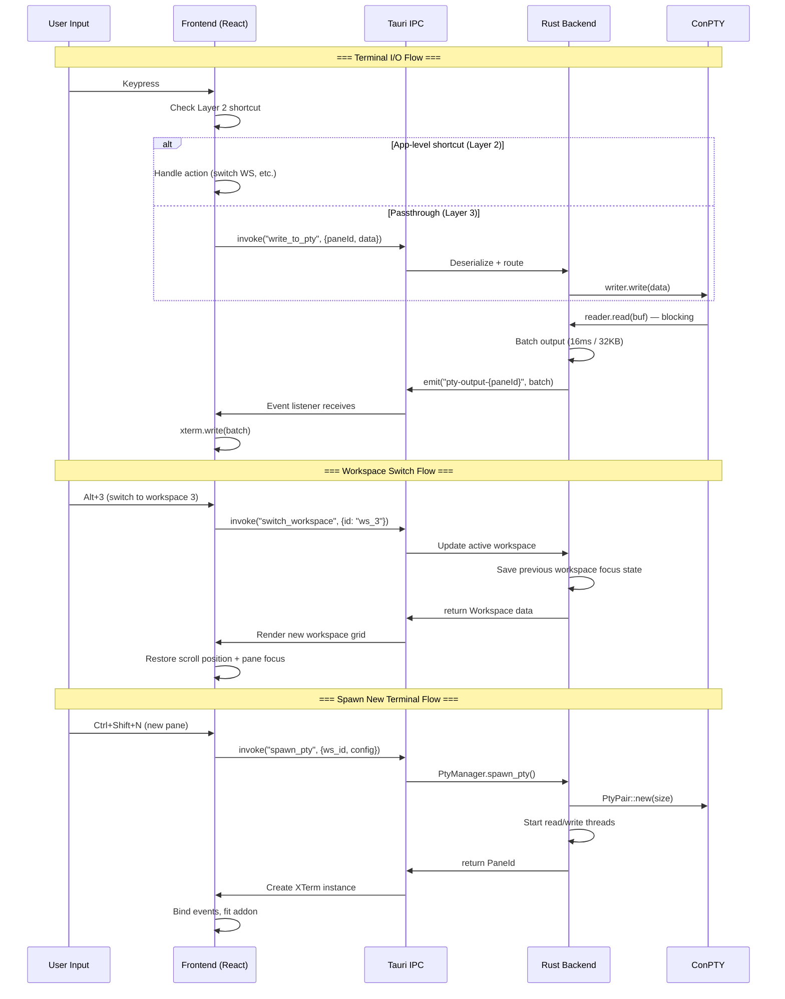
```mermaid
sequenceDiagram
    participant User as User Input
    participant FE as Frontend (React)
    participant IPC as Tauri IPC
    participant BE as Rust Backend
    participant PTY as ConPTY

    Note over User, PTY: === Terminal I/O Flow ===

    User->>FE: Keypress
    FE->>FE: Check Layer 2 shortcut
    alt App-level shortcut (Layer 2)
        FE->>FE: Handle action (switch WS, etc.)
    else Passthrough (Layer 3)
        FE->>IPC: invoke("write_to_pty", {paneId, data})
        IPC->>BE: Deserialize + route
        BE->>PTY: writer.write(data)
    end

    PTY->>BE: reader.read(buf) — blocking
    BE->>BE: Batch output (16ms / 32KB)
    BE->>IPC: emit("pty-output-{paneId}", batch)
    IPC->>FE: Event listener receives
    FE->>FE: xterm.write(batch)

    Note over User, PTY: === Workspace Switch Flow ===

    User->>FE: Alt+3 (switch to workspace 3)
    FE->>IPC: invoke("switch_workspace", {id: "ws_3"})
    IPC->>BE: Update active workspace
    BE->>BE: Save previous workspace focus state
    BE->>IPC: return Workspace data
    IPC->>FE: Render new workspace grid
    FE->>FE: Restore scroll position + pane focus

    Note over User, PTY: === Spawn New Terminal Flow ===

    User->>FE: Ctrl+Shift+N (new pane)
    FE->>IPC: invoke("spawn_pty", {ws_id, config})
    IPC->>BE: PtyManager.spawn_pty()
    BE->>PTY: PtyPair::new(size)
    BE->>BE: Start read/write threads
    BE->>IPC: return PaneId
    IPC->>FE: Create XTerm instance
    FE->>FE: Bind events, fit addon
```

### 4.4 Payload Type Definitions (TypeScript)

```typescript
// === Core Types ===

interface Workspace {
  id: string;
  name: string;
  color: string;
  font_family: string | null;
  shell_override: string | null;
  layout: GridLayout;
  panes: PaneState[];
  worktree_path: string | null;
  order_index: number;
  created_at: string;
  updated_at: string;
}

interface PaneState {
  id: string;
  slot_index: number;
  cwd: string;
  shell: string;
  startup_cmd: string | null;
  passthrough: boolean;
  cols: number;
  rows: number;
}

interface PtyConfig {
  shell: string;        // "pwsh" | "cmd" | "git-bash" | "wsl" | "wsl:Ubuntu"
  cwd: string;
  cols: number;
  rows: number;
  env?: Record<string, string>;
  startup_cmd?: string;
}

type GridLayout =
  | 'Single'
  | 'SplitH2'
  | 'Grid2x2'
  | 'Grid3x2'
  | 'Grid3x3'
  | { Custom: PaneGeometry[] };

interface PaneGeometry {
  slot_index: number;
  x: number;      // percentage 0-100
  y: number;      // percentage 0-100
  width: number;  // percentage 0-100
  height: number; // percentage 0-100
}

interface InitialState {
  workspaces: Workspace[];
  active_workspace_id: string | null;
  config: AppConfig;
  is_dirty_shutdown: boolean;
  window_position: WindowPosition | null;
  available_shells: ShellInfo[];
}

interface ShellInfo {
  id: string;           // e.g., "pwsh", "cmd", "git-bash"
  name: string;         // e.g., "PowerShell 7"
  path: string;         // e.g., "C:\\Program Files\\PowerShell\\7\\pwsh.exe"
  available: boolean;
}

interface WindowPosition {
  x: number;
  y: number;
  width: number;
  height: number;
  is_maximized: boolean;
  monitor_id: string | null;
}

// === Config Types ===

interface AppConfig {
  general: GeneralConfig;
  appearance: AppearanceConfig;
  terminal: TerminalConfig;
  keybindings: Record<string, string>;
  advanced: AdvancedConfig;
}

interface ConfigPatch {
  general?: Partial<GeneralConfig>;
  appearance?: Partial<AppearanceConfig>;
  terminal?: Partial<TerminalConfig>;
  keybindings?: Record<string, string>;
  advanced?: Partial<AdvancedConfig>;
}

// === V2 Types (defined early for architectural stability) ===

interface AttentionItem {
  id: string;
  pane_id: string;
  workspace_id: string;
  kind: 'waiting_input' | 'error_exit' | 'test_failure' | 'completed';
  message: string;
  timestamp: string;
  dismissed: boolean;
}

interface TokenUsage {
  workspace_id: string;
  total_input_tokens: number;
  total_output_tokens: number;
  estimated_cost_usd: number;
  agent_sessions: AgentSession[];
}

interface AgentSession {
  pane_id: string;
  agent_name: string;    // "claude-code", "cursor", etc.
  input_tokens: number;
  output_tokens: number;
}
```

---

## 5. Desain Data

### 5.1 Entity-Relationship Diagram

```mermaid
erDiagram
    WORKSPACE ||--o{ PANE : contains
    WORKSPACE ||--o| PANE_GEOMETRY : "custom layout"
    PANE ||--o| PANE_GEOMETRY : has
    PANE ||--o| SCROLLBACK_SNAPSHOT : "crash recovery"
    WORKSPACE_TEMPLATE ||--o{ TEMPLATE_PANE_CONFIG : defines
    SNIPPET }o--o| SNIPPET : standalone
    RECENTLY_CLOSED ||--|| WORKSPACE : "snapshot of"
    WINDOW_POSITION ||--o{ WORKSPACE : "hosts (runtime)"

    WORKSPACE {
        text id PK
        text name
        text color
        text font_family
        text shell_override
        text layout
        text worktree_path
        int order_index
        int is_active
        text created_at
        text updated_at
    }

    PANE {
        text id PK
        text workspace_id FK
        int slot_index
        text cwd
        text shell
        text startup_cmd
        int passthrough
        int cols
        int rows
        text created_at
    }

    PANE_GEOMETRY {
        text pane_id PK_FK
        real x_percent
        real y_percent
        real w_percent
        real h_percent
    }

    SCROLLBACK_SNAPSHOT {
        text pane_id PK_FK
        blob content
        int line_count
        text updated_at
    }

    WINDOW_POSITION {
        text window_label PK
        int x
        int y
        int width
        int height
        int is_maximized
        text monitor_id
        text updated_at
    }

    WORKSPACE_TEMPLATE {
        text id PK
        text name
        text description
        text layout
        text pane_configs
        text color
        text font_family
        text created_at
    }

    RECENTLY_CLOSED {
        text id PK
        text workspace_data
        text closed_at
    }

    SNIPPET {
        text id PK
        text name
        text command
        text category
        int usage_count
        text created_at
    }
```

### 5.2 State Machine: PTY Lifecycle

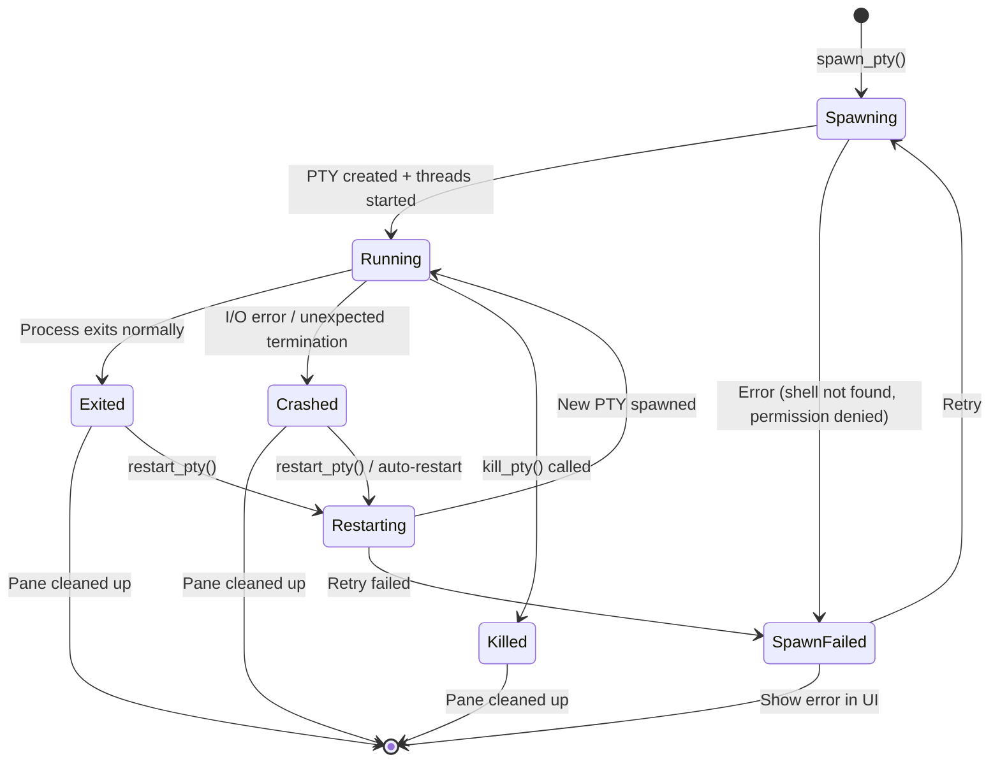
```mermaid
stateDiagram-v2
    [*] --> Spawning: spawn_pty()

    Spawning --> Running: PTY created + threads started
    Spawning --> SpawnFailed: Error (shell not found, permission denied)

    Running --> Exited: Process exits normally
    Running --> Crashed: I/O error / unexpected termination
    Running --> Killed: kill_pty() called

    Exited --> [*]: Pane cleaned up
    Exited --> Restarting: restart_pty()

    Crashed --> [*]: Pane cleaned up
    Crashed --> Restarting: restart_pty() / auto-restart

    Killed --> [*]: Pane cleaned up

    SpawnFailed --> [*]: Show error in UI
    SpawnFailed --> Spawning: Retry

    Restarting --> Running: New PTY spawned
    Restarting --> SpawnFailed: Retry failed
```

### 5.3 State Machine: Workspace Lifecycle

```mermaid
stateDiagram-v2
    [*] --> Created: create_workspace()

    Created --> Active: switch_workspace() / first workspace
    Created --> Inactive: Workspace created but not switched to

    Active --> Inactive: User switches to another workspace
    Inactive --> Active: switch_workspace()

    Active --> Detached: detach_to_window() (V1)
    Inactive --> Detached: detach_to_window() (V1)
    Detached --> Active: attach_to_window() (V1)

    Active --> Closing: User clicks close
    Inactive --> Closing: User clicks close

    Closing --> ConfirmClose: Has active processes
    Closing --> Closed: No active processes
    ConfirmClose --> Closed: User confirms
    ConfirmClose --> Active: User cancels

    Closed --> RecentlyClosed: Saved to undo buffer
    RecentlyClosed --> Created: undo_close_workspace()
    RecentlyClosed --> [*]: Buffer limit exceeded / app restart
    Closed --> [*]: Force close (no undo)
```

### 5.4 State Machine: Autosave

```mermaid
stateDiagram-v2
    [*] --> Idle: App started

    Idle --> DirtyPending: State changed (any mutation)
    DirtyPending --> DirtyPending: More changes within debounce window
    DirtyPending --> Diffing: Timer fires (5s)

    Diffing --> Writing: Diff found — changes to persist
    Diffing --> Idle: No diff — skip write

    Writing --> Idle: Write success
    Writing --> RetryPending: Write failed

    RetryPending --> Writing: Retry after 1s
    RetryPending --> ErrorState: 3 consecutive failures

    ErrorState --> Writing: Manual force_save()
    ErrorState --> Idle: App restart
```

### 5.5 Data Flow: App Startup Sequence

```mermaid
sequenceDiagram
    participant OS as Windows OS
    participant App as Tauri App
    participant SM as State Manager
    participant CM as Config Manager
    participant WM as Workspace Manager
    participant PM as PTY Manager
    participant FE as Frontend

    OS->>App: Launch executable
    App->>SM: acquire_lock()
    SM->>SM: Check lockfile exists?

    alt Lockfile exists (dirty shutdown)
        SM->>SM: is_dirty_shutdown = true
    else No lockfile (clean start)
        SM->>SM: is_dirty_shutdown = false
    end

    SM->>SM: Create new lockfile
    App->>CM: load()
    CM->>CM: Read config.json → AppConfig
    App->>SM: load_snapshot()
    SM->>SM: Read state.db → StateSnapshot

    App->>WM: Initialize from snapshot
    WM->>WM: Rebuild workspace list

    App->>FE: Webview created
    FE->>App: invoke("get_initial_state")
    App->>FE: return InitialState

    alt is_dirty_shutdown == true
        FE->>FE: Show recovery banner
        FE->>App: User clicks [Restore Layout]
        App->>PM: Spawn PTYs for restored panes
    else Clean start + restore_session == true
        App->>PM: Spawn PTYs for last session panes
    else Clean start + restore_session == false
        App->>WM: Create default workspace
        App->>PM: Spawn 1 PTY
    end

    PM->>PM: ConPTY instances created
    PM->>FE: PTY output events start streaming
    FE->>FE: xterm.js instances render

    App->>App: Start autosave engine
    App->>App: Start process monitor
```

---

## 6. Desain Keamanan

### 6.1 Tauri Security Model

Tauri 2.x menggunakan **permission-based security model**. Setiap plugin dan command harus di-declare secara eksplisit.

#### 6.1.1 Capability Configuration (`capabilities/main.json`)

```json
{
  "identifier": "main-capability",
  "description": "Capability for the main app window",
  "windows": ["main", "workspace-*"],
  "permissions": [
    "core:default",
    "core:window:allow-create",
    "core:window:allow-close",
    "core:window:allow-set-title",
    "core:window:allow-set-position",
    "core:window:allow-set-size",
    "core:window:allow-set-focus",
    "core:window:allow-show",
    "core:window:allow-hide",
    "core:event:default",
    "core:event:allow-listen",
    "core:event:allow-emit",
    "sql:default",
    "sql:allow-execute",
    "sql:allow-select",
    "shell:allow-spawn",
    "global-shortcut:default",
    {
      "identifier": "fs:allow-read",
      "allow": [
        { "path": "$APPDATA/Nonaterm/**" },
        { "path": "$HOME/**" }
      ]
    },
    {
      "identifier": "fs:allow-write",
      "allow": [
        { "path": "$APPDATA/Nonaterm/**" }
      ]
    }
  ]
}
```

#### 6.1.2 Content Security Policy

```json
{
  "csp": "default-src 'self'; script-src 'self'; style-src 'self' 'unsafe-inline'; img-src 'self' data:; font-src 'self' data:; connect-src ipc: http://ipc.localhost"
}
```

### 6.2 Input Validation & Sanitization

| Input Point                    | Validasi                                                               |
| ------------------------------ | ---------------------------------------------------------------------- |
| **Workspace name**             | Max 64 chars, strip HTML tags, trim whitespace                         |
| **Color value**                | Regex validate hex color `^#[0-9a-fA-F]{6}$`                          |
| **Shell path**                 | Whitelist dari detected shells + validate file exists + is executable   |
| **CWD path**                   | Validate path exists + is directory + user has access                   |
| **Startup command**            | Tidak disanitasi (passed raw ke PTY — ini expected behavior)            |
| **PTY write data**             | Raw passthrough — terminal emulator handles escape sequences           |
| **Config JSON import**         | Schema validation + version check sebelum apply                        |
| **Template JSON import**       | Schema validation + path sanitization                                  |

> Status implementasi sekarang: import/export config workspace sudah aktif pada lane MVP baseline dengan payload JSON versioned dan validasi parse dasar sebelum apply ke persistence layer.

> [!WARNING]
> **Startup command tidak disanitasi** karena tujuannya memang menjalankan command arbitrary di shell user. Ini bukan vulnerability — ini fitur. Namun, di UI harus jelas bahwa startup command akan dieksekusi saat workspace dibuka.

### 6.3 PTY Security Boundaries

```mermaid
graph TB
    subgraph "App Process (Tauri)"
        Backend["Rust Backend<br/>(Admin-level)"]
    end

    subgraph "PTY Process (User-level)"
        Shell1["pwsh.exe"]
        Shell2["cmd.exe"]
        Shell3["wsl.exe"]
    end

    subgraph "Webview (Sandboxed)"
        FE["React Frontend"]
    end

    Backend -->|"ConPTY API"| Shell1
    Backend -->|"ConPTY API"| Shell2
    Backend -->|"ConPTY API"| Shell3
    FE -->|"IPC (Tauri commands only)"| Backend

    style FE fill:#f0f0f0,stroke:#999
    style Shell1 fill:#ffe0e0,stroke:#c00
    style Shell2 fill:#ffe0e0,stroke:#c00
    style Shell3 fill:#ffe0e0,stroke:#c00
```

**Prinsip keamanan:**
- Frontend **tidak pernah** langsung berkomunikasi dengan PTY — selalu melalui Tauri IPC
- PTY processes berjalan dengan privilege level user yang menjalankan Nonaterm
- Webview di-sandbox oleh Tauri/WebView2 — tidak bisa mengakses filesystem langsung
- Semua file operations hanya ke `%APPDATA%/Nonaterm/` (scoped filesystem access)

### 6.4 Data at Rest

| Data                     | Lokasi                          | Proteksi                                          |
| ------------------------ | ------------------------------- | ------------------------------------------------- |
| Config (preferences)     | `%APPDATA%/Nonaterm/config.json`  | OS-level file permissions (user-only)             |
| State (workspaces)       | `%APPDATA%/Nonaterm/state.db`     | SQLite WAL mode + OS permissions                  |
| Scrollback snapshots     | In SQLite BLOB                  | Compressed (zstd), no encryption — user data      |
| Templates                | `%APPDATA%/Nonaterm/templates/`   | OS permissions, user-editable by design            |

> [!NOTE]
> Tidak ada encryption untuk data at rest karena semua data adalah milik user di mesin lokal. Terminal scrollback dan config tidak mengandung credentials yang perlu di-encrypt melebihi OS-level file protection.

### 6.5 Update & Release Surface

- Channel update saat ini ditargetkan ke GitHub Releases melalui updater manifest `latest.json`
- Release build direncanakan via GitHub Actions untuk menghasilkan artifact Windows + manifest updater
- Signing key updater harus disediakan via secret CI sebelum public release pertama

---

## 7. Strategi Error Handling

### 7.1 Error Taxonomy

```mermaid
graph TB
    Errors["All Errors"]

    Errors --> Recoverable["Recoverable"]
    Errors --> Fatal["Fatal"]

    Recoverable --> PtyErr["PTY Errors"]
    Recoverable --> StateErr["State Errors"]
    Recoverable --> ConfigErr["Config Errors"]
    Recoverable --> UIErr["UI Errors"]

    Fatal --> DBCorrupt["DB Corruption"]
    Fatal --> WebviewCrash["Webview Crash"]
    Fatal --> OOM["Out of Memory"]

    PtyErr --> SpawnFail["Shell spawn failed"]
    PtyErr --> IOErr["I/O read/write error"]
    PtyErr --> ExitNonZero["Process exit code ≠ 0"]

    StateErr --> WriteFail["Autosave write failed"]
    StateErr --> LockConflict["Lockfile conflict"]
    StateErr --> SchemaErr["Schema migration error"]

    ConfigErr --> ParseErr["JSON parse error"]
    ConfigErr --> InvalidVal["Invalid config value"]

    UIErr --> WebGLFail["WebGL not available"]
    UIErr --> FitErr["Terminal fit error"]
```

### 7.2 Error Handling per Komponen

#### 7.2.1 PTY Errors

| Error                      | Handling                                                                | User-Facing                                              |
| -------------------------- | ----------------------------------------------------------------------- | -------------------------------------------------------- |
| Shell not found            | Log error, return structured error ke frontend                          | "Shell 'X' tidak ditemukan. [Pilih Shell Lain]"          |
| Shell spawn failed         | Retry 1x dengan delay 500ms, jika gagal return error                    | "Gagal membuka terminal. [Coba Lagi] [Lihat Log]"       |
| PTY I/O read error         | Close PTY gracefully, emit `pty-error` event                            | Pane menampilkan exit status + "[Restart Shell]" button  |
| PTY I/O write error        | Buffer input, retry 1x, jika gagal emit error                           | Toast: "Input gagal dikirim ke terminal"                 |
| Process exit code ≠ 0      | Emit `pty-exit` event, keep pane visible                                | Pane menampilkan exit code + "[Restart]" button          |
| ConPTY API failure         | Fallback: try `cmd.exe` if `pwsh.exe` fails                            | "PTY error. Menggunakan cmd.exe sebagai fallback."       |

**Auto-restart logic:**
```rust
// Pseudocode
async fn handle_pty_exit(pane_id: PaneId, exit_code: i32, config: &AppConfig) {
    if config.terminal.auto_restart_shell && exit_code != 0 {
        // Wait 1s before restart untuk menghindari rapid crash loop
        tokio::time::sleep(Duration::from_secs(1)).await;

        // Max 3 auto-restarts dalam 30 detik
        if restart_count_in_window(pane_id, Duration::from_secs(30)) < 3 {
            restart_pty(pane_id).await;
        } else {
            // Stop auto-restarting — kemungkinan persistent error
            emit_event("pty-error", "Shell keeps crashing. Auto-restart disabled.");
        }
    }
}
```

#### 7.2.2 State / Persistence Errors

| Error                      | Handling                                                                | User-Facing                                              |
| -------------------------- | ----------------------------------------------------------------------- | -------------------------------------------------------- |
| SQLite write failed        | Retry 3x dengan exponential backoff (1s, 2s, 4s)                       | Toast: "Gagal menyimpan state. Mencoba ulang..."         |
| SQLite DB corrupted        | Backup corrupt file, create fresh DB, log error                         | Banner: "Database state rusak. State direset."           |
| Lockfile conflict          | Check if other instance running, if not → take over lock               | "Instance Nonaterm lain sedang berjalan. [Force Start]"    |
| Schema migration error     | Backup DB, attempt migration, fallback to fresh DB                      | "Database perlu diperbarui. [Update] [Reset]"            |
| Autosave disk full         | Stop autosave, warn user, continue running                              | Banner: "Disk penuh. Autosave dihentikan."               |

#### 7.2.3 Crash Recovery Flow

```mermaid
sequenceDiagram
    participant App as App Startup
    participant SM as State Manager
    participant UI as Frontend

    App->>SM: acquire_lock()
    SM->>SM: Lockfile exists? (dirty shutdown)

    alt Dirty Shutdown Detected
        SM->>SM: Load last snapshot from SQLite
        SM->>App: is_dirty_shutdown = true
        App->>UI: Show recovery banner
        UI->>UI: "[Pulihkan Layout] [Mulai Baru]"

        alt User clicks Restore
            UI->>App: restore_from_snapshot()
            App->>App: Recreate workspaces from snapshot
            App->>App: Spawn PTYs with saved cwd + startup_cmd
            App->>UI: Workspace restored (tanpa proses state)
            Note over UI: Banner: "Layout dipulihkan.<br/>Proses yang berjalan sebelumnya<br/>tidak dapat dilanjutkan."
        else User clicks Start Fresh
            App->>App: Create default workspace
            App->>App: Spawn 1 PTY
        end
    else Clean Start
        SM->>SM: Normal restore from last session
    end

    SM->>SM: Create fresh lockfile
```

#### 7.2.4 Config Errors

| Error                      | Handling                                                                |
| -------------------------- | ----------------------------------------------------------------------- |
| `config.json` parse error  | Backup file, load defaults, warn user                                   |
| Invalid value in config    | Replace invalid field with default, keep rest                           |
| Config file missing        | Create with defaults — ini expected behavior di first launch            |
| Config file permission err | Log warning, use in-memory defaults                                    |

### 7.3 Frontend Error Boundary

```typescript
// React Error Boundary strategy
// Level 1: Per-pane boundary — satu pane crash tidak menjatuhkan seluruh grid
// Level 2: Per-workspace boundary — workspace error tidak mempengaruhi sidebar/app shell
// Level 3: App-level boundary — last resort, show "restart app" screen

// WebGL fallback chain:
// 1. Try WebglAddon
// 2. If fails → CanvasAddon
// 3. If fails → Basic DOM renderer (xterm.js default)
// Log which renderer is used untuk diagnostics
```

---

## 8. Pertimbangan Performa

### 8.1 Performance Budget

| Metrik                              | Target       | Measurement Method                                |
| ----------------------------------- | ------------ | -------------------------------------------------- |
| Cold start (icon → siap pakai)      | < 800ms      | Timestamp: process start → first terminal ready    |
| Switch workspace                    | < 100ms      | Timestamp: shortcut press → grid fully rendered    |
| Spawn terminal baru                 | < 150ms      | Timestamp: action → prompt siap input              |
| Idle CPU (9 terminals idle)         | < 1%         | Windows Performance Monitor, 30s average           |
| Memori per terminal pane            | < 15MB       | Process memory / active pane count                 |
| Total memori (9 terminals + shell)  | < 200MB      | Total working set size                             |
| Frame rate UI saat resize           | ≥ 60fps      | Chrome DevTools performance timeline               |
| PTY output latency                  | < 32ms       | Batch interval + IPC overhead                      |

### 8.2 Rendering Pipeline

```mermaid
graph LR
    PTY["PTY Read Thread"]
    Batch["Batch Buffer<br/>(16ms / 32KB)"]
    IPC["Tauri Event<br/>Emit"]
    Listen["Frontend<br/>Event Listener"]
    XTerm["xterm.js<br/>write()"]
    WebGL["WebGL Addon<br/>Render"]
    GPU["GPU<br/>Frame Buffer"]

    PTY -->|"8KB chunks"| Batch
    Batch -->|"Batched payload"| IPC
    IPC -->|"Serialized"| Listen
    Listen -->|"Uint8Array"| XTerm
    XTerm -->|"Cell updates"| WebGL
    WebGL -->|"Draw calls"| GPU
```

**Optimisasi di setiap stage:**

| Stage           | Optimisasi                                                                                  |
| --------------- | ------------------------------------------------------------------------------------------- |
| PTY Read        | 8KB buffer — match OS pipe buffer size, minimize syscalls                                   |
| Batching        | 16ms interval (60fps cadence) + 32KB cap — prevent memory spike                             |
| IPC             | Binary payload (`Vec<u8>`), bukan string — hindari UTF-8 encoding overhead                  |
| Frontend Listen | Single event listener per pane, tidak re-register                                           |
| xterm.js write  | `write(Uint8Array)` — zero-copy dari IPC payload                                            |
| WebGL Render    | Batched cell updates — xterm.js internal optimization                                       |

### 8.3 Lazy Rendering Strategy

```mermaid
flowchart TD
    Check{"Pane visible<br/>in active workspace?"}
    Check -->|Yes| Active["Full rendering:<br/>xterm.js + WebGL active"]
    Check -->|No| Hidden["Minimal mode:<br/>buffer PTY output,<br/>don't render"]

    Hidden --> Switch{"User switches<br/>to this workspace"}
    Switch --> Replay["Replay buffered<br/>output to xterm.js"]
    Replay --> Active
```

**Detail implementasi:**
- Pane di workspace tidak aktif: PTY tetap berjalan, output di-buffer di backend (ring buffer, max 1MB per pane)
- Saat workspace di-switch ke: flush buffer ke xterm.js dalam satu batch
- xterm.js instance **tetap hidup** di memory (tidak destroy/recreate) untuk instant switch
- WebGL context hanya di-activate untuk visible panes

### 8.4 PTY I/O Batching dengan Backpressure

```mermaid
sequenceDiagram
    participant PT as PTY Read Thread
    participant BB as Batch Buffer
    participant FE as Frontend

    Note over PT, FE: Normal flow (output rendah)
    PT->>BB: Push 2KB
    Note over BB: Timer 16ms belum habis
    PT->>BB: Push 1KB
    Note over BB: Timer 16ms habis
    BB->>FE: Emit 3KB batch
    FE->>FE: xterm.write(3KB)

    Note over PT, FE: High throughput flow (npm install)
    PT->>BB: Push 8KB
    PT->>BB: Push 8KB
    PT->>BB: Push 8KB
    PT->>BB: Push 8KB
    Note over BB: Buffer hit 32KB cap
    BB->>FE: Emit 32KB batch
    FE->>FE: xterm.write(32KB)
    Note over FE: Takes ~5ms to process

    Note over PT, FE: Backpressure (output sangat deras)
    PT->>BB: Push 8KB (terus menerus)
    Note over BB: Frontend belum acknowledge batch sebelumnya
    BB->>BB: Drop oldest data (ring buffer behavior)
    Note over BB: Emit batch saat frontend ready
    BB->>FE: Emit latest 32KB
```

### 8.5 Memory Management

| Komponen                 | Budget      | Strategi                                                          |
| ------------------------ | ----------- | ----------------------------------------------------------------- |
| xterm.js instance        | ~8MB        | Scrollback default 5000 lines, trim otomatis                     |
| WebGL context            | ~3MB        | Shared atlas texture, satu per visible pane                       |
| PTY buffer (backend)     | ~2MB        | Ring buffer 1MB read + 1MB write, per terminal                   |
| Workspace metadata       | < 1KB       | Sangat kecil — string + numbers                                  |
| SQLite connection        | ~2MB        | Single connection, WAL mode                                      |
| React component tree     | ~10MB       | Virtualized lists untuk sidebar (jika > 20 workspaces)           |
| **Total per pane**       | **~13MB**   | Under 15MB budget ✓                                              |
| **Total 9 panes + app**  | **~137MB**  | Under 200MB budget ✓                                             |

### 8.6 Cold Start Optimization

```mermaid
gantt
    title Cold Start Budget: < 800ms
    dateFormat X
    axisFormat %L ms

    section Critical Path
    Process spawn + Rust init    : 0, 100
    Load config.json             : 100, 130
    Load state.db snapshot       : 130, 180
    Create Tauri window          : 180, 280
    Load webview + React bundle  : 280, 480
    Render initial workspace     : 480, 580
    Spawn first PTY              : 580, 680
    PTY ready (prompt visible)   : 680, 780

    section Deferred (after ready)
    Spawn remaining PTYs         : 780, 900
    Start autosave engine        : 800, 830
    Start process monitor        : 830, 860
    File watcher (V2)            : 860, 900
```

**Strategi key:**
1. **Spawn PTY pertama** di workspace aktif terlebih dahulu — user melihat terminal siap di < 780ms
2. **Defer** spawn PTY lainnya setelah first paint — lazy spawn dalam 100ms increments
3. **Precompile** React bundle (Vite build, no dev server overhead)
4. **SQLite WAL mode** — read tidak blocked oleh previous write
5. **Config loading** — single file read, < 30ms
6. **Minimize IPC roundtrips** — `get_initial_state` mengembalikan SEMUA data yang dibutuhkan untuk first render dalam satu call

### 8.7 Workspace Switch Optimization

Target: < 100ms dari shortcut press sampai grid fully rendered.

```mermaid
sequenceDiagram
    participant User as User
    participant FE as Frontend
    participant Store as Zustand Store
    participant XTerm as xterm.js Instances

    User->>FE: Alt+3 (keydown event)
    FE->>Store: setActive("ws_3")
    Note over Store: Synchronous state update<br/>~1ms
    Store->>FE: React re-render triggered
    Note over FE: CSS transition: opacity 0→1<br/>~50ms (perception trick)
    FE->>XTerm: Show pre-existing xterm instances<br/>(display: block)
    FE->>XTerm: fit() on visible panes
    Note over XTerm: Already initialized, just unhide<br/>~10ms

    Note over User,XTerm: Total: ~60ms perceived ✓
```

**Kunci: xterm.js instances TIDAK di-destroy saat switch workspace.** Mereka di-hide (`display: none`) dan di-show kembali. Ini menghilangkan overhead re-initialization yang bisa memakan 200-500ms per terminal.

---

## 9. Dependency & Versi

### 9.1 Rust Crates (Backend)

| Crate                      | Versi (Target) | Fungsi                                              |
| -------------------------- | --------------- | --------------------------------------------------- |
| `tauri`                    | ^2.5            | Framework aplikasi desktop                          |
| `tauri-build`              | ^2.5            | Build script untuk Tauri                            |
| `portable-pty`             | ^0.8            | PTY abstraction (ConPTY on Windows)                 |
| `tauri-plugin-sql`         | ^2.2            | SQLite integration via Tauri plugin                 |
| `tauri-plugin-global-shortcut` | ^2.2        | Global hotkey (quake-style show/hide)               |
| `tauri-plugin-fs`          | ^2.2            | Scoped filesystem access                            |
| `tauri-plugin-shell`       | ^2.2            | Shell command execution                             |
| `serde`                    | ^1.0            | Serialization/deserialization                       |
| `serde_json`               | ^1.0            | JSON serialization                                  |
| `uuid`                     | ^1.0            | UUID generation untuk IDs                           |
| `chrono`                   | ^0.4            | DateTime handling                                   |
| `notify`                   | ^7.0            | File system watching (V2 — Agent Edit Diff)         |
| `log`                      | ^0.4            | Logging facade                                      |
| `env_logger`               | ^0.11           | Logging implementation                              |
| `thiserror`                | ^2.0            | Error type derivation                               |
| `anyhow`                   | ^1.0            | Error handling untuk application code               |
| `parking_lot`              | ^0.12           | Faster Mutex/RwLock implementations                 |
| `crossbeam-channel`        | ^0.5            | Multi-producer channels untuk PTY I/O               |
| `zstd`                     | ^0.13           | Compression untuk scrollback snapshots              |

### 9.2 NPM Packages (Frontend)

| Package                    | Versi (Target) | Fungsi                                              |
| -------------------------- | --------------- | --------------------------------------------------- |
| `react`                    | ^19.0           | UI framework                                       |
| `react-dom`                | ^19.0           | DOM rendering                                      |
| `typescript`               | ^5.7            | Type safety                                        |
| `@tauri-apps/api`          | ^2.5            | Tauri frontend API (invoke, listen, emit)           |
| `@tauri-apps/plugin-sql`   | ^2.2            | SQL plugin frontend API                             |
| `xterm`                    | ^5.5            | Terminal emulator core                              |
| `@xterm/addon-webgl`       | ^0.18           | GPU-accelerated rendering                           |
| `@xterm/addon-fit`         | ^0.10           | Auto-fit terminal to container                      |
| `@xterm/addon-search`      | ^0.15           | Search scrollback (V1)                              |
| `@xterm/addon-web-links`   | ^0.11           | Clickable URLs in terminal output                   |
| `@xterm/addon-unicode11`   | ^0.8            | Unicode 11 width support                            |
| `@xterm/addon-canvas`      | ^0.7            | Canvas fallback renderer                            |
| `zustand`                  | ^5.0            | State management (lightweight, no boilerplate)      |
| `fuse.js`                  | ^7.0            | Fuzzy search (Command Palette)                      |
| `react-beautiful-dnd`      | ^13.1           | Drag-and-drop (sidebar reorder, pane rearrange)     |
| `@radix-ui/react-dialog`   | ^1.1            | Accessible dialog/modal primitives                  |
| `@radix-ui/react-popover`  | ^1.1            | Accessible popover (color picker, context menu)     |
| `@radix-ui/react-tooltip`  | ^1.1            | Accessible tooltips                                 |
| `clsx`                     | ^2.1            | Conditional className utility                       |
| `tailwindcss`              | ^4.0            | Utility-first CSS                                   |

### 9.3 Build Tools

| Tool                       | Versi (Target) | Fungsi                                              |
| -------------------------- | --------------- | --------------------------------------------------- |
| `vite`                     | ^6.0            | Frontend bundler (dev server + production build)    |
| `@vitejs/plugin-react`     | ^4.3            | React support untuk Vite                            |
| `eslint`                   | ^9.0            | Linting                                             |
| `prettier`                 | ^3.4            | Code formatting                                     |
| `vitest`                   | ^3.0            | Unit testing frontend                               |
| `@tauri-apps/cli`          | ^2.5            | Tauri CLI (dev, build, bundle)                      |
| `cargo-flamegraph`         | latest          | Performance profiling Rust                          |

### 9.4 Runtime Requirements

| Requirement                | Detail                                                                  |
| -------------------------- | ----------------------------------------------------------------------- |
| **OS**                     | Windows 10 version 1809+ (untuk ConPTY support)                         |
| **WebView2**               | Microsoft Edge WebView2 Runtime (auto-installed on Win 10/11)           |
| **GPU**                    | Optional — WebGL support untuk optimal rendering, fallback ke Canvas    |
| **Disk Space**             | ~50MB installer + ~10MB app data                                        |
| **RAM**                    | Minimum 4GB (recommended 8GB untuk 9 terminals)                         |

---

## 10. Glossary

| Term                        | Definisi                                                                                  |
| --------------------------- | ----------------------------------------------------------------------------------------- |
| **Attention Inbox**         | (V2) Panel terpusat yang menampilkan terminal yang menunggu input atau memiliki error      |
| **Autosave**                | Penyimpanan state otomatis secara berkala ke disk lokal                                    |
| **Backpressure**            | Mekanisme untuk memperlambat producer saat consumer tidak bisa mengikuti kecepatan data    |
| **Batching**                | Mengelompokkan beberapa operasi kecil menjadi satu operasi besar untuk efisiensi           |
| **Broadcast Input**         | (V2) Mengirim input yang sama ke beberapa terminal sekaligus                              |
| **Cold Start**              | Waktu dari klik icon sampai aplikasi siap digunakan                                       |
| **ConPTY**                  | Windows Console Pseudo Terminal — API Windows untuk membuat terminal emulator              |
| **CRUD**                    | Create, Read, Update, Delete — operasi dasar data                                         |
| **Debounce**                | Menunda eksekusi sampai tidak ada trigger baru dalam interval tertentu                     |
| **Diff-based**              | Hanya menyimpan perubahan, bukan seluruh state                                            |
| **Grid Layout**             | Tata letak terminal dalam grid (1×1, 1×2, 2×2, 3×2, 3×3)                                 |
| **IPC**                     | Inter-Process Communication — mekanisme komunikasi antara Rust backend dan webview         |
| **Lockfile**                | File penanda bahwa aplikasi sedang berjalan, digunakan untuk deteksi crash                 |
| **MVP**                     | Minimum Viable Product — versi pertama dengan fitur inti                                  |
| **Pane**                    | Satu slot terminal individual di dalam grid workspace                                     |
| **Passthrough Mode**        | Mode di mana semua keyboard input diteruskan ke PTY tanpa intercept                       |
| **PTY**                     | Pseudo-Terminal — interface virtual yang mengemulasi terminal hardware                     |
| **Ring Buffer**             | Buffer circular yang menulis ulang data lama saat penuh                                   |
| **Scrollback**              | Buffer histori output terminal yang bisa di-scroll ke atas                                |
| **Snapshot**                | Salinan lengkap state pada satu titik waktu                                               |
| **Token Meter**             | (V2) Penghitung estimasi token dan biaya API dari AI agent CLI                            |
| **Vibecoder**               | Target persona — developer yang banyak melakukan AI-assisted coding                       |
| **WAL**                     | Write-Ahead Logging — mode SQLite untuk concurrent read/write                             |
| **WebGL**                   | Web Graphics Library — API untuk GPU-accelerated rendering di browser/webview              |
| **Workspace**               | Unit organisasi yang mengelompokkan 1–9 terminal dengan identitas visual sendiri           |
| **Workspace Template**      | (V1) Konfigurasi workspace yang bisa disimpan dan digunakan ulang                          |
| **Worktree**                | Git worktree — direktori kerja terpisah yang terikat ke satu branch git                    |
| **xterm.js**                | Library JavaScript untuk terminal emulator di browser/webview                              |
| **Zustand**                 | Library state management ringan untuk React                                               |

---

> [!IMPORTANT]
> Dokumen ini adalah **living document**. Setiap perubahan arsitektural signifikan harus di-update di sini sebelum implementasi. Versi history dikelola via Git — setiap perubahan SDD harus menjadi commit terpisah dengan pesan yang jelas.

---

*Terakhir diperbarui: 18 Juni 2026*
*Penulis: Nonaterm Engineering Team*
