# Technical Design Document (TDD)

## Nonaterm — Terminal Workspace Manager untuk Vibecoder

| Field         | Value                              |
|---------------|------------------------------------|
| **Versi**     | 1.0                               |
| **Tanggal**   | 18 Juni 2026                       |
| **Status**    | Draft                              |
| **Platform**  | Windows 10/11 (x86_64)            |
| **Bahasa**    | Rust 1.82+ / TypeScript 5.x       |
| **Framework** | Tauri 2.x / React 19              |
| **Referensi** | [PRD v0.1](./prd.md)              |

---

## Daftar Isi

1. [Ringkasan Teknis](#1-ringkasan-teknis)
2. [Arsitektur Sistem Detail](#2-arsitektur-sistem-detail)
3. [Desain Backend (Rust)](#3-desain-backend-rust)
4. [Desain Frontend (React + TypeScript)](#4-desain-frontend-react--typescript)
5. [Desain IPC (Frontend ↔ Backend)](#5-desain-ipc-frontend--backend)
6. [Desain Database](#6-desain-database)
7. [Strategi Testing](#7-strategi-testing)
8. [Strategi Deployment & Build](#8-strategi-deployment--build)
9. [Monitoring & Observability](#9-monitoring--observability)
10. [Risiko Teknis & Mitigasi](#10-risiko-teknis--mitigasi)
11. [API Specification](#11-api-specification)

---

## 1. Ringkasan Teknis

### 1.1 Technology Stack Overview

| Layer           | Teknologi                       | Versi     | Justifikasi                                        |
|-----------------|---------------------------------|-----------|----------------------------------------------------|
| Runtime         | Rust (Tokio async runtime)      | 1.82+     | Memory safety tanpa GC, native performance         |
| App Framework   | Tauri 2.x                       | 2.x       | Lightweight, native WebView, Rust-first             |
| PTY             | `portable-pty`                  | 0.9+      | Cross-platform abstraction, ConPTY backend          |
| Frontend        | React 19 + TypeScript 5.x       | 19 / 5.x  | Ekosistem matang, concurrent rendering             |
| Terminal Render | xterm.js + WebGL addon          | 5.x       | GPU-accelerated, de-facto standard                 |
| State/Config    | SQLite (via `tauri-plugin-sql`)  | 3.46+     | ACID compliance, query flexibility                 |
| Config Files    | JSON di `%APPDATA%/Nonaterm/`     | —         | Human-readable, hot-reloadable                     |
| IPC             | Tauri Command + Event Channel   | —         | Built-in serialization, type-safe                  |
| Bundler         | Vite 6                          | 6.x       | HMR cepat, ESM-native                             |

### 1.2 Architecture Decision Records (ADR)

#### ADR-001: Tauri 2.x dipilih di atas Electron

| Aspek            | Tauri 2.x                         | Electron                              |
|------------------|------------------------------------|---------------------------------------|
| Binary size      | ~3–8 MB (system WebView)           | ~150+ MB (bundled Chromium)           |
| Memory footprint | ~30–60 MB idle                     | ~150–300 MB idle                      |
| Backend lang     | Rust (native, no GC)              | Node.js (V8 GC overhead)             |
| Security model   | Capability-based permissions       | `nodeIntegration` on/off              |
| Cold start       | < 800ms (target PRD)              | 2–5 detik tipikal                     |
| WebView          | System-native (WebView2)          | Bundled Chromium                      |

**Keputusan:** Tauri dipilih karena PRD mensyaratkan footprint memori < 200MB untuk 9 terminal aktif, cold start < 800ms, dan performa native Rust. Electron tidak mungkin memenuhi budget memori tanpa kompromi signifikan.

**Risiko:** Ketergantungan pada WebView2 system — mitigasi: WebView2 sudah built-in di Windows 10 21H2+ dan Windows 11.

#### ADR-002: React 19 dipilih di atas Svelte 5

| Aspek              | React 19                            | Svelte 5                            |
|--------------------|-------------------------------------|-------------------------------------|
| Ekosistem          | Sangat besar, battle-tested         | Lebih kecil, growing                |
| xterm.js binding   | `@nicktomlin/xterm-for-react`, langsung | Perlu custom wrapper                |
| Concurrent mode    | React Transitions untuk heavy re-render | Tidak ada padanan langsung         |
| State management   | Zustand/Jotai/React Context mature  | Runes (baru, API masih evolving)    |
| Developer pool     | Besar                               | Lebih kecil                         |

**Keputusan:** React dipilih karena ekosistem xterm.js binding yang lebih matang, React 19 Concurrent Rendering untuk mengatasi heavy re-render grid 9 terminal, dan developer familiarity.

**Trade-off:** Bundle size lebih besar (~40KB gzipped untuk React vs ~3KB Svelte), tapi tidak material karena assets lokal (bukan network-loaded).

#### ADR-003: SQLite dipilih di atas Pure JSON Files

| Aspek               | SQLite                              | Pure JSON                            |
|----------------------|-------------------------------------|--------------------------------------|
| Query capability     | Full SQL — JOIN, INDEX, aggregate   | Manual parsing, full file read       |
| Concurrent writes    | WAL mode — reader/writer parallel   | File lock atau corruption risk       |
| Crash safety         | ACID transactions                   | Partial write = corrupt file         |
| Data growth          | Efisien untuk ribuan workspace/pane | Lambat saat file membesar            |
| Migration            | Versioned schema migration          | Manual field check                   |
| Tooling              | DB Browser, `sqlite3` CLI           | Text editor saja                     |

**Keputusan:** SQLite memberikan crash safety (ACID) yang krusial untuk autosave mechanism (PRD Section 19), query flexibility untuk fitur search history lintas workspace, dan WAL mode untuk concurrent read/write tanpa blocking UI.

**Catatan:** JSON tetap dipakai untuk user-facing config file (`config.json`) yang perlu human-editable dan hot-reloadable.

#### ADR-004: `portable-pty` dipilih di atas Direct ConPTY FFI

| Aspek                | `portable-pty`                     | Direct ConPTY FFI                    |
|----------------------|------------------------------------|--------------------------------------|
| API ergonomics       | High-level Rust traits              | Raw Win32 API, `unsafe` blocks       |
| Maintenance burden   | Maintained oleh WezTerm team        | Semua tanggung jawab kita            |
| Cross-platform ready | Ya (Unix PTY + ConPTY)              | Windows only                         |
| Edge case handling   | Tested di WezTerm production        | Harus discover sendiri               |
| ConPTY features      | Standard ConPTY, no passthrough     | Full control termasuk passthrough    |

**Keputusan:** `portable-pty` dipilih untuk mengurangi maintenance burden dan memanfaatkan battle-tested code dari WezTerm. Scope MVP hanya Windows, tetapi abstraction layer memudahkan cross-platform expansion di masa depan.

**Risiko:** Jika butuh `PSEUDOCONSOLE_PASSTHROUGH_MODE`, perlu fork atau patch. Mitigasi: evaluasi di V2 berdasarkan user feedback.

#### ADR-005: xterm.js + WebGL dipilih di atas Alternatif Renderer

| Aspek             | xterm.js + WebGL                  | Alacritty-style (GPU native)      | DOM-based renderer             |
|-------------------|-----------------------------------|------------------------------------|-------------------------------|
| Performance       | ~900% lebih cepat dari DOM        | Lebih cepat (native GPU)          | Lambat untuk output deras     |
| Integration       | Native di WebView (Tauri)         | Perlu separate window/process     | Mudah tapi lambat             |
| Ecosystem         | Addon ecosystem besar             | Tidak ada                         | Terbatas                      |
| Maintenance       | Aktif (dipakai VS Code, Warp)     | Custom = full ownership           | N/A                           |
| Accessibility     | Screen reader support via DOM tree | Tidak ada                         | Native                        |

**Keputusan:** xterm.js + WebGL addon karena berjalan native di WebView2 (Tauri), GPU-accelerated rendering, sudah proven di VS Code terminal dan Warp, addon ecosystem (search, fit, serialize, unicode11, ligatures), dan active maintenance.

**Trade-off:** Tetap di dalam WebView berarti tidak se-cepat native GPU renderer (Alacritty), tapi good enough untuk 9 pane dengan batching strategy yang benar.

---

## 2. Arsitektur Sistem Detail

### 2.1 C4 Model — Level 1: System Context Diagram

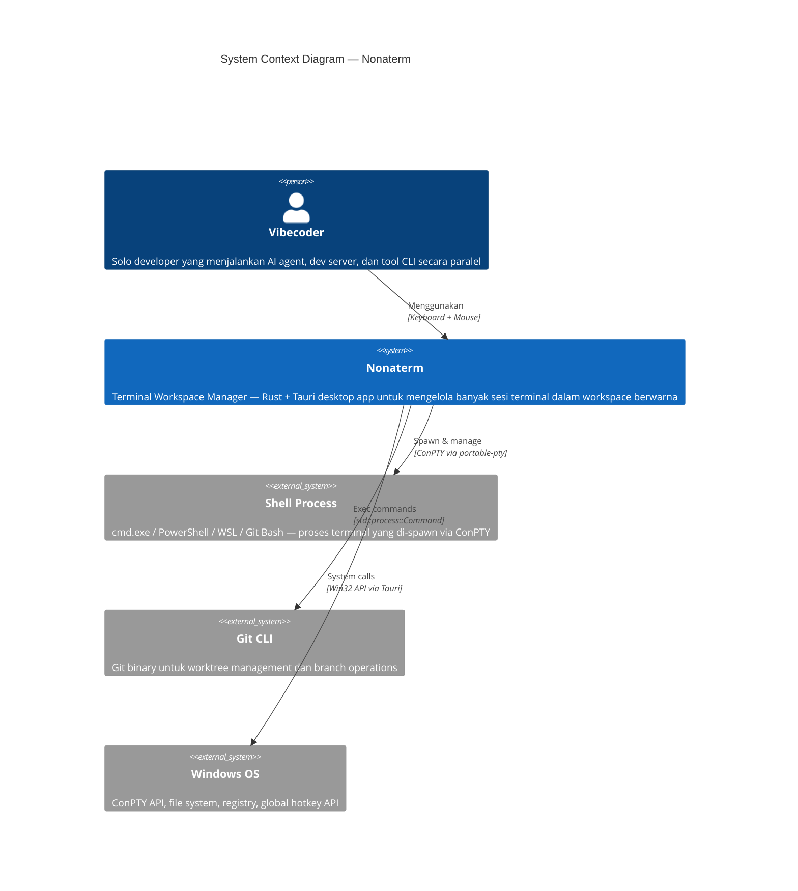
```mermaid
C4Context
    title System Context Diagram — Nonaterm

    Person(vibecoder, "Vibecoder", "Solo developer yang menjalankan AI agent, dev server, dan tool CLI secara paralel")

    System(Nonaterm, "Nonaterm", "Terminal Workspace Manager — Rust + Tauri desktop app untuk mengelola banyak sesi terminal dalam workspace berwarna")

    System_Ext(shell, "Shell Process", "cmd.exe / PowerShell / WSL / Git Bash — proses terminal yang di-spawn via ConPTY")
    System_Ext(git, "Git CLI", "Git binary untuk worktree management dan branch operations")
    System_Ext(os, "Windows OS", "ConPTY API, file system, registry, global hotkey API")

    Rel(vibecoder, Nonaterm, "Menggunakan", "Keyboard + Mouse")
    Rel(Nonaterm, shell, "Spawn & manage", "ConPTY via portable-pty")
    Rel(Nonaterm, git, "Exec commands", "std::process::Command")
    Rel(Nonaterm, os, "System calls", "Win32 API via Tauri")
```

### 2.2 C4 Model — Level 2: Container Diagram

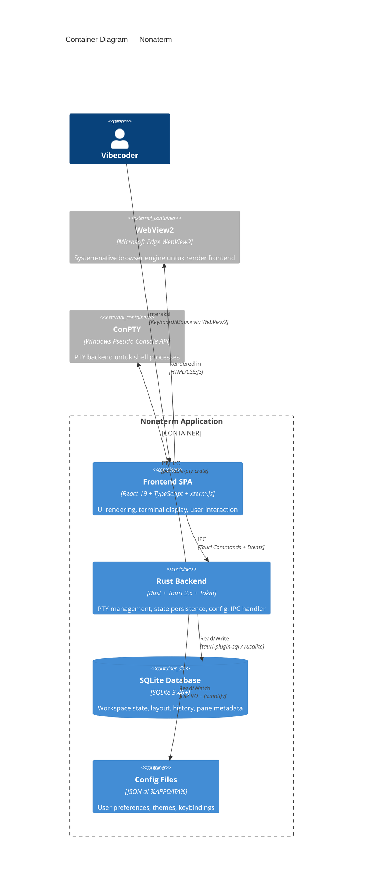
```mermaid
C4Container
    title Container Diagram — Nonaterm

    Person(user, "Vibecoder")

    Container_Boundary(app, "Nonaterm Application") {
        Container(frontend, "Frontend SPA", "React 19 + TypeScript + xterm.js", "UI rendering, terminal display, user interaction")
        Container(backend, "Rust Backend", "Rust + Tauri 2.x + Tokio", "PTY management, state persistence, config, IPC handler")
        ContainerDb(sqlite, "SQLite Database", "SQLite 3.46+", "Workspace state, layout, history, pane metadata")
        Container(config, "Config Files", "JSON di %APPDATA%", "User preferences, themes, keybindings")
    }

    Container_Ext(webview, "WebView2", "Microsoft Edge WebView2", "System-native browser engine untuk render frontend")
    Container_Ext(conpty, "ConPTY", "Windows Pseudo Console API", "PTY backend untuk shell processes")

    Rel(user, frontend, "Interaksi", "Keyboard/Mouse via WebView2")
    Rel(frontend, backend, "IPC", "Tauri Commands + Events")
    Rel(backend, sqlite, "Read/Write", "tauri-plugin-sql / rusqlite")
    Rel(backend, config, "Read/Watch", "File I/O + fs::notify")
    Rel(backend, conpty, "PTY I/O", "portable-pty crate")
    Rel(frontend, webview, "Rendered in", "HTML/CSS/JS")
```

### 2.3 C4 Model — Level 3: Component Diagram (Backend)

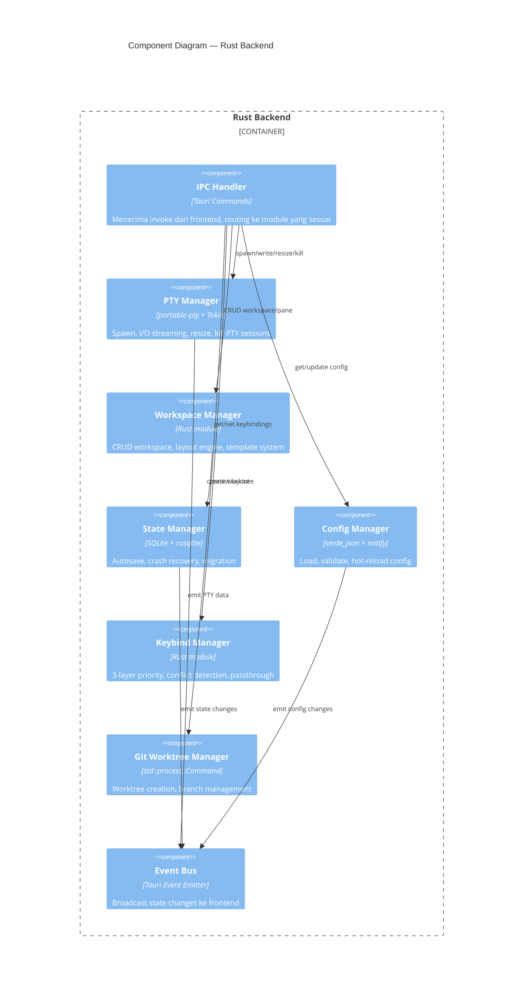
```mermaid
C4Component
    title Component Diagram — Rust Backend

    Container_Boundary(backend, "Rust Backend") {
        Component(ipc, "IPC Handler", "Tauri Commands", "Menerima invoke dari frontend, routing ke module yang sesuai")
        Component(pty_mgr, "PTY Manager", "portable-pty + Tokio", "Spawn, I/O streaming, resize, kill PTY sessions")
        Component(ws_mgr, "Workspace Manager", "Rust module", "CRUD workspace, layout engine, template system")
        Component(state_mgr, "State Manager", "SQLite + rusqlite", "Autosave, crash recovery, migration")
        Component(config_mgr, "Config Manager", "serde_json + notify", "Load, validate, hot-reload config")
        Component(keybind_mgr, "Keybind Manager", "Rust module", "3-layer priority, conflict detection, passthrough")
        Component(git_mgr, "Git Worktree Manager", "std::process::Command", "Worktree creation, branch management")
        Component(event_bus, "Event Bus", "Tauri Event Emitter", "Broadcast state changes ke frontend")
    }

    Rel(ipc, pty_mgr, "spawn/write/resize/kill")
    Rel(ipc, ws_mgr, "CRUD workspace/pane")
    Rel(ipc, config_mgr, "get/update config")
    Rel(ipc, keybind_mgr, "get/set keybindings")
    Rel(ipc, git_mgr, "create worktree")
    Rel(ws_mgr, state_mgr, "persist layout")
    Rel(pty_mgr, event_bus, "emit PTY data")
    Rel(state_mgr, event_bus, "emit state changes")
    Rel(config_mgr, event_bus, "emit config changes")
```

### 2.4 Process Architecture — Thread Model

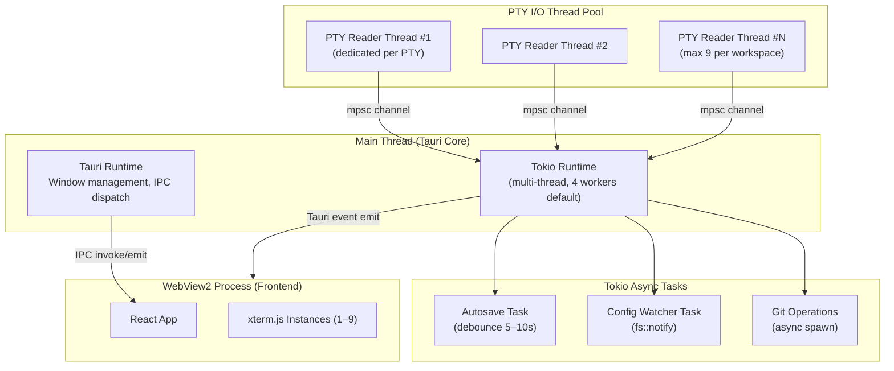
```mermaid
flowchart TB
    subgraph main_thread["Main Thread (Tauri Core)"]
        tauri_rt["Tauri Runtime<br/>Window management, IPC dispatch"]
        tokio_rt["Tokio Runtime<br/>(multi-thread, 4 workers default)"]
    end

    subgraph pty_threads["PTY I/O Thread Pool"]
        pt1["PTY Reader Thread #1<br/>(dedicated per PTY)"]
        pt2["PTY Reader Thread #2"]
        ptn["PTY Reader Thread #N<br/>(max 9 per workspace)"]
    end

    subgraph async_tasks["Tokio Async Tasks"]
        autosave["Autosave Task<br/>(debounce 5–10s)"]
        config_watch["Config Watcher Task<br/>(fs::notify)"]
        git_ops["Git Operations<br/>(async spawn)"]
    end

    subgraph webview_process["WebView2 Process (Frontend)"]
        react["React App"]
        xterm["xterm.js Instances (1–9)"]
    end

    tauri_rt -->|"IPC invoke/emit"| react
    tokio_rt --> autosave
    tokio_rt --> config_watch
    tokio_rt --> git_ops
    pt1 -->|"mpsc channel"| tokio_rt
    pt2 -->|"mpsc channel"| tokio_rt
    ptn -->|"mpsc channel"| tokio_rt
    tokio_rt -->|"Tauri event emit"| webview_process
```

**Desain Thread:**

| Thread/Task             | Tipe            | Jumlah        | Tanggung Jawab                                    |
|------------------------|-----------------|---------------|---------------------------------------------------|
| Main Thread            | OS thread       | 1             | Tauri core, window management                     |
| Tokio Workers          | OS thread       | 4 (default)   | Async task execution, IPC handling                |
| PTY Reader             | OS thread       | 1 per PTY     | Blocking read dari PTY master fd                  |
| PTY Writer             | Shared via Mutex| Per PTY       | Non-blocking write ke PTY master                  |
| Autosave Task          | Tokio task      | 1             | Debounced state persistence                       |
| Config Watcher         | Tokio task      | 1             | File system notification handling                 |

### 2.5 Memory Architecture

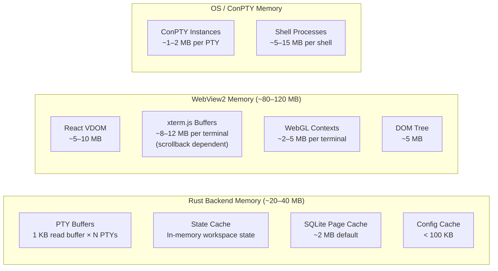
```mermaid
flowchart LR
    subgraph rust_backend["Rust Backend Memory (~20–40 MB)"]
        pty_bufs["PTY Buffers<br/>1 KB read buffer × N PTYs"]
        state_cache["State Cache<br/>In-memory workspace state"]
        sqlite_cache["SQLite Page Cache<br/>~2 MB default"]
        config_cache["Config Cache<br/>< 100 KB"]
    end

    subgraph webview_mem["WebView2 Memory (~80–120 MB)"]
        react_vdom["React VDOM<br/>~5–10 MB"]
        xterm_bufs["xterm.js Buffers<br/>~8–12 MB per terminal<br/>(scrollback dependent)"]
        webgl_ctx["WebGL Contexts<br/>~2–5 MB per terminal"]
        dom["DOM Tree<br/>~5 MB"]
    end

    subgraph os_mem["OS / ConPTY Memory"]
        conpty_inst["ConPTY Instances<br/>~1–2 MB per PTY"]
        shell_proc["Shell Processes<br/>~5–15 MB per shell"]
    end
```

**Budget Memori (9 terminal aktif):**

| Komponen                     | Estimasi per Unit | × 9 Terminal | Total        |
|------------------------------|-------------------|--------------|--------------|
| Rust backend (shared)        | —                 | —            | ~30 MB       |
| xterm.js buffer (1000 lines) | ~8 MB             | 9            | ~72 MB       |
| WebGL context                | ~3 MB             | 9            | ~27 MB       |
| ConPTY instance              | ~1.5 MB           | 9            | ~13.5 MB     |
| Shell process (pwsh)         | ~12 MB            | 9            | ~108 MB      |
| **TOTAL (tanpa shell)**      |                   |              | **~142 MB**  |
| **TOTAL (dengan shell)**     |                   |              | **~250 MB**  |

> [!WARNING]
> Total 250MB termasuk shell process yang bukan milik Nonaterm. Target PRD 200MB adalah untuk overhead Nonaterm sendiri (~142 MB), bukan total system memory termasuk shell child processes. Ini perlu dikomunikasikan dengan jelas.

**Strategi Optimasi Memori:**
1. **Lazy-load xterm.js** — Pane di workspace non-aktif tidak di-instantiate sampai workspace di-switch
2. **Scrollback limit** — Default 1000 baris, configurable. Setiap 1000 baris tambahan = ~8 MB per pane
3. **WebGL context sharing** — Investigasi apakah xterm.js mendukung shared WebGL context (saat ini tidak — masing-masing pane punya context sendiri)
4. **PTY buffer recycling** — Read buffer 1 KB di-reuse, bukan allocate baru per read

### 2.6 IPC Flow — High-Level

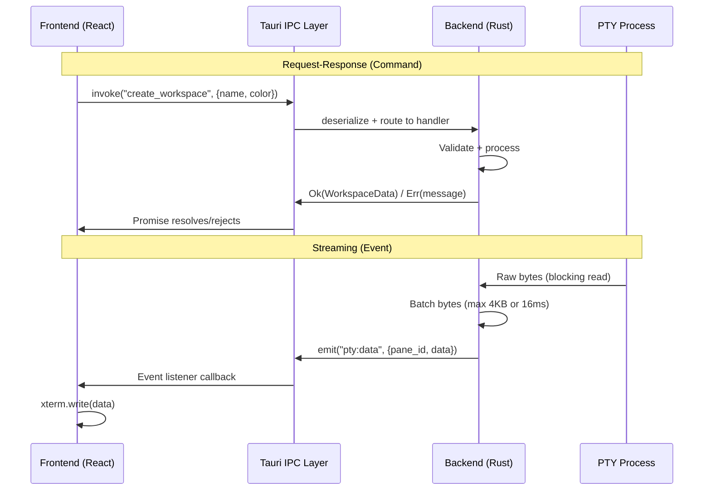
```mermaid
sequenceDiagram
    participant FE as Frontend (React)
    participant IPC as Tauri IPC Layer
    participant BE as Backend (Rust)
    participant PTY as PTY Process

    Note over FE,PTY: Request-Response (Command)
    FE->>IPC: invoke("create_workspace", {name, color})
    IPC->>BE: deserialize + route to handler
    BE->>BE: Validate + process
    BE->>IPC: Ok(WorkspaceData) / Err(message)
    IPC->>FE: Promise resolves/rejects

    Note over FE,PTY: Streaming (Event)
    PTY->>BE: Raw bytes (blocking read)
    BE->>BE: Batch bytes (max 4KB or 16ms)
    BE->>IPC: emit("pty:data", {pane_id, data})
    IPC->>FE: Event listener callback
    FE->>FE: xterm.write(data)
```

---

## 3. Desain Backend (Rust)

### 3.1 Module Structure — File Tree

```
src-tauri/
├── Cargo.toml
├── tauri.conf.json
├── capabilities/
│   └── default.json                  # Tauri permission definitions
├── icons/
├── src/
│   ├── main.rs                       # Entry point, Tauri builder setup
│   ├── lib.rs                        # Module declarations, app builder
│   ├── error.rs                      # Unified error types (thiserror)
│   ├── commands/                     # Tauri #[command] handlers
│   │   ├── mod.rs
│   │   ├── pty_commands.rs           # spawn, write, resize, kill
│   │   ├── workspace_commands.rs     # CRUD workspace
│   │   ├── pane_commands.rs          # CRUD pane within workspace
│   │   ├── config_commands.rs        # get/set config
│   │   ├── keybind_commands.rs       # get/set keybindings
│   │   └── git_commands.rs           # worktree operations
│   ├── pty/                          # PTY Manager Module
│   │   ├── mod.rs
│   │   ├── manager.rs               # PtyManager struct, spawn/kill
│   │   ├── session.rs               # PtySession — per-PTY state
│   │   ├── reader.rs                # Dedicated reader thread logic
│   │   ├── writer.rs                # Write handle wrapper
│   │   ├── backpressure.rs          # Flow control mechanism
│   │   └── resize.rs                # Resize handling
│   ├── workspace/                   # Workspace Manager Module
│   │   ├── mod.rs
│   │   ├── manager.rs              # WorkspaceManager struct
│   │   ├── layout.rs               # Grid layout engine
│   │   ├── template.rs             # Template CRUD & apply
│   │   └── types.rs                # Workspace, Pane structs
│   ├── state/                       # State Manager Module
│   │   ├── mod.rs
│   │   ├── manager.rs              # StateManager — autosave, recovery
│   │   ├── autosave.rs             # Debounce + diff logic
│   │   ├── lockfile.rs             # Crash detection via lockfile
│   │   ├── migration.rs            # SQLite schema migrations
│   │   └── schema.rs               # DDL constants│   ├── config/                      # Config Manager Module
│   │   ├── mod.rs
│   │   ├── manager.rs              # ConfigManager — load, watch, reload
│   │   ├── types.rs                # Config struct definitions
│   │   ├── defaults.rs             # Default values
│   │   └── validation.rs           # Config validation rules
│   ├── keybind/                     # Keybind Manager Module
│   │   ├── mod.rs
│   │   ├── manager.rs             # KeybindManager
│   │   ├── priority.rs            # 3-layer priority resolution
│   │   ├── passthrough.rs         # Passthrough mode logic
│   │   └── conflict.rs            # Conflict detection
│   └── git/                        # Git Worktree Module
│       ├── mod.rs
│       ├── manager.rs             # GitManager
│       ├── worktree.rs            # Worktree create/delete/list
│       └── branch.rs             # Branch operations
├── migrations/                     # SQL migration files
│   ├── 001_initial_schema.sql
│   ├── 002_add_templates.sql
│   └── 003_add_keybinds.sql
└── tests/
    ├── pty_tests.rs
    ├── workspace_tests.rs
    └── state_tests.rs
```

### 3.2 PTY Manager Module

#### 3.2.1 Core Struct Design

```rust
// src/pty/manager.rs
use std::collections::HashMap;
use std::sync::Arc;
use tokio::sync::{Mutex, RwLock, mpsc};
use portable_pty::{PtySize, native_pty_system, PtySystem};
use uuid::Uuid;

pub struct PtyManager {
    /// Map dari pane_id ke PtySession
    sessions: Arc<RwLock<HashMap<String, Arc<PtySession>>>>,
    /// Tauri app handle untuk emit events
    app_handle: tauri::AppHandle,
    /// Konfigurasi global PTY
    config: Arc<RwLock<PtyConfig>>,
}

pub struct PtyConfig {
    pub default_shell: String,        // "pwsh" | "cmd" | "wsl" | "git-bash"
    pub default_rows: u16,            // 24
    pub default_cols: u16,            // 80
    pub scrollback_lines: u32,        // 1000
    pub read_buffer_size: usize,      // 4096 bytes
    pub batch_interval_ms: u64,       // 16ms (~60fps)
    pub max_batch_bytes: usize,       // 4096 bytes
}
```

#### 3.2.2 PtySession — Per-PTY State

```rust
// src/pty/session.rs
use std::sync::Arc;
use tokio::sync::{Mutex, mpsc, watch};
use portable_pty::{MasterPty, Child};

pub struct PtySession {
    pub id: String,
    pub pane_id: String,
    pub workspace_id: String,
    /// Shell yang di-spawn (pwsh, cmd, wsl, dll)
    pub shell: String,
    /// Current working directory
    pub cwd: Arc<Mutex<String>>,
    /// PTY master handle (write side)
    pub master_write: Arc<Mutex<Box<dyn std::io::Write + Send>>>,
    /// Child process handle
    pub child: Arc<Mutex<Box<dyn Child + Send>>>,
    /// PTY dimensions
    pub size: Arc<Mutex<PtySize>>,
    /// Status: Running, Exited(code), Killed
    pub status: Arc<watch::Sender<PtyStatus>>,
    /// Backpressure: apakah frontend sudah siap menerima data
    pub flow_control: Arc<FlowControl>,
    /// Channel untuk mengirim kill signal ke reader thread
    pub shutdown_tx: mpsc::Sender<()>,
}

#[derive(Clone, Debug, PartialEq)]
pub enum PtyStatus {
    Starting,
    Running,
    Exited(i32),     // exit code
    Killed,
    Error(String),
}
```

#### 3.2.3 ConPTY Initialization Flow

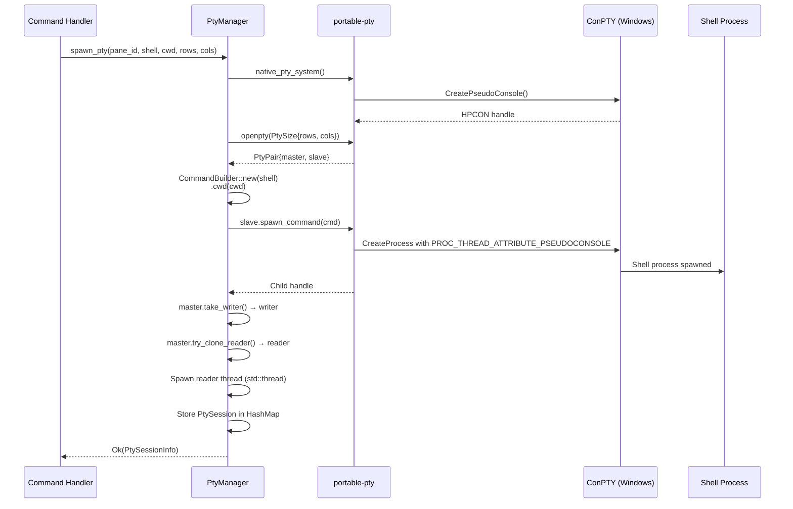
```mermaid
sequenceDiagram
    participant CMD as Command Handler
    participant PM as PtyManager
    participant PTY as portable-pty
    participant CP as ConPTY (Windows)
    participant SH as Shell Process

    CMD->>PM: spawn_pty(pane_id, shell, cwd, rows, cols)
    PM->>PTY: native_pty_system()
    PTY->>CP: CreatePseudoConsole()
    CP-->>PTY: HPCON handle
    PM->>PTY: openpty(PtySize{rows, cols})
    PTY-->>PM: PtyPair{master, slave}
    PM->>PM: CommandBuilder::new(shell)<br/>.cwd(cwd)
    PM->>PTY: slave.spawn_command(cmd)
    PTY->>CP: CreateProcess with PROC_THREAD_ATTRIBUTE_PSEUDOCONSOLE
    CP->>SH: Shell process spawned
    PTY-->>PM: Child handle
    PM->>PM: master.take_writer() → writer
    PM->>PM: master.try_clone_reader() → reader
    PM->>PM: Spawn reader thread (std::thread)
    PM->>PM: Store PtySession in HashMap
    PM-->>CMD: Ok(PtySessionInfo)
```

#### 3.2.4 PTY Reader Thread — Batching & Backpressure

```rust
// src/pty/reader.rs
use std::io::Read;
use std::time::{Duration, Instant};

/// Dedicated OS thread per PTY untuk blocking read.
/// Mengirim data via mpsc channel ke Tokio runtime untuk di-emit ke frontend.
pub fn spawn_reader_thread(
    session_id: String,
    pane_id: String,
    mut reader: Box<dyn Read + Send>,
    data_tx: mpsc::Sender<PtyDataBatch>,
    mut shutdown_rx: mpsc::Receiver<()>,
    flow_control: Arc<FlowControl>,
    config: PtyConfig,
) -> std::thread::JoinHandle<()> {
    std::thread::Builder::new()
        .name(format!("pty-reader-{}", &pane_id[..8]))
        .spawn(move || {
            let mut buf = vec![0u8; config.read_buffer_size]; // 4 KB
            let mut batch = Vec::with_capacity(config.max_batch_bytes);
            let mut last_flush = Instant::now();

            loop {
                // Check shutdown signal (non-blocking)
                if shutdown_rx.try_recv().is_ok() {
                    break;
                }

                // Backpressure: tunggu sampai frontend siap
                flow_control.wait_until_ready();

                match reader.read(&mut buf) {
                    Ok(0) => break, // EOF — proses sudah exit
                    Ok(n) => {
                        batch.extend_from_slice(&buf[..n]);

                        // Flush jika batch penuh ATAU interval tercapai
                        let should_flush = batch.len() >= config.max_batch_bytes
                            || last_flush.elapsed() >= Duration::from_millis(
                                config.batch_interval_ms
                            );

                        if should_flush {
                            let data = std::mem::take(&mut batch);
                            let _ = data_tx.blocking_send(PtyDataBatch {
                                pane_id: pane_id.clone(),
                                data,
                                timestamp: Instant::now(),
                            });
                            last_flush = Instant::now();
                        }
                    }
                    Err(e) => {
                        tracing::error!(pane_id = %pane_id, "PTY read error: {}", e);
                        break;
                    }
                }
            }

            // Flush remaining data
            if !batch.is_empty() {
                let _ = data_tx.blocking_send(PtyDataBatch {
                    pane_id: pane_id.clone(),
                    data: batch,
                    timestamp: Instant::now(),
                });
            }
        })
        .expect("Failed to spawn PTY reader thread")
}
```

#### 3.2.5 Backpressure Mechanism

```rust
// src/pty/backpressure.rs
use std::sync::atomic::{AtomicBool, AtomicU64, Ordering};
use std::sync::Condvar;

/// Flow control antara PTY reader dan frontend renderer.
/// Frontend mengirim ACK setelah memproses batch data.
/// Jika > max_pending_batches belum di-ACK, reader thread di-pause.
pub struct FlowControl {
    /// Apakah frontend siap menerima data
    ready: AtomicBool,
    /// Jumlah batch yang belum di-ACK oleh frontend
    pending_batches: AtomicU64,
    /// Batas maksimal batch pending sebelum backpressure
    max_pending: u64,
    /// Condvar untuk blocking wait
    condvar: Condvar,
    mutex: std::sync::Mutex<()>,
}

impl FlowControl {
    pub fn new(max_pending: u64) -> Self {
        Self {
            ready: AtomicBool::new(true),
            pending_batches: AtomicU64::new(0),
            max_pending,
            condvar: Condvar::new(),
            mutex: std::sync::Mutex::new(()),
        }
    }

    /// Dipanggil oleh reader thread sebelum mengirim batch
    pub fn wait_until_ready(&self) {
        let guard = self.mutex.lock().unwrap();
        let _guard = self.condvar.wait_while(guard, |_| {
            self.pending_batches.load(Ordering::Relaxed) >= self.max_pending
        }).unwrap();
    }

    /// Dipanggil saat batch dikirim ke frontend
    pub fn batch_sent(&self) {
        self.pending_batches.fetch_add(1, Ordering::Relaxed);
    }

    /// Dipanggil oleh frontend (via IPC) setelah batch diproses
    pub fn acknowledge(&self) {
        let prev = self.pending_batches.fetch_sub(1, Ordering::Relaxed);
        if prev <= self.max_pending {
            self.condvar.notify_one();
        }
    }
}
```

**Flow Backpressure:**

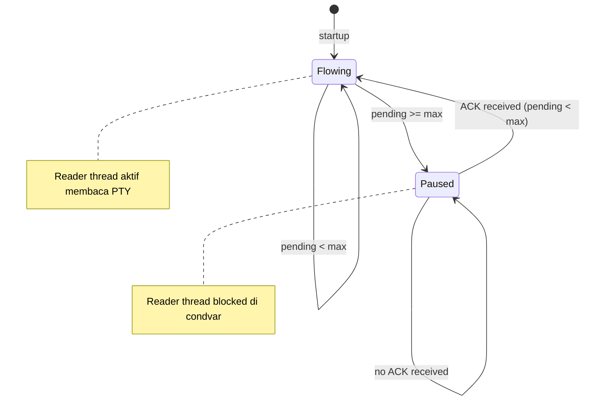
```mermaid
stateDiagram-v2
    [*] --> Flowing: startup
    Flowing --> Flowing: pending < max
    Flowing --> Paused: pending >= max
    Paused --> Paused: no ACK received
    Paused --> Flowing: ACK received (pending < max)

    note right of Flowing: Reader thread aktif membaca PTY
    note right of Paused: Reader thread blocked di condvar
```

#### 3.2.6 Resize Handling

```rust
// src/pty/resize.rs
impl PtyManager {
    /// Resize PTY dimensions. Dipanggil saat user resize pane di grid.
    /// portable-pty menangani SIGWINCH / ConPTY resize secara internal.
    pub async fn resize_pty(
        &self,
        pane_id: &str,
        rows: u16,
        cols: u16,
    ) -> Result<(), NonatermError> {
        let sessions = self.sessions.read().await;
        let session = sessions.get(pane_id)
            .ok_or(NonatermError::PaneNotFound(pane_id.to_string()))?;

        let new_size = PtySize {
            rows,
            cols,
            pixel_width: 0,
            pixel_height: 0,
        };

        // portable-pty handles ConPTY ResizePseudoConsole internally
        session.master.resize(new_size)
            .map_err(|e| NonatermError::PtyResize(e.to_string()))?;

        // Update cached size
        *session.size.lock().await = new_size;

        tracing::debug!(pane_id = %pane_id, rows, cols, "PTY resized");
        Ok(())
    }
}
```

#### 3.2.7 Process Lifecycle — State Machine

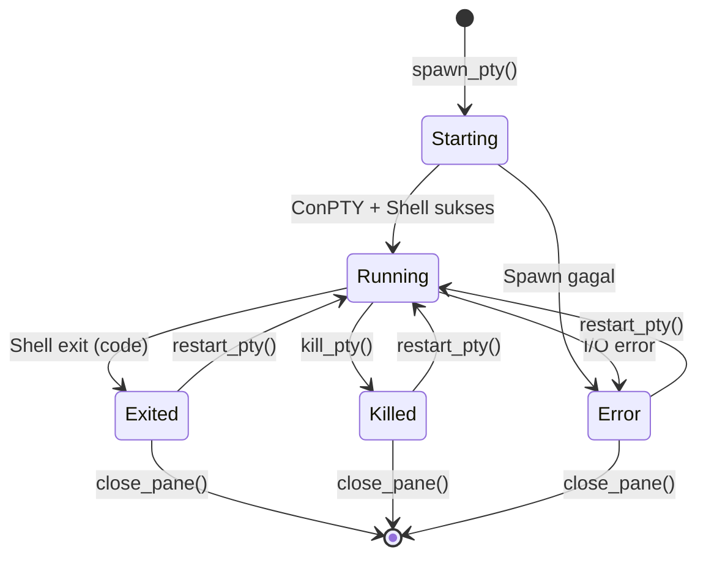
```mermaid
stateDiagram-v2
    [*] --> Starting: spawn_pty()
    Starting --> Running: ConPTY + Shell sukses
    Starting --> Error: Spawn gagal

    Running --> Exited: Shell exit (code)
    Running --> Killed: kill_pty()
    Running --> Error: I/O error

    Exited --> Running: restart_pty()
    Killed --> Running: restart_pty()
    Error --> Running: restart_pty()

    Exited --> [*]: close_pane()
    Killed --> [*]: close_pane()
    Error --> [*]: close_pane()
```

### 3.3 Workspace Manager Module

#### 3.3.1 Core Types

```rust
// src/workspace/types.rs
use serde::{Serialize, Deserialize};
use chrono::{DateTime, Utc};

#[derive(Debug, Clone, Serialize, Deserialize)]
pub struct Workspace {
    pub id: String,              // UUID v4
    pub name: String,
    pub color: String,           // Hex color "#5B8DEF"
    pub font_family: Option<String>,
    pub font_size: Option<f32>,
    pub default_shell: Option<String>,
    pub worktree_path: Option<String>,
    pub startup_commands: Vec<StartupCommand>,
    pub layout: GridLayout,
    pub panes: Vec<PaneConfig>,
    pub sort_order: i32,
    pub created_at: DateTime<Utc>,
    pub updated_at: DateTime<Utc>,
}

#[derive(Debug, Clone, Serialize, Deserialize)]
pub struct PaneConfig {
    pub id: String,              // UUID v4
    pub workspace_id: String,
    pub slot_index: u8,          // 0–8 (posisi dalam grid)
    pub shell: Option<String>,   // override workspace default
    pub cwd: Option<String>,
    pub startup_cmd: Option<String>,
    pub status: PaneStatus,
}

#[derive(Debug, Clone, Serialize, Deserialize)]
pub enum PaneStatus {
    Empty,
    Running,
    Idle,
    Exited(i32),
    Error(String),
}

#[derive(Debug, Clone, Serialize, Deserialize)]
pub struct GridLayout {
    pub preset: LayoutPreset,
    pub custom_sizes: Option<Vec<PaneSize>>,
}

#[derive(Debug, Clone, Copy, Serialize, Deserialize)]
pub enum LayoutPreset {
    Single,     // 1×1
    SplitH,     // 1×2 horizontal
    SplitV,     // 2×1 vertical
    Grid2x2,    // 2×2 = 4 pane
    Grid2x3,    // 2×3 = 6 pane
    Grid3x3,    // 3×3 = 9 pane
}

#[derive(Debug, Clone, Serialize, Deserialize)]
pub struct PaneSize {
    pub slot_index: u8,
    pub width_percent: f32,      // 0.0–1.0
    pub height_percent: f32,     // 0.0–1.0
}

#[derive(Debug, Clone, Serialize, Deserialize)]
pub struct StartupCommand {
    pub slot_index: u8,
    pub command: String,
    pub delay_ms: Option<u32>,   // Delay sebelum execute
}
```

#### 3.3.2 Layout Engine — Grid Calculation Algorithm

```rust
// src/workspace/layout.rs

/// Menghitung posisi dan ukuran setiap pane berdasarkan preset layout
/// dan container dimensions.
///
/// Algorithm:
/// 1. Tentukan grid dimensions (rows × cols) dari preset
/// 2. Hitung base cell size dari container dimensions
/// 3. Jika ada custom_sizes, override proportional sizing
/// 4. Pastikan total width/height = 100% (compensate rounding errors)
pub fn calculate_grid_positions(
    layout: &GridLayout,
    container_width: f32,
    container_height: f32,
    gap: f32,           // Gap antar pane dalam pixels
    pane_count: usize,
) -> Vec<PanePosition> {
    let (grid_rows, grid_cols) = match layout.preset {
        LayoutPreset::Single  => (1, 1),
        LayoutPreset::SplitH  => (1, 2),
        LayoutPreset::SplitV  => (2, 1),
        LayoutPreset::Grid2x2 => (2, 2),
        LayoutPreset::Grid2x3 => (2, 3),
        LayoutPreset::Grid3x3 => (3, 3),
    };

    let total_gap_h = gap * (grid_cols as f32 - 1.0);
    let total_gap_v = gap * (grid_rows as f32 - 1.0);
    let cell_width = (container_width - total_gap_h) / grid_cols as f32;
    let cell_height = (container_height - total_gap_v) / grid_rows as f32;

    let mut positions = Vec::with_capacity(pane_count);

    for i in 0..pane_count.min(grid_rows * grid_cols) {
        let row = i / grid_cols;
        let col = i % grid_cols;

        let (w, h) = if let Some(ref custom) = layout.custom_sizes {
            custom.get(i)
                .map(|s| (
                    s.width_percent * container_width,
                    s.height_percent * container_height
                ))
                .unwrap_or((cell_width, cell_height))
        } else {
            (cell_width, cell_height)
        };

        positions.push(PanePosition {
            slot_index: i as u8,
            x: col as f32 * (cell_width + gap),
            y: row as f32 * (cell_height + gap),
            width: w,
            height: h,
        });
    }

    positions
}

#[derive(Debug, Clone, Serialize, Deserialize)]
pub struct PanePosition {
    pub slot_index: u8,
    pub x: f32,
    pub y: f32,
    pub width: f32,
    pub height: f32,
}
```

#### 3.3.3 Template System

```rust
// src/workspace/template.rs
#[derive(Debug, Clone, Serialize, Deserialize)]
pub struct WorkspaceTemplate {
    pub id: String,
    pub name: String,
    pub description: Option<String>,
    pub layout: GridLayout,
    pub pane_templates: Vec<PaneTemplate>,
    pub default_color: Option<String>,
    pub created_at: DateTime<Utc>,
}

#[derive(Debug, Clone, Serialize, Deserialize)]
pub struct PaneTemplate {
    pub slot_index: u8,
    pub shell: Option<String>,
    pub startup_cmd: Option<String>,
    /// Placeholder: {{PROJECT_DIR}}, {{BRANCH_NAME}}
    pub cwd_template: Option<String>,
}

impl WorkspaceTemplate {
    /// Instantiate template ke workspace baru dengan variable substitution
    pub fn instantiate(
        &self,
        name: String,
        variables: HashMap<String, String>,
    ) -> Workspace {
        let panes = self.pane_templates.iter().map(|pt| {
            let cwd = pt.cwd_template.as_ref().map(|t| {
                let mut result = t.clone();
                for (key, value) in &variables {
                    result = result.replace(
                        &format!("{{{{{}}}}}", key),
                        value
                    );
                }
                result
            });
            PaneConfig {
                id: Uuid::new_v4().to_string(),
                workspace_id: String::new(), // akan di-set nanti
                slot_index: pt.slot_index,
                shell: pt.shell.clone(),
                cwd,
                startup_cmd: pt.startup_cmd.clone(),
                status: PaneStatus::Empty,
            }
        }).collect();

        Workspace {
            id: Uuid::new_v4().to_string(),
            name,
            color: self.default_color.clone()
                .unwrap_or_else(|| "#5B8DEF".to_string()),
            layout: self.layout.clone(),
            panes,
            // ... other fields with defaults
            ..Default::default()
        }
    }
}
```

### 3.4 State Manager Module

> **Status implementasi (19 Juni 2026):** `StateManager` aktif di `src-tauri/src/state/mod.rs` sebagai modul tunggal. Persistence utama sekarang SQLite via `tauri-plugin-sql` dengan fallback/mirror JSON snapshot (`workspace-snapshot.json`). Lockfile `Nonaterm.lock` menandai dirty shutdown, autosave frontend 5 detik memanggil `state_save_snapshot`, recovery banner UI sudah aktif, dan export/import config menggunakan `ExportPayload` + command `state_export_*` / `state_import_*`. Refactor ke pemisahan `manager.rs` / `autosave.rs` / `lockfile.rs` masih opsional untuk perapian internal.

#### 3.4.1 Autosave Mechanism — Debounce + Diff

```rust
// src/state/autosave.rs
use tokio::sync::{mpsc, watch};
use tokio::time::{Duration, sleep};

pub struct AutosaveManager {
    /// Channel untuk menerima state change notifications
    change_rx: mpsc::Receiver<StateChange>,
    /// Interval debounce (default: 5 detik)
    debounce_interval: Duration,
    /// Referensi ke StateManager untuk actual persist
    state_manager: Arc<StateManager>,
    /// Last persisted state hash — untuk diff comparison
    last_hash: u64,
}

#[derive(Debug)]
pub enum StateChange {
    WorkspaceModified(String),    // workspace_id
    PaneAdded(String, String),    // workspace_id, pane_id
    PaneRemoved(String, String),
    LayoutChanged(String),
    CwdChanged(String, String),   // pane_id, new_cwd
}

impl AutosaveManager {
    /// Main autosave loop — berjalan sebagai Tokio task.
    ///
    /// Strategy:
    /// 1. Kumpulkan semua StateChange dalam window debounce
    /// 2. Hitung hash dari state saat ini
    /// 3. Bandingkan dengan last_hash
    /// 4. Hanya persist jika hash berbeda (ada perubahan nyata)
    pub async fn run(mut self) {
        let mut pending_changes: Vec<StateChange> = Vec::new();
        let mut debounce_timer = tokio::time::interval(self.debounce_interval);
        debounce_timer.set_missed_tick_behavior(
            tokio::time::MissedTickBehavior::Skip
        );

        loop {
            tokio::select! {
                // Terima change notification
                Some(change) = self.change_rx.recv() => {
                    pending_changes.push(change);
                }

                // Debounce timer tick
                _ = debounce_timer.tick() => {
                    if pending_changes.is_empty() {
                        continue;
                    }

                    // Compute current state hash
                    let current_hash = self.state_manager
                        .compute_state_hash().await;

                    if current_hash != self.last_hash {
                        match self.state_manager.persist_state().await {
                            Ok(()) => {
                                self.last_hash = current_hash;
                                tracing::debug!(
                                    changes = pending_changes.len(),
                                    "Autosave completed"
                                );
                            }
                            Err(e) => {
                                tracing::error!("Autosave failed: {}", e);
                            }
                        }
                    }

                    pending_changes.clear();
                }
            }
        }
    }
}
```

#### 3.4.2 Crash Recovery — Lockfile Mechanism

```rust
// src/state/lockfile.rs
use std::fs;
use std::path::PathBuf;

pub struct LockfileManager {
    lockfile_path: PathBuf,
}

impl LockfileManager {
    pub fn new(app_data_dir: &PathBuf) -> Self {
        Self {
            lockfile_path: app_data_dir.join("Nonaterm.lock"),
        }
    }

    /// Dipanggil saat app start.
    /// Return true jika shutdown sebelumnya tidak normal.
    pub fn check_and_acquire(&self) -> Result<bool, NonatermError> {
        let was_dirty = self.lockfile_path.exists();

        if was_dirty {
            tracing::warn!("Lockfile ditemukan — shutdown sebelumnya tidak normal");
            // Baca PID lama untuk verifikasi
            if let Ok(content) = fs::read_to_string(&self.lockfile_path) {
                let old_pid: u32 = content.trim().parse().unwrap_or(0);
                tracing::info!(old_pid, "Previous instance PID");
            }
        }

        // Tulis PID saat ini
        fs::write(&self.lockfile_path, std::process::id().to_string())
            .map_err(|e| NonatermError::Lockfile(e.to_string()))?;

        Ok(was_dirty)
    }

    /// Dipanggil saat app shutdown normal.
    pub fn release(&self) -> Result<(), NonatermError> {
        if self.lockfile_path.exists() {
            fs::remove_file(&self.lockfile_path)
                .map_err(|e| NonatermError::Lockfile(e.to_string()))?;
        }
        Ok(())
    }
}
```

**Crash Recovery Flow:**

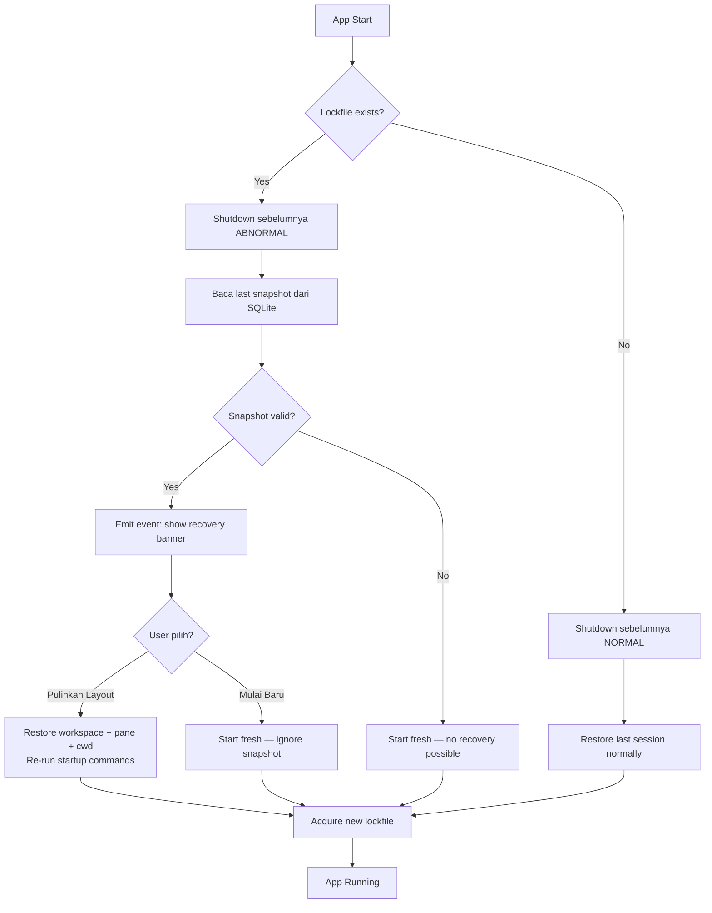
```mermaid
flowchart TD
    A[App Start] --> B{Lockfile exists?}
    B -->|Yes| C[Shutdown sebelumnya ABNORMAL]
    B -->|No| D[Shutdown sebelumnya NORMAL]

    C --> E[Baca last snapshot dari SQLite]
    E --> F{Snapshot valid?}
    F -->|Yes| G[Emit event: show recovery banner]
    F -->|No| H[Start fresh — no recovery possible]

    G --> I{User pilih?}
    I -->|Pulihkan Layout| J[Restore workspace + pane + cwd<br/>Re-run startup commands]
    I -->|Mulai Baru| K[Start fresh — ignore snapshot]

    D --> L[Restore last session normally]

    J --> M[Acquire new lockfile]
    K --> M
    H --> M
    L --> M
    M --> N[App Running]
```

#### 3.4.3 SQLite Schema (DDL)

> Lihat [Section 6: Desain Database](#6-desain-database) untuk schema lengkap.

#### 3.4.4 Migration Strategy

```rust
// src/state/migration.rs
use tauri_plugin_sql::{Migration, MigrationKind};

pub fn get_migrations() -> Vec<Migration> {
    vec![
        Migration {
            version: 1,
            description: "initial_schema",
            sql: include_str!("../../migrations/001_initial_schema.sql"),
            kind: MigrationKind::Up,
        },
        Migration {
            version: 2,
            description: "add_templates",
            sql: include_str!("../../migrations/002_add_templates.sql"),
            kind: MigrationKind::Up,
        },
        Migration {
            version: 3,
            description: "add_keybinds",
            sql: include_str!("../../migrations/003_add_keybinds.sql"),
            kind: MigrationKind::Up,
        },
    ]
}
```

**Migration rules:**
1. Migration files **append-only** — tidak pernah edit migration yang sudah dirilis
2. Setiap migration harus **idempotent** (`IF NOT EXISTS`, `IF EXISTS`)
3. Destructive migration (DROP, ALTER column type) hanya boleh di major version
4. Migration dijalankan otomatis saat app start, sebelum UI ready

### 3.5 Config Manager Module

#### 3.5.1 Config Structure

```rust
// src/config/types.rs
#[derive(Debug, Clone, Serialize, Deserialize)]
pub struct AppConfig {
    pub general: GeneralConfig,
    pub appearance: AppearanceConfig,
    pub terminal: TerminalConfig,
    pub keybindings: KeybindingsConfig,
    pub advanced: AdvancedConfig,
}

#[derive(Debug, Clone, Serialize, Deserialize)]
pub struct GeneralConfig {
    /// Restore session saat startup
    pub restore_session: bool,
    /// Default shell ("pwsh" | "cmd" | "wsl" | "git-bash")
    pub default_shell: String,
    /// Default working directory
    pub default_cwd: Option<String>,
    /// Global hotkey untuk show/hide (format: "Ctrl+Alt+T")
    pub global_hotkey: Option<String>,
    /// Autosave interval dalam detik
    pub autosave_interval_secs: u32,
}

#[derive(Debug, Clone, Serialize, Deserialize)]
pub struct AppearanceConfig {
    /// "dark" | "light" | "custom"
    pub theme: String,
    pub font_family: String,
    pub font_size: f32,
    pub cursor_style: String,     // "block" | "underline" | "bar"
    pub cursor_blink: bool,
    pub opacity: f32,             // 0.0–1.0
    pub acrylic: bool,            // Windows Mica/Acrylic effect
    pub custom_css: Option<String>,
}

#[derive(Debug, Clone, Serialize, Deserialize)]
pub struct TerminalConfig {
    pub scrollback_lines: u32,
    pub bell_behavior: String,    // "none" | "sound" | "visual" | "both"
    pub copy_on_select: bool,
    pub confirm_paste_multiline: bool,
    pub word_separators: String,
    pub right_click_paste: bool,
}
```

#### 3.5.2 Hot-Reload Mechanism

```rust
// src/config/manager.rs
use notify::{Watcher, RecursiveMode, Event, EventKind};
use tokio::sync::watch;

pub struct ConfigManager {
    config: Arc<RwLock<AppConfig>>,
    config_path: PathBuf,
    /// Watch channel untuk notify subscribers tentang config changes
    change_tx: watch::Sender<AppConfig>,
    change_rx: watch::Receiver<AppConfig>,
}

impl ConfigManager {
    /// Start file watcher untuk hot-reload config.json
    pub async fn start_watcher(&self, app_handle: tauri::AppHandle)
        -> Result<(), NonatermError>
    {
        let config_path = self.config_path.clone();
        let config = self.config.clone();
        let change_tx = self.change_tx.clone();

        // Spawn blocking task karena notify::Watcher is sync
        tokio::task::spawn_blocking(move || {
            let (tx, rx) = std::sync::mpsc::channel();

            let mut watcher = notify::recommended_watcher(tx)
                .expect("Failed to create file watcher");

            watcher.watch(&config_path, RecursiveMode::NonRecursive)
                .expect("Failed to watch config file");

            // Debounce: tunggu 500ms setelah perubahan terakhir
            let mut last_event = std::time::Instant::now();

            for result in rx {
                match result {
                    Ok(Event { kind: EventKind::Modify(_), .. }) => {
                        let now = std::time::Instant::now();
                        if now.duration_since(last_event)
                            < std::time::Duration::from_millis(500)
                        {
                            continue; // Debounce
                        }
                        last_event = now;

                        // Reload config
                        match Self::load_and_validate(&config_path) {
                            Ok(new_config) => {
                                *config.blocking_write() = new_config.clone();
                                let _ = change_tx.send(new_config.clone());
                                // Emit ke frontend
                                let _ = app_handle.emit("config:changed", &new_config);
                                tracing::info!("Config hot-reloaded");
                            }
                            Err(e) => {
                                tracing::warn!("Config reload failed: {}", e);
                                let _ = app_handle.emit("config:error", &e.to_string());
                            }
                        }
                    }
                    _ => {}
                }
            }
        });

        Ok(())
    }
}
```

#### 3.5.3 Config Validation

```rust
// src/config/validation.rs
pub fn validate_config(config: &AppConfig) -> Vec<ConfigWarning> {
    let mut warnings = Vec::new();

    // Font size bounds
    if config.appearance.font_size < 8.0 || config.appearance.font_size > 72.0 {
        warnings.push(ConfigWarning::OutOfRange {
            field: "appearance.font_size".into(),
            value: config.appearance.font_size.to_string(),
            valid_range: "8.0–72.0".into(),
        });
    }

    // Scrollback bounds
    if config.terminal.scrollback_lines > 100_000 {
        warnings.push(ConfigWarning::Performance {
            field: "terminal.scrollback_lines".into(),
            message: "Scrollback > 100k lines akan menggunakan \
                      memori signifikan (~800MB untuk 9 terminal)".into(),
        });
    }

    // Autosave interval
    if config.general.autosave_interval_secs < 2 {
        warnings.push(ConfigWarning::Performance {
            field: "general.autosave_interval_secs".into(),
            message: "Interval < 2 detik bisa membebani disk I/O".into(),
        });
    }

    // Shell validity
    let valid_shells = ["pwsh", "powershell", "cmd", "wsl", "git-bash", "bash"];
    if !valid_shells.contains(&config.general.default_shell.as_str()) {
        warnings.push(ConfigWarning::InvalidValue {
            field: "general.default_shell".into(),
            value: config.general.default_shell.clone(),
            valid_values: valid_shells.iter().map(|s| s.to_string()).collect(),
        });
    }

    warnings
}
```

#### 3.5.4 Default Values

```rust
// src/config/defaults.rs
impl Default for AppConfig {
    fn default() -> Self {
        Self {
            general: GeneralConfig {
                restore_session: true,
                default_shell: "pwsh".to_string(),
                default_cwd: None,
                global_hotkey: None,          // Harus user set sendiri
                autosave_interval_secs: 5,
            },
            appearance: AppearanceConfig {
                theme: "dark".to_string(),
                font_family: "Cascadia Code".to_string(),
                font_size: 14.0,
                cursor_style: "block".to_string(),
                cursor_blink: true,
                opacity: 1.0,
                acrylic: false,
                custom_css: None,
            },
            terminal: TerminalConfig {
                scrollback_lines: 1000,
                bell_behavior: "visual".to_string(),
                copy_on_select: false,
                confirm_paste_multiline: true,
                word_separators: " ()\"'`-=+[]{}|;:,.<>?/!@#$%^&*~".to_string(),
                right_click_paste: true,
            },
            // ... keybindings dan advanced defaults
        }
    }
}
```

### 3.6 Keybind Manager Module

#### 3.6.1 Three-Layer Priority System

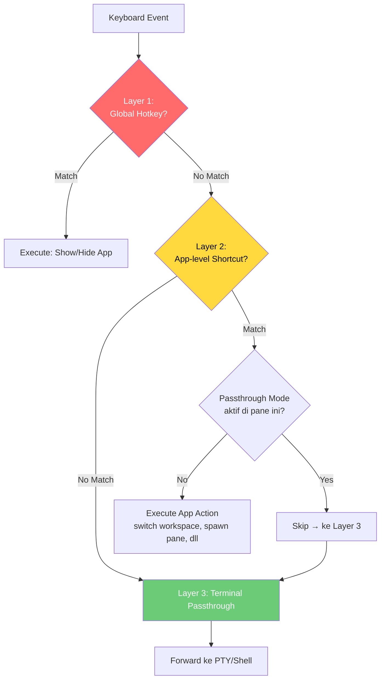
```mermaid
flowchart TB
    KE[Keyboard Event] --> L1{Layer 1:<br/>Global Hotkey?}
    L1 -->|Match| A1[Execute: Show/Hide App]
    L1 -->|No Match| L2{Layer 2:<br/>App-level Shortcut?}

    L2 -->|Match| PP{Passthrough Mode<br/>aktif di pane ini?}
    PP -->|Yes| L3_pass[Skip → ke Layer 3]
    PP -->|No| A2[Execute App Action<br/>switch workspace, spawn pane, dll]

    L2 -->|No Match| L3[Layer 3: Terminal Passthrough]
    L3_pass --> L3
    L3 --> PTY[Forward ke PTY/Shell]

    style L1 fill:#ff6b6b,color:#fff
    style L2 fill:#ffd93d,color:#000
    style L3 fill:#6bcb77,color:#fff
```

#### 3.6.2 Priority Resolution

```rust
// src/keybind/priority.rs
use std::collections::HashMap;

pub struct KeybindResolver {
    /// Layer 1: Global hotkeys (OS-level, via Tauri global_shortcut plugin)
    global_hotkeys: HashMap<KeyCombo, GlobalAction>,
    /// Layer 2: App-level shortcuts
    app_shortcuts: HashMap<KeyCombo, AppAction>,
    /// Per-pane passthrough mode status
    passthrough_panes: HashSet<String>,
    /// Well-known CLI shortcuts untuk conflict detection
    cli_shortcuts: HashSet<KeyCombo>,
}

#[derive(Debug, Clone, Hash, Eq, PartialEq)]
pub struct KeyCombo {
    pub ctrl: bool,
    pub alt: bool,
    pub shift: bool,
    pub meta: bool,      // Win key
    pub key: String,     // "P", "1", "Escape", dll
}

pub enum KeybindResult {
    /// Shortcut dihandle oleh app — jangan forward ke PTY
    Handled(AppAction),
    /// Forward ke PTY (passthrough)
    Passthrough,
}

impl KeybindResolver {
    pub fn resolve(
        &self,
        combo: &KeyCombo,
        focused_pane_id: &str,
    ) -> KeybindResult {
        // Layer 1: Global hotkeys sudah di-handle oleh OS — tidak sampai sini

        // Layer 2: App-level shortcuts
        if let Some(action) = self.app_shortcuts.get(combo) {
            // Cek passthrough mode
            if self.passthrough_panes.contains(focused_pane_id) {
                return KeybindResult::Passthrough;
            }
            return KeybindResult::Handled(action.clone());
        }

        // Layer 3: Passthrough ke PTY
        KeybindResult::Passthrough
    }
}
```

#### 3.6.3 Conflict Detection Algorithm

```rust
// src/keybind/conflict.rs

/// Daftar shortcut yang umum dipakai oleh CLI tools.
/// Sumber: readline default bindings, vim/nvim, tmux, common TUI apps.
const WELL_KNOWN_CLI_SHORTCUTS: &[(&str, &str)] = &[
    ("Ctrl+P",   "readline: previous-history / vim: scroll up"),
    ("Ctrl+N",   "readline: next-history / vim: scroll down"),
    ("Ctrl+F",   "readline: forward-char"),
    ("Ctrl+B",   "readline: backward-char"),
    ("Ctrl+R",   "readline: reverse-search-history / fzf"),
    ("Ctrl+A",   "readline: beginning-of-line / tmux prefix"),
    ("Ctrl+E",   "readline: end-of-line"),
    ("Ctrl+W",   "readline: unix-word-rubout"),
    ("Ctrl+U",   "readline: unix-line-discard"),
    ("Ctrl+K",   "readline: kill-line"),
    ("Ctrl+D",   "EOF / exit shell"),
    ("Ctrl+C",   "SIGINT"),
    ("Ctrl+Z",   "SIGTSTP / undo (vim)"),
    ("Ctrl+L",   "clear screen"),
    ("Ctrl+T",   "readline: transpose-chars"),
    ("Ctrl+1..9", "banyak TUI app menggunakan untuk tab switching"),
];

pub fn check_conflict(combo: &KeyCombo) -> Option<ConflictWarning> {
    let combo_str = combo.to_display_string(); // "Ctrl+P"

    for (known, description) in WELL_KNOWN_CLI_SHORTCUTS {
        if combo_str.eq_ignore_ascii_case(known) {
            return Some(ConflictWarning {
                combo: combo_str,
                conflict_with: known.to_string(),
                description: description.to_string(),
                severity: ConflictSeverity::Warning,
            });
        }
    }
    None
}
```

#### 3.6.4 Passthrough Mode Implementation

```rust
// src/keybind/passthrough.rs
impl KeybindManager {
    /// Toggle passthrough mode untuk pane tertentu.
    /// Saat aktif, SEMUA app-level shortcut di-skip untuk pane ini.
    pub fn toggle_passthrough(&mut self, pane_id: &str) -> bool {
        if self.resolver.passthrough_panes.contains(pane_id) {
            self.resolver.passthrough_panes.remove(pane_id);
            false // passthrough OFF
        } else {
            self.resolver.passthrough_panes.insert(pane_id.to_string());
            true  // passthrough ON
        }
    }

    /// Auto-detect: apakah proses di pane ini kemungkinan butuh passthrough.
    /// Berdasarkan nama proses, bukan parsing output.
    pub fn should_suggest_passthrough(process_name: &str) -> bool {
        const PASSTHROUGH_CANDIDATES: &[&str] = &[
            "vim", "nvim", "vi", "nano", "emacs",
            "tmux", "screen",
            "opencode", "aider", "claude",  // AI agent CLI
            "htop", "btop", "top",
            "less", "more",
            "fzf", "sk",                     // Fuzzy finders
            "lazygit", "gitui",              // Git TUI
        ];

        let name_lower = process_name.to_lowercase();
        PASSTHROUGH_CANDIDATES.iter().any(|c| name_lower.contains(c))
    }
}
```

### 3.7 Git Worktree Integration Module

#### 3.7.1 Worktree Creation Flow

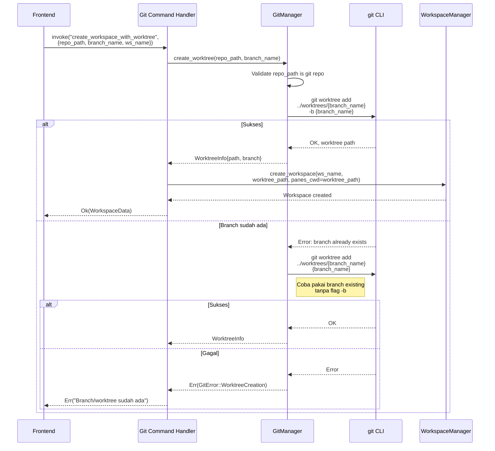
```mermaid
sequenceDiagram
    participant FE as Frontend
    participant CMD as Git Command Handler
    participant GM as GitManager
    participant GIT as git CLI
    participant WM as WorkspaceManager

    FE->>CMD: invoke("create_workspace_with_worktree",<br/>{repo_path, branch_name, ws_name})
    CMD->>GM: create_worktree(repo_path, branch_name)
    GM->>GM: Validate repo_path is git repo
    GM->>GIT: git worktree add<br/>../worktrees/{branch_name}<br/>-b {branch_name}
    alt Sukses
        GIT-->>GM: OK, worktree path
        GM-->>CMD: WorktreeInfo{path, branch}
        CMD->>WM: create_workspace(ws_name,<br/>worktree_path, panes_cwd=worktree_path)
        WM-->>CMD: Workspace created
        CMD-->>FE: Ok(WorkspaceData)
    else Branch sudah ada
        GIT-->>GM: Error: branch already exists
        GM->>GIT: git worktree add<br/>../worktrees/{branch_name}<br/>{branch_name}
        Note right of GM: Coba pakai branch existing<br/>tanpa flag -b
        alt Sukses
            GIT-->>GM: OK
            GM-->>CMD: WorktreeInfo
        else Gagal
            GIT-->>GM: Error
            GM-->>CMD: Err(GitError::WorktreeCreation)
            CMD-->>FE: Err("Branch/worktree sudah ada")
        end
    end
```

#### 3.7.2 GitManager Implementation

```rust
// src/git/manager.rs
use std::process::Command;
use std::path::{Path, PathBuf};

pub struct GitManager;

impl GitManager {
    /// Cek apakah path adalah git repository
    pub fn is_git_repo(path: &Path) -> bool {
        Command::new("git")
            .args(["rev-parse", "--is-inside-work-tree"])
            .current_dir(path)
            .output()
            .map(|o| o.status.success())
            .unwrap_or(false)
    }

    /// Buat worktree baru dengan branch baru
    pub async fn create_worktree(
        repo_path: &Path,
        branch_name: &str,
    ) -> Result<WorktreeInfo, GitError> {
        let worktree_base = repo_path.join(".worktrees");
        std::fs::create_dir_all(&worktree_base)?;

        let worktree_path = worktree_base.join(branch_name);

        // Coba buat branch baru + worktree
        let output = Command::new("git")
            .args([
                "worktree", "add",
                worktree_path.to_str().unwrap(),
                "-b", branch_name,
            ])
            .current_dir(repo_path)
            .output()?;

        if output.status.success() {
            return Ok(WorktreeInfo {
                path: worktree_path,
                branch: branch_name.to_string(),
                is_new_branch: true,
            });
        }

        // Fallback: branch sudah ada, coba attach ke branch existing
        let output = Command::new("git")
            .args([
                "worktree", "add",
                worktree_path.to_str().unwrap(),
                branch_name,
            ])
            .current_dir(repo_path)
            .output()?;

        if output.status.success() {
            Ok(WorktreeInfo {
                path: worktree_path,
                branch: branch_name.to_string(),
                is_new_branch: false,
            })
        } else {
            Err(GitError::WorktreeCreation(
                String::from_utf8_lossy(&output.stderr).to_string()
            ))
        }
    }

    /// List semua worktree di repo
    pub async fn list_worktrees(
        repo_path: &Path,
    ) -> Result<Vec<WorktreeInfo>, GitError> {
        let output = Command::new("git")
            .args(["worktree", "list", "--porcelain"])
            .current_dir(repo_path)
            .output()?;

        // Parse porcelain output
        let stdout = String::from_utf8_lossy(&output.stdout);
        Self::parse_worktree_list(&stdout)
    }

    /// Hapus worktree (force jika perlu)
    pub async fn remove_worktree(
        repo_path: &Path,
        worktree_path: &Path,
        force: bool,
    ) -> Result<(), GitError> {
        let mut args = vec!["worktree", "remove"];
        if force { args.push("--force"); }
        args.push(worktree_path.to_str().unwrap());

        let output = Command::new("git")
            .args(&args)
            .current_dir(repo_path)
            .output()?;

        if output.status.success() {
            Ok(())
        } else {
            Err(GitError::WorktreeRemoval(
                String::from_utf8_lossy(&output.stderr).to_string()
            ))
        }
    }
}
```

---

## 4. Desain Frontend (React + TypeScript)

### 4.1 Component Tree Hierarchy

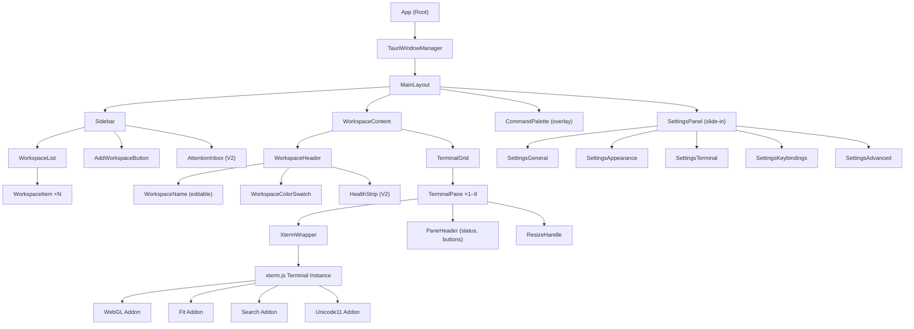
```mermaid
graph TD
    App["App (Root)"]
    App --> TW["TauriWindowManager"]
    TW --> ML["MainLayout"]

    ML --> SB["Sidebar"]
    ML --> WC["WorkspaceContent"]
    ML --> CP["CommandPalette (overlay)"]
    ML --> SP["SettingsPanel (slide-in)"]

    SB --> WL["WorkspaceList"]
    WL --> WI["WorkspaceItem ×N"]
    SB --> AB["AddWorkspaceButton"]
    SB --> AI["AttentionInbox (V2)"]

    WC --> WH["WorkspaceHeader"]
    WH --> WN["WorkspaceName (editable)"]
    WH --> WCS["WorkspaceColorSwatch"]
    WH --> HS["HealthStrip (V2)"]

    WC --> TG["TerminalGrid"]
    TG --> TP["TerminalPane ×1–9"]
    TP --> XW["XtermWrapper"]
    TP --> PH["PaneHeader (status, buttons)"]
    TP --> RH["ResizeHandle"]

    XW --> XT["xterm.js Terminal Instance"]
    XT --> WGL["WebGL Addon"]
    XT --> FIT["Fit Addon"]
    XT --> SCH["Search Addon"]
    XT --> UNI["Unicode11 Addon"]

    SP --> SG["SettingsGeneral"]
    SP --> SA["SettingsAppearance"]
    SP --> ST["SettingsTerminal"]
    SP --> SK["SettingsKeybindings"]
    SP --> SAV["SettingsAdvanced"]
```

### 4.2 State Management — Zustand

```typescript
// src/stores/workspaceStore.ts
import { create } from 'zustand';
import { subscribeWithSelector } from 'zustand/middleware';
import { invoke } from '@tauri-apps/api/core';

interface WorkspaceState {
  // Data
  workspaces: Workspace[];
  activeWorkspaceId: string | null;
  panes: Record<string, PaneState>;  // paneId -> PaneState

  // Computed
  activeWorkspace: () => Workspace | null;
  activePanes: () => PaneState[];

  // Actions
  loadWorkspaces: () => Promise<void>;
  createWorkspace: (name: string, color?: string) => Promise<Workspace>;
  switchWorkspace: (id: string) => Promise<void>;
  deleteWorkspace: (id: string) => Promise<void>;
  updateWorkspace: (id: string, updates: Partial<Workspace>) => Promise<void>;
  reorderWorkspace: (id: string, newIndex: number) => Promise<void>;
}

export const useWorkspaceStore = create<WorkspaceState>()(
  subscribeWithSelector((set, get) => ({
    workspaces: [],
    activeWorkspaceId: null,
    panes: {},

    activeWorkspace: () => {
      const { workspaces, activeWorkspaceId } = get();
      return workspaces.find(w => w.id === activeWorkspaceId) ?? null;
    },

    activePanes: () => {
      const { panes, activeWorkspaceId } = get();
      return Object.values(panes)
        .filter(p => p.workspaceId === activeWorkspaceId);
    },

    loadWorkspaces: async () => {
      const workspaces = await invoke<Workspace[]>('list_workspaces');
      const lastActive = await invoke<string | null>('get_active_workspace_id');
      set({ workspaces, activeWorkspaceId: lastActive });
    },

    switchWorkspace: async (id: string) => {
      // Optimistic update untuk target < 100ms
      set({ activeWorkspaceId: id });
      await invoke('set_active_workspace', { workspaceId: id });
    },

    createWorkspace: async (name: string, color?: string) => {
      const ws = await invoke<Workspace>('create_workspace', { name, color });
      set(state => ({
        workspaces: [...state.workspaces, ws],
        activeWorkspaceId: ws.id,
      }));
      return ws;
    },

    // ... other actions
  }))
);
```

```typescript
// src/stores/terminalStore.ts
interface TerminalState {
  // Per-pane terminal state (bukan xterm.js instance — itu di ref)
  paneStatuses: Record<string, PtyStatus>;
  passthroughPanes: Set<string>;
  focusedPaneId: string | null;

  // Actions
  setFocusedPane: (paneId: string) => void;
  togglePassthrough: (paneId: string) => Promise<boolean>;
  updatePaneStatus: (paneId: string, status: PtyStatus) => void;
}

// src/stores/configStore.ts
interface ConfigState {
  config: AppConfig | null;
  loadConfig: () => Promise<void>;
  updateConfig: (path: string, value: unknown) => Promise<void>;
}
```

### 4.3 Terminal Rendering Pipeline

#### 4.3.1 xterm.js Initialization per Pane

```typescript
// src/components/terminal/XtermWrapper.tsx
import { useEffect, useRef, useCallback } from 'react';
import { Terminal } from '@xterm/xterm';
import { WebglAddon } from '@xterm/addon-webgl';
import { FitAddon } from '@xterm/addon-fit';
import { SearchAddon } from '@xterm/addon-search';
import { Unicode11Addon } from '@xterm/addon-unicode11';
import { listen } from '@tauri-apps/api/event';
import { invoke } from '@tauri-apps/api/core';

interface XtermWrapperProps {
  paneId: string;
  workspaceId: string;
  fontSize: number;
  fontFamily: string;
  theme: ITheme;
  onReady: (terminal: Terminal) => void;
}

export function XtermWrapper({
  paneId, workspaceId, fontSize, fontFamily, theme, onReady
}: XtermWrapperProps) {
  const containerRef = useRef<HTMLDivElement>(null);
  const terminalRef = useRef<Terminal | null>(null);
  const fitAddonRef = useRef<FitAddon | null>(null);

  useEffect(() => {
    if (!containerRef.current) return;

    // 1. Buat Terminal instance
    const terminal = new Terminal({
      fontSize,
      fontFamily,
      theme,
      cursorBlink: true,
      cursorStyle: 'block',
      scrollback: 1000,
      allowProposedApi: true,
      // Performance: disable accessibility tree saat WebGL aktif
      // (kecuali screen reader terdeteksi)
      screenReaderMode: false,
    });

    // 2. Load addons
    const fitAddon = new FitAddon();
    const searchAddon = new SearchAddon();
    const unicodeAddon = new Unicode11Addon();

    terminal.loadAddon(fitAddon);
    terminal.loadAddon(searchAddon);
    terminal.loadAddon(unicodeAddon);
    terminal.unicode.activeVersion = '11';

    // 3. Attach ke DOM
    terminal.open(containerRef.current);

    // 4. Load WebGL addon SETELAH terminal.open()
    try {
      const webglAddon = new WebglAddon();
      webglAddon.onContextLoss(() => {
        // Fallback ke canvas renderer jika WebGL context lost
        webglAddon.dispose();
        console.warn(`[Pane ${paneId}] WebGL context lost, using canvas fallback`);
      });
      terminal.loadAddon(webglAddon);
    } catch (e) {
      console.warn(`[Pane ${paneId}] WebGL not available:`, e);
      // Canvas renderer otomatis aktif sebagai fallback
    }

    // 5. Fit ke container
    fitAddon.fit();

    // 6. Store refs
    terminalRef.current = terminal;
    fitAddonRef.current = fitAddon;

    onReady(terminal);

    return () => {
      terminal.dispose();
    };
  }, [paneId]);

  // ... PTY data listener dan input handler (lihat bagian selanjutnya)

  return (
    <div
      ref={containerRef}
      className="xterm-container"
      style={{ width: '100%', height: '100%' }}
    />
  );
}
```

#### 4.3.2 PTY Data Streaming — Event Listener

```typescript
// Di dalam XtermWrapper — event listener untuk PTY data
useEffect(() => {
  if (!terminalRef.current) return;
  const terminal = terminalRef.current;

  // Listen untuk PTY data dari backend
  const unlisten = listen<PtyDataEvent>(`pty:data:${paneId}`, (event) => {
    const { data } = event.payload;
    // data adalah base64-encoded bytes dari Rust
    const bytes = Uint8Array.from(atob(data), c => c.charCodeAt(0));
    terminal.write(bytes);

    // ACK ke backend untuk flow control (backpressure)
    invoke('pty_ack', { paneId });
  });

  // Input dari terminal ke PTY
  const onDataDisposable = terminal.onData((data: string) => {
    invoke('pty_write', { paneId, data });
  });

  // Binary data (untuk special keys)
  const onBinaryDisposable = terminal.onBinary((data: string) => {
    invoke('pty_write_binary', {
      paneId,
      data: Array.from(data, c => c.charCodeAt(0)),
    });
  });

  return () => {
    unlisten.then(fn => fn());
    onDataDisposable.dispose();
    onBinaryDisposable.dispose();
  };
}, [paneId]);
```

#### 4.3.3 Render Batching Strategy

```typescript
// src/utils/renderBatcher.ts

/**
 * RenderBatcher — mengelompokkan write() calls ke xterm.js
 * untuk menghindari per-byte rendering yang sangat mahal.
 *
 * Strategy:
 * 1. Data masuk dari event listener di-buffer
 * 2. requestAnimationFrame() digunakan untuk flush buffer
 * 3. Satu rAF flush = satu xterm.write() call dengan semua data
 * 4. Ini memastikan max 60 write() calls/detik (60fps)
 */
export class RenderBatcher {
  private buffer: Uint8Array[] = [];
  private rafId: number | null = null;
  private terminal: Terminal;

  constructor(terminal: Terminal) {
    this.terminal = terminal;
  }

  write(data: Uint8Array) {
    this.buffer.push(data);

    if (this.rafId === null) {
      this.rafId = requestAnimationFrame(() => {
        this.flush();
      });
    }
  }

  private flush() {
    if (this.buffer.length === 0) {
      this.rafId = null;
      return;
    }

    // Gabungkan semua buffered data jadi satu Uint8Array
    const totalLength = this.buffer.reduce((sum, arr) => sum + arr.length, 0);
    const merged = new Uint8Array(totalLength);
    let offset = 0;
    for (const chunk of this.buffer) {
      merged.set(chunk, offset);
      offset += chunk.length;
    }

    // Satu write() call ke xterm.js — sangat efisien
    this.terminal.write(merged);
    this.buffer = [];
    this.rafId = null;
  }

  dispose() {
    if (this.rafId !== null) {
      cancelAnimationFrame(this.rafId);
    }
    this.flush();
  }
}
```

### 4.4 Grid Layout Engine (Frontend)

#### 4.4.1 CSS Grid Implementation

```typescript
// src/components/grid/TerminalGrid.tsx
import { useCallback, useMemo } from 'react';
import { useWorkspaceStore } from '@/stores/workspaceStore';

interface TerminalGridProps {
  workspaceId: string;
  layout: GridLayout;
  panes: PaneState[];
}

export function TerminalGrid({ workspaceId, layout, panes }: TerminalGridProps) {
  const gridStyle = useMemo(() => {
    const { preset, customSizes } = layout;

    // Base grid template berdasarkan preset
    const gridTemplates: Record<LayoutPreset, GridTemplate> = {
      'single':  { cols: '1fr',         rows: '1fr'         },
      'split_h': { cols: '1fr 1fr',     rows: '1fr'         },
      'split_v': { cols: '1fr',         rows: '1fr 1fr'     },
      'grid2x2': { cols: '1fr 1fr',     rows: '1fr 1fr'     },
      'grid2x3': { cols: '1fr 1fr 1fr', rows: '1fr 1fr'     },
      'grid3x3': { cols: '1fr 1fr 1fr', rows: '1fr 1fr 1fr' },
    };

    const template = gridTemplates[preset];

    // Override dengan custom sizes jika ada
    if (customSizes && customSizes.length > 0) {
      return {
        display: 'grid' as const,
        gridTemplateColumns: customSizes
          .map(s => `${s.widthPercent * 100}%`)
          .join(' '),
        gridTemplateRows: customSizes
          .map(s => `${s.heightPercent * 100}%`)
          .join(' '),
        gap: '2px',
        width: '100%',
        height: '100%',
      };
    }

    return {
      display: 'grid' as const,
      gridTemplateColumns: template.cols,
      gridTemplateRows: template.rows,
      gap: '2px',
      width: '100%',
      height: '100%',
    };
  }, [layout]);

  return (
    <div className="terminal-grid" style={gridStyle}>
      {panes.map((pane, index) => (
        <TerminalPane
          key={pane.id}
          pane={pane}
          slotIndex={index}
          workspaceId={workspaceId}
        />
      ))}
    </div>
  );
}
```

#### 4.4.2 Resize Handle Mechanics

```typescript
// src/components/grid/ResizeHandle.tsx
import { useCallback, useRef } from 'react';

interface ResizeHandleProps {
  direction: 'horizontal' | 'vertical';
  paneIdBefore: string;
  paneIdAfter: string;
  onResize: (paneId: string, delta: number) => void;
}

export function ResizeHandle({
  direction, paneIdBefore, paneIdAfter, onResize
}: ResizeHandleProps) {
  const isDragging = useRef(false);
  const startPos = useRef(0);

  const handleMouseDown = useCallback((e: React.MouseEvent) => {
    isDragging.current = true;
    startPos.current = direction === 'horizontal' ? e.clientX : e.clientY;

    const handleMouseMove = (e: MouseEvent) => {
      if (!isDragging.current) return;
      const currentPos = direction === 'horizontal' ? e.clientX : e.clientY;
      const delta = currentPos - startPos.current;

      // Minimum pane size: 120px width, 80px height
      onResize(paneIdBefore, delta);
      startPos.current = currentPos;
    };

    const handleMouseUp = () => {
      isDragging.current = false;
      document.removeEventListener('mousemove', handleMouseMove);
      document.removeEventListener('mouseup', handleMouseUp);
      document.body.style.cursor = '';
      document.body.style.userSelect = '';
    };

    document.addEventListener('mousemove', handleMouseMove);
    document.addEventListener('mouseup', handleMouseUp);
    document.body.style.cursor =
      direction === 'horizontal' ? 'col-resize' : 'row-resize';
    document.body.style.userSelect = 'none';
  }, [direction, paneIdBefore, onResize]);

  return (
    <div
      className={`resize-handle resize-handle--${direction}`}
      onMouseDown={handleMouseDown}
      style={{
        // Hit area 8px (Fitts's Law — minimum 32px ideal, 8px acceptable for divider)
        [direction === 'horizontal' ? 'width' : 'height']: '8px',
        cursor: direction === 'horizontal' ? 'col-resize' : 'row-resize',
      }}
    />
  );
}
```

### 4.5 Theming System

#### 4.5.1 CSS Custom Properties

```css
/* src/styles/themes.css */

/* === Base Theme Variables === */
:root {
  /* Surface colors */
  --tw-bg-primary: #1e1e2e;
  --tw-bg-secondary: #181825;
  --tw-bg-surface: #313244;
  --tw-bg-overlay: #45475a;

  /* Text colors */
  --tw-text-primary: #cdd6f4;
  --tw-text-secondary: #a6adc8;
  --tw-text-muted: #6c7086;

  /* Accent (overridden per-workspace) */
  --tw-accent: #89b4fa;
  --tw-accent-hover: #74c7ec;
  --tw-accent-dim: rgba(137, 180, 250, 0.15);

  /* Terminal colors (xterm.js ITheme) */
  --tw-term-bg: #1e1e2e;
  --tw-term-fg: #cdd6f4;
  --tw-term-cursor: #f5e0dc;
  --tw-term-selection: rgba(137, 180, 250, 0.3);

  /* ANSI colors */
  --tw-term-black: #45475a;
  --tw-term-red: #f38ba8;
  --tw-term-green: #a6e3a1;
  --tw-term-yellow: #f9e2af;
  --tw-term-blue: #89b4fa;
  --tw-term-magenta: #f5c2e7;
  --tw-term-cyan: #94e2d5;
  --tw-term-white: #bac2de;

  /* Layout */
  --tw-sidebar-width: 220px;
  --tw-header-height: 40px;
  --tw-grid-gap: 2px;
  --tw-pane-border-radius: 4px;

  /* Animation */
  --tw-transition-fast: 100ms ease;
  --tw-transition-normal: 200ms ease;
}

/* === Light Theme === */
[data-theme="light"] {
  --tw-bg-primary: #eff1f5;
  --tw-bg-secondary: #e6e9ef;
  --tw-bg-surface: #ccd0da;
  --tw-text-primary: #4c4f69;
  --tw-text-secondary: #5c5f77;
  --tw-term-bg: #eff1f5;
  --tw-term-fg: #4c4f69;
}

/* === Per-Workspace Color Override === */
[data-workspace-color] {
  --tw-accent: attr(data-workspace-color);
}
```

#### 4.5.2 xterm.js Theme Integration

```typescript
// src/utils/theme.ts
export function buildXtermTheme(cssVars: CSSStyleDeclaration): ITheme {
  const get = (name: string) =>
    cssVars.getPropertyValue(name).trim();

  return {
    background: get('--tw-term-bg'),
    foreground: get('--tw-term-fg'),
    cursor: get('--tw-term-cursor'),
    selectionBackground: get('--tw-term-selection'),
    black: get('--tw-term-black'),
    red: get('--tw-term-red'),
    green: get('--tw-term-green'),
    yellow: get('--tw-term-yellow'),
    blue: get('--tw-term-blue'),
    magenta: get('--tw-term-magenta'),
    cyan: get('--tw-term-cyan'),
    white: get('--tw-term-white'),
    // Bright variants
    brightBlack: get('--tw-term-bright-black'),
    brightRed: get('--tw-term-bright-red'),
    // ... etc
  };
}

// Per-workspace color override
export function applyWorkspaceColor(
  element: HTMLElement,
  color: string
) {
  element.style.setProperty('--tw-accent', color);
  // Derive hover dan dim variants
  element.style.setProperty('--tw-accent-hover', lighten(color, 10));
  element.style.setProperty('--tw-accent-dim', `${color}26`); // 15% opacity
}
```

---

## 5. Desain IPC (Frontend ↔ Backend)

### 5.1 Command API Reference

#### 5.1.1 Workspace Commands

| Command                        | Parameters                                              | Return Type            | Deskripsi                                 |
|--------------------------------|---------------------------------------------------------|------------------------|-------------------------------------------|
| `list_workspaces`              | —                                                       | `Workspace[]`          | List semua workspace                      |
| `create_workspace`             | `{name: string, color?: string}`                        | `Workspace`            | Buat workspace baru                       |
| `create_workspace_from_template` | `{templateId: string, name: string, vars: Record}`   | `Workspace`            | Buat dari template                        |
| `create_workspace_with_worktree` | `{repoPath: string, branchName: string, wsName: string}` | `Workspace`         | Buat workspace + git worktree             |
| `update_workspace`             | `{id: string, updates: Partial<Workspace>}`             | `Workspace`            | Update nama/warna/font/dll                |
| `delete_workspace`             | `{id: string, force: bool}`                             | `void`                 | Hapus workspace (force = kill proses)     |
| `reorder_workspace`            | `{id: string, newIndex: i32}`                           | `void`                 | Ubah urutan di sidebar                    |
| `get_active_workspace_id`      | —                                                       | `string \| null`       | ID workspace terakhir aktif               |
| `set_active_workspace`         | `{workspaceId: string}`                                 | `void`                 | Set workspace aktif                       |

#### 5.1.2 Pane Commands

| Command                    | Parameters                                               | Return Type         | Deskripsi                                |
|----------------------------|----------------------------------------------------------|---------------------|------------------------------------------|
| `spawn_pane`               | `{workspaceId: string, slotIndex: u8, shell?: string, cwd?: string}` | `PaneInfo`     | Spawn terminal baru di slot grid         |
| `close_pane`               | `{paneId: string}`                                       | `void`              | Tutup pane (kill PTY)                    |
| `restart_pane`             | `{paneId: string}`                                       | `PaneInfo`          | Restart shell di pane                    |
| `get_pane_status`          | `{paneId: string}`                                       | `PtyStatus`         | Status PTY (running/exited/error)        |

#### 5.1.3 PTY I/O Commands

| Command                   | Parameters                                   | Return Type    | Deskripsi                                     |
|---------------------------|----------------------------------------------|----------------|-----------------------------------------------|
| `pty_write`               | `{paneId: string, data: string}`             | `void`         | Kirim input teks ke PTY                       |
| `pty_write_binary`        | `{paneId: string, data: number[]}`           | `void`         | Kirim binary data ke PTY                      |
| `pty_resize`              | `{paneId: string, rows: u16, cols: u16}`     | `void`         | Resize PTY dimensions                         |
| `pty_ack`                 | `{paneId: string}`                           | `void`         | ACK bahwa frontend sudah proses batch data    |

#### 5.1.4 Config Commands

| Command                    | Parameters                                    | Return Type       | Deskripsi                             |
|----------------------------|-----------------------------------------------|-------------------|---------------------------------------|
| `get_config`               | —                                             | `AppConfig`       | Baca seluruh config                   |
| `update_config`            | `{path: string, value: JsonValue}`            | `AppConfig`       | Update config field (dot notation)    |
| `reset_config`             | —                                             | `AppConfig`       | Reset ke default                      |
| `get_config_path`          | —                                             | `string`          | Path ke config.json                   |

#### 5.1.5 Keybind Commands

| Command                       | Parameters                                         | Return Type              | Deskripsi                            |
|-------------------------------|-----------------------------------------------------|--------------------------|--------------------------------------|
| `get_keybindings`             | —                                                   | `KeybindingMap`          | Semua keybinding aktif               |
| `set_keybinding`              | `{action: string, combo: KeyCombo}`                 | `ConflictWarning \| null` | Set keybinding, return conflict jika ada |
| `reset_keybinding`            | `{action: string}`                                  | `void`                   | Reset ke default                     |
| `check_conflict`              | `{combo: KeyCombo}`                                 | `ConflictWarning \| null` | Cek conflict tanpa menyimpan        |
| `toggle_passthrough`          | `{paneId: string}`                                  | `bool`                   | Toggle passthrough mode              |

#### 5.1.6 Git Commands

| Command                       | Parameters                                          | Return Type          | Deskripsi                         |
|-------------------------------|------------------------------------------------------|----------------------|-----------------------------------|
| `git_is_repo`                 | `{path: string}`                                     | `bool`               | Cek apakah path = git repo       |
| `git_list_worktrees`          | `{repoPath: string}`                                | `WorktreeInfo[]`     | List worktrees                    |
| `git_list_branches`           | `{repoPath: string}`                                | `BranchInfo[]`       | List branches                     |
| `git_remove_worktree`         | `{repoPath: string, worktreePath: string, force: bool}` | `void`          | Hapus worktree                    |

### 5.2 Event API Reference

| Event Name              | Payload Type                              | Direction        | Deskripsi                                     |
|-------------------------|-------------------------------------------|------------------|-----------------------------------------------|
| `pty:data:{paneId}`     | `{data: string}`                          | Backend → FE     | PTY output data (base64 encoded bytes)        |
| `pty:status:{paneId}`   | `{status: PtyStatus}`                     | Backend → FE     | Status change (running, exited, error)        |
| `pty:exit:{paneId}`     | `{exitCode: number}`                      | Backend → FE     | Proses PTY exit                               |
| `workspace:updated`     | `{workspace: Workspace}`                  | Backend → FE     | Workspace data berubah                        |
| `workspace:deleted`     | `{workspaceId: string}`                   | Backend → FE     | Workspace dihapus                             |
| `config:changed`        | `{config: AppConfig}`                     | Backend → FE     | Config berubah (hot-reload)                   |
| `config:error`          | `{message: string}`                       | Backend → FE     | Config reload error                           |
| `state:recovery`        | `{isDirtyShutdown: bool, snapshotAge: string}` | Backend → FE | Crash recovery banner trigger                |
| `autosave:tick`         | `{timestamp: string}`                     | Backend → FE     | Autosave completed (untuk UI indicator)       |

### 5.3 Sequence Diagrams — Key Flows

#### 5.3.1 Terminal Spawn Flow

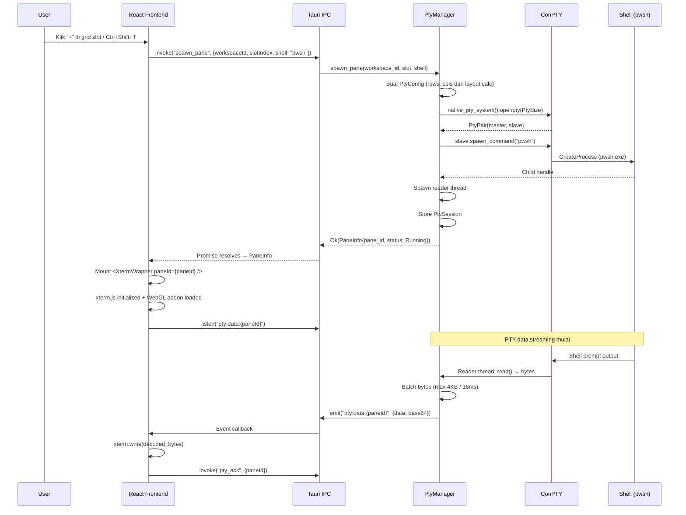
```mermaid
sequenceDiagram
    participant U as User
    participant FE as React Frontend
    participant IPC as Tauri IPC
    participant PM as PtyManager
    participant CP as ConPTY
    participant SH as Shell (pwsh)

    U->>FE: Klik "+" di grid slot / Ctrl+Shift+T
    FE->>IPC: invoke("spawn_pane", {workspaceId, slotIndex, shell: "pwsh"})
    IPC->>PM: spawn_pane(workspace_id, slot, shell)
    PM->>PM: Buat PtyConfig (rows, cols dari layout calc)
    PM->>CP: native_pty_system().openpty(PtySize)
    CP-->>PM: PtyPair{master, slave}
    PM->>CP: slave.spawn_command("pwsh")
    CP->>SH: CreateProcess (pwsh.exe)
    SH-->>PM: Child handle
    PM->>PM: Spawn reader thread
    PM->>PM: Store PtySession
    PM-->>IPC: Ok(PaneInfo{pane_id, status: Running})
    IPC-->>FE: Promise resolves → PaneInfo
    FE->>FE: Mount <XtermWrapper paneId={paneId} />
    FE->>FE: xterm.js initialized + WebGL addon loaded
    FE->>IPC: listen("pty:data:{paneId}")

    Note over PM,SH: PTY data streaming mulai
    SH->>CP: Shell prompt output
    CP->>PM: Reader thread: read() → bytes
    PM->>PM: Batch bytes (max 4KB / 16ms)
    PM->>IPC: emit("pty:data:{paneId}", {data: base64})
    IPC->>FE: Event callback
    FE->>FE: xterm.write(decoded_bytes)
    FE->>IPC: invoke("pty_ack", {paneId})
```

#### 5.3.2 Workspace Switch Flow

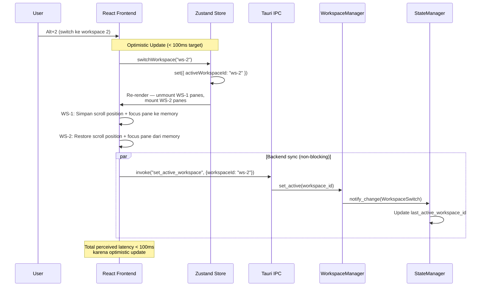
```mermaid
sequenceDiagram
    participant U as User
    participant FE as React Frontend
    participant ZS as Zustand Store
    participant IPC as Tauri IPC
    participant WM as WorkspaceManager
    participant SM as StateManager

    U->>FE: Alt+2 (switch ke workspace 2)

    Note over FE,ZS: Optimistic Update (< 100ms target)
    FE->>ZS: switchWorkspace("ws-2")
    ZS->>ZS: set({ activeWorkspaceId: "ws-2" })
    ZS->>FE: Re-render — unmount WS-1 panes,<br/>mount WS-2 panes

    FE->>FE: WS-1: Simpan scroll position + focus pane ke memory
    FE->>FE: WS-2: Restore scroll position + focus pane dari memory

    par Backend sync (non-blocking)
        FE->>IPC: invoke("set_active_workspace", {workspaceId: "ws-2"})
        IPC->>WM: set_active(workspace_id)
        WM->>SM: notify_change(WorkspaceSwitch)
        SM->>SM: Update last_active_workspace_id
    end

    Note over FE: Total perceived latency < 100ms<br/>karena optimistic update
```

#### 5.3.3 Autosave Cycle

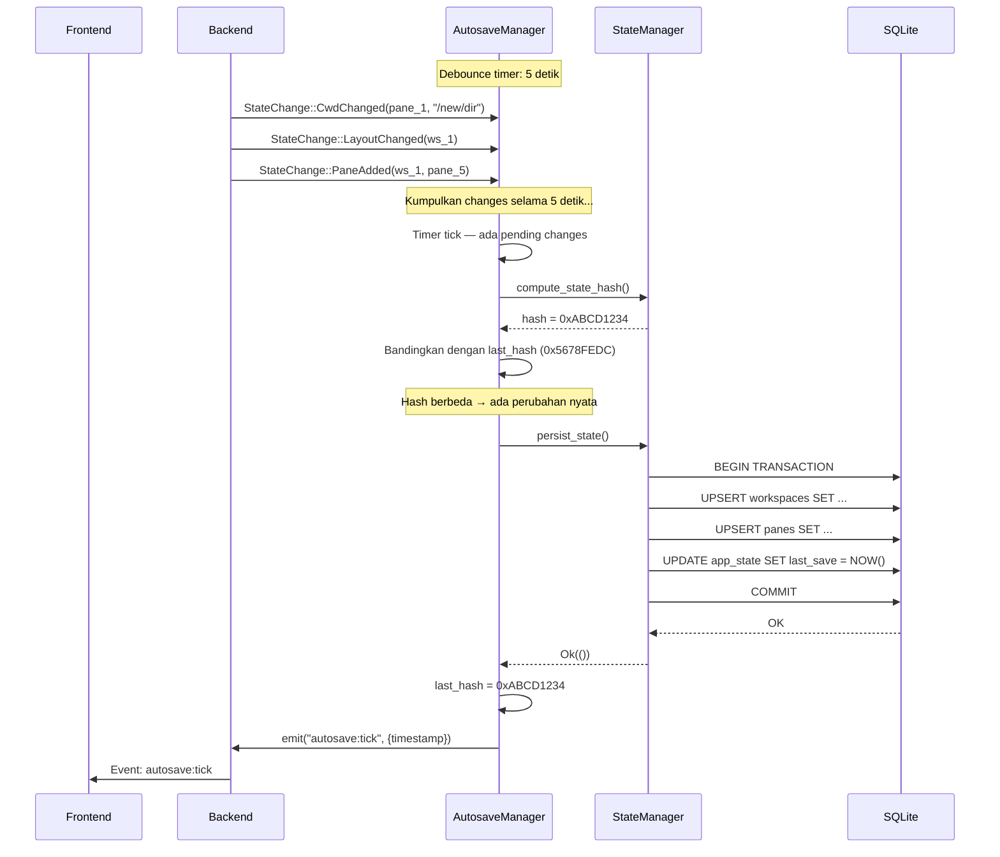
```mermaid
sequenceDiagram
    participant FE as Frontend
    participant BE as Backend
    participant AS as AutosaveManager
    participant SM as StateManager
    participant DB as SQLite

    Note over AS: Debounce timer: 5 detik

    BE->>AS: StateChange::CwdChanged(pane_1, "/new/dir")
    BE->>AS: StateChange::LayoutChanged(ws_1)
    BE->>AS: StateChange::PaneAdded(ws_1, pane_5)

    Note over AS: Kumpulkan changes selama 5 detik...

    AS->>AS: Timer tick — ada pending changes
    AS->>SM: compute_state_hash()
    SM-->>AS: hash = 0xABCD1234
    AS->>AS: Bandingkan dengan last_hash (0x5678FEDC)
    Note over AS: Hash berbeda → ada perubahan nyata
    AS->>SM: persist_state()
    SM->>DB: BEGIN TRANSACTION
    SM->>DB: UPSERT workspaces SET ...
    SM->>DB: UPSERT panes SET ...
    SM->>DB: UPDATE app_state SET last_save = NOW()
    SM->>DB: COMMIT
    DB-->>SM: OK
    SM-->>AS: Ok(())
    AS->>AS: last_hash = 0xABCD1234
    AS->>BE: emit("autosave:tick", {timestamp})
    BE->>FE: Event: autosave:tick
```

#### 5.3.4 Crash Recovery Flow

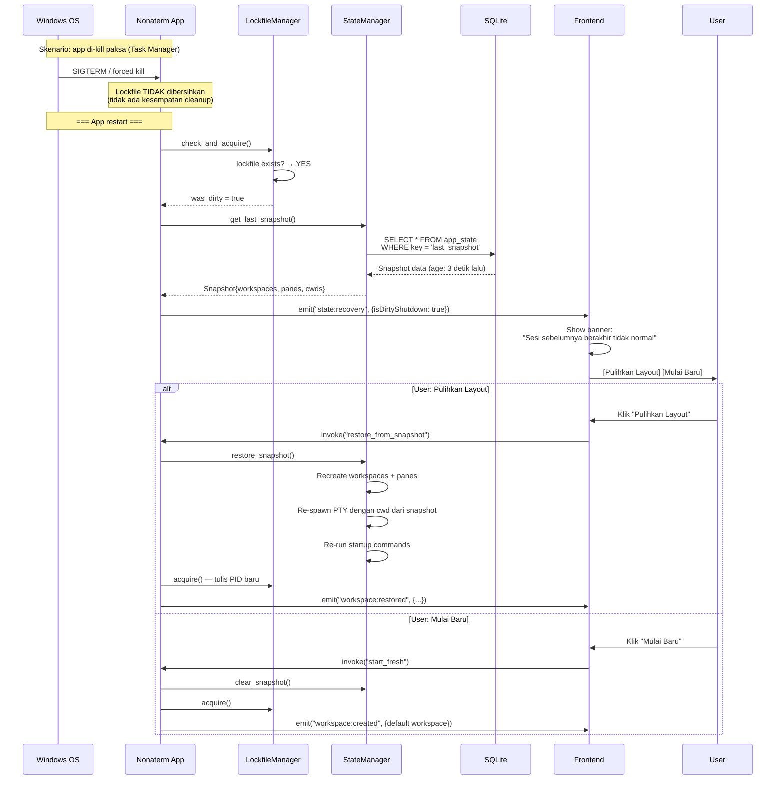
```mermaid
sequenceDiagram
    participant OS as Windows OS
    participant APP as Nonaterm App
    participant LF as LockfileManager
    participant SM as StateManager
    participant DB as SQLite
    participant FE as Frontend
    participant U as User

    Note over OS,APP: Skenario: app di-kill paksa (Task Manager)

    OS->>APP: SIGTERM / forced kill
    Note over APP: Lockfile TIDAK dibersihkan<br/>(tidak ada kesempatan cleanup)

    Note over OS,APP: === App restart ===

    APP->>LF: check_and_acquire()
    LF->>LF: lockfile exists? → YES
    LF-->>APP: was_dirty = true

    APP->>SM: get_last_snapshot()
    SM->>DB: SELECT * FROM app_state<br/>WHERE key = 'last_snapshot'
    DB-->>SM: Snapshot data (age: 3 detik lalu)
    SM-->>APP: Snapshot{workspaces, panes, cwds}

    APP->>FE: emit("state:recovery", {isDirtyShutdown: true})
    FE->>FE: Show banner:<br/>"Sesi sebelumnya berakhir tidak normal"

    FE->>U: [Pulihkan Layout] [Mulai Baru]

    alt User: Pulihkan Layout
        U->>FE: Klik "Pulihkan Layout"
        FE->>APP: invoke("restore_from_snapshot")
        APP->>SM: restore_snapshot()
        SM->>SM: Recreate workspaces + panes
        SM->>SM: Re-spawn PTY dengan cwd dari snapshot
        SM->>SM: Re-run startup commands
        APP->>LF: acquire() — tulis PID baru
        APP->>FE: emit("workspace:restored", {...})
    else User: Mulai Baru
        U->>FE: Klik "Mulai Baru"
        FE->>APP: invoke("start_fresh")
        APP->>SM: clear_snapshot()
        APP->>LF: acquire()
        APP->>FE: emit("workspace:created", {default workspace})
    end
```

---

## 6. Desain Database

### 6.1 SQLite Schema — Complete DDL

```sql
-- migrations/001_initial_schema.sql

-- === PRAGMA Settings ===
PRAGMA journal_mode = WAL;          -- Write-Ahead Logging untuk concurrent read/write
PRAGMA foreign_keys = ON;           -- Enforce FK constraints
PRAGMA busy_timeout = 5000;         -- 5 detik retry saat locked
PRAGMA synchronous = NORMAL;        -- Balance antara safety dan performa

-- === Core Tables ===

CREATE TABLE IF NOT EXISTS workspaces (
    id              TEXT PRIMARY KEY,
    name            TEXT NOT NULL DEFAULT 'Workspace',
    color           TEXT NOT NULL DEFAULT '#89b4fa',
    font_family     TEXT,
    font_size       REAL,
    default_shell   TEXT,
    worktree_path   TEXT,                       -- NULL jika tidak pakai worktree
    worktree_repo   TEXT,                       -- Path ke repo induk
    layout_preset   TEXT NOT NULL DEFAULT 'single',
    layout_custom   TEXT,                        -- JSON string untuk custom sizes
    sort_order      INTEGER NOT NULL DEFAULT 0,
    created_at      TEXT NOT NULL DEFAULT (datetime('now')),
    updated_at      TEXT NOT NULL DEFAULT (datetime('now'))
);

CREATE TABLE IF NOT EXISTS panes (
    id              TEXT PRIMARY KEY,
    workspace_id    TEXT NOT NULL REFERENCES workspaces(id) ON DELETE CASCADE,
    slot_index      INTEGER NOT NULL,           -- 0–8
    shell           TEXT,                        -- Override workspace default
    cwd             TEXT,                        -- Last known working directory
    startup_cmd     TEXT,
    last_exit_code  INTEGER,
    created_at      TEXT NOT NULL DEFAULT (datetime('now')),
    updated_at      TEXT NOT NULL DEFAULT (datetime('now')),

    UNIQUE(workspace_id, slot_index)
);

CREATE TABLE IF NOT EXISTS startup_commands (
    id              TEXT PRIMARY KEY,
    workspace_id    TEXT NOT NULL REFERENCES workspaces(id) ON DELETE CASCADE,
    slot_index      INTEGER NOT NULL,
    command         TEXT NOT NULL,
    delay_ms        INTEGER DEFAULT 0,
    sort_order      INTEGER NOT NULL DEFAULT 0,
    created_at      TEXT NOT NULL DEFAULT (datetime('now'))
);

CREATE TABLE IF NOT EXISTS app_state (
    key             TEXT PRIMARY KEY,
    value           TEXT NOT NULL,
    updated_at      TEXT NOT NULL DEFAULT (datetime('now'))
);
-- Rows: 'last_active_workspace_id', 'last_snapshot', 'window_positions', etc.

-- === Indexes ===
CREATE INDEX IF NOT EXISTS idx_panes_workspace
    ON panes(workspace_id);

CREATE INDEX IF NOT EXISTS idx_panes_workspace_slot
    ON panes(workspace_id, slot_index);

CREATE INDEX IF NOT EXISTS idx_startup_cmds_workspace
    ON startup_commands(workspace_id);

CREATE INDEX IF NOT EXISTS idx_workspaces_sort
    ON workspaces(sort_order);
```

```sql
-- migrations/002_add_templates.sql

CREATE TABLE IF NOT EXISTS templates (
    id              TEXT PRIMARY KEY,
    name            TEXT NOT NULL UNIQUE,
    description     TEXT,
    layout_preset   TEXT NOT NULL DEFAULT 'single',
    layout_custom   TEXT,
    default_color   TEXT,
    created_at      TEXT NOT NULL DEFAULT (datetime('now')),
    updated_at      TEXT NOT NULL DEFAULT (datetime('now'))
);

CREATE TABLE IF NOT EXISTS template_panes (
    id              TEXT PRIMARY KEY,
    template_id     TEXT NOT NULL REFERENCES templates(id) ON DELETE CASCADE,
    slot_index      INTEGER NOT NULL,
    shell           TEXT,
    startup_cmd     TEXT,
    cwd_template    TEXT,                    -- Template string: "{{PROJECT_DIR}}/frontend"
    created_at      TEXT NOT NULL DEFAULT (datetime('now')),

    UNIQUE(template_id, slot_index)
);

CREATE INDEX IF NOT EXISTS idx_template_panes_template
    ON template_panes(template_id);
```

```sql
-- migrations/003_add_keybinds.sql

CREATE TABLE IF NOT EXISTS keybindings (
    id              TEXT PRIMARY KEY,
    action          TEXT NOT NULL UNIQUE,     -- "switch_workspace_1", "spawn_pane", etc.
    key_combo       TEXT NOT NULL,            -- "Ctrl+Shift+T" format string
    is_default      INTEGER NOT NULL DEFAULT 1,
    created_at      TEXT NOT NULL DEFAULT (datetime('now')),
    updated_at      TEXT NOT NULL DEFAULT (datetime('now'))
);

CREATE TABLE IF NOT EXISTS passthrough_overrides (
    id              TEXT PRIMARY KEY,
    shell_profile   TEXT NOT NULL,           -- "wsl", "pwsh", etc.
    disabled_actions TEXT NOT NULL,           -- JSON array of action names
    created_at      TEXT NOT NULL DEFAULT (datetime('now'))
);
```

### 6.2 ER Diagram

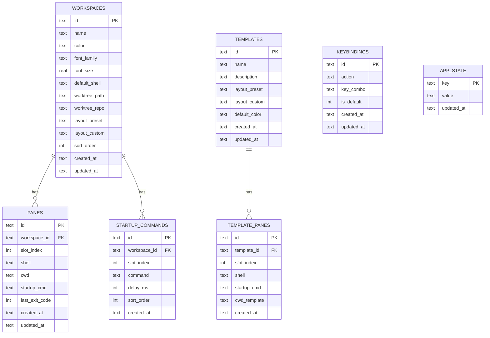
```mermaid
erDiagram
    WORKSPACES {
        text id PK
        text name
        text color
        text font_family
        real font_size
        text default_shell
        text worktree_path
        text worktree_repo
        text layout_preset
        text layout_custom
        int sort_order
        text created_at
        text updated_at
    }

    PANES {
        text id PK
        text workspace_id FK
        int slot_index
        text shell
        text cwd
        text startup_cmd
        int last_exit_code
        text created_at
        text updated_at
    }

    STARTUP_COMMANDS {
        text id PK
        text workspace_id FK
        int slot_index
        text command
        int delay_ms
        int sort_order
        text created_at
    }

    TEMPLATES {
        text id PK
        text name
        text description
        text layout_preset
        text layout_custom
        text default_color
        text created_at
        text updated_at
    }

    TEMPLATE_PANES {
        text id PK
        text template_id FK
        int slot_index
        text shell
        text startup_cmd
        text cwd_template
        text created_at
    }

    KEYBINDINGS {
        text id PK
        text action
        text key_combo
        int is_default
        text created_at
        text updated_at
    }

    APP_STATE {
        text key PK
        text value
        text updated_at
    }

    WORKSPACES ||--o{ PANES : "has"
    WORKSPACES ||--o{ STARTUP_COMMANDS : "has"
    TEMPLATES ||--o{ TEMPLATE_PANES : "has"
```

### 6.3 Index Strategy

| Index Name                        | Tabel     | Kolom                        | Justifikasi                                    |
|-----------------------------------|-----------|------------------------------|------------------------------------------------|
| `idx_panes_workspace`             | panes     | `workspace_id`               | JOIN saat load workspace + panes               |
| `idx_panes_workspace_slot`        | panes     | `workspace_id, slot_index`   | UNIQUE lookup saat spawn di slot tertentu      |
| `idx_startup_cmds_workspace`      | startup_commands | `workspace_id`          | Load commands saat workspace restore           |
| `idx_workspaces_sort`             | workspaces| `sort_order`                 | ORDER BY saat render sidebar                   |
| `idx_template_panes_template`     | template_panes | `template_id`            | JOIN saat apply template                       |
| PK indexes (auto)                 | semua     | `id`                         | Otomatis dari PRIMARY KEY                      |

### 6.4 Data Flow Diagram

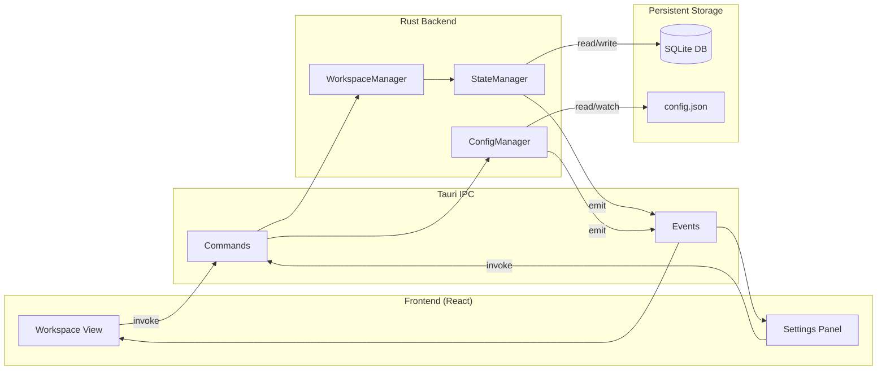
```mermaid
flowchart LR
    subgraph UI["Frontend (React)"]
        WS[Workspace View]
        SET[Settings Panel]
    end

    subgraph IPC["Tauri IPC"]
        CMD[Commands]
        EVT[Events]
    end

    subgraph Backend["Rust Backend"]
        WM[WorkspaceManager]
        SM[StateManager]
        CM[ConfigManager]
    end

    subgraph Storage["Persistent Storage"]
        DB[(SQLite DB)]
        CF[config.json]
    end

    WS -->|invoke| CMD
    CMD --> WM
    WM --> SM
    SM -->|read/write| DB
    CM -->|read/watch| CF
    SM -->|emit| EVT
    EVT --> WS
    SET -->|invoke| CMD
    CMD --> CM
    CM -->|emit| EVT
    EVT --> SET
```

---

## 7. Strategi Testing

### 7.1 Test Pyramid

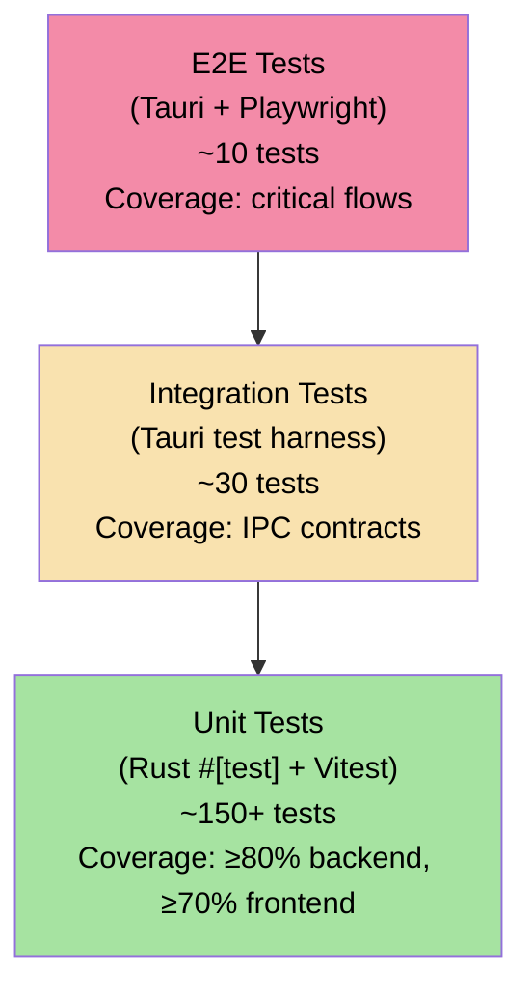
```mermaid
graph TB
    E2E["E2E Tests<br/>(Tauri + Playwright)<br/>~10 tests<br/>Coverage: critical flows"]
    INT["Integration Tests<br/>(Tauri test harness)<br/>~30 tests<br/>Coverage: IPC contracts"]
    UNIT["Unit Tests<br/>(Rust #[test] + Vitest)<br/>~150+ tests<br/>Coverage: ≥80% backend, ≥70% frontend"]

    E2E --> INT --> UNIT

    style UNIT fill:#a6e3a1,color:#000
    style INT fill:#f9e2af,color:#000
    style E2E fill:#f38ba8,color:#000
```

### 7.2 Unit Test Strategy

#### Rust (`#[test]` + `#[tokio::test]`)

| Module              | Test Focus                                    | Contoh Test Case                                          |
|---------------------|-----------------------------------------------|-----------------------------------------------------------|
| `pty::backpressure` | Flow control logic                            | `test_pauses_when_max_pending_reached`                   |
| `pty::reader`       | Batching logic                                | `test_flushes_at_max_batch_size`                         |
| `workspace::layout` | Grid calculation                              | `test_grid3x3_equal_distribution`                        |
| `workspace::template` | Variable substitution                       | `test_template_replaces_project_dir_placeholder`         |
| `state::autosave`   | Debounce + diff                               | `test_no_write_when_state_unchanged`                     |
| `state::lockfile`   | Crash detection                               | `test_detects_dirty_shutdown`                            |
| `config::validation`| Config bounds checking                        | `test_rejects_font_size_below_8`                         |
| `keybind::conflict` | Conflict detection                            | `test_detects_ctrl_p_conflict`                           |
| `keybind::priority` | Layer resolution                              | `test_passthrough_mode_skips_layer2`                     |
| `git::worktree`     | Worktree create/list/remove                   | `test_creates_worktree_with_new_branch`                  |

```rust
// Contoh: tests/workspace_tests.rs
#[test]
fn test_grid3x3_positions_cover_full_container() {
    let layout = GridLayout {
        preset: LayoutPreset::Grid3x3,
        custom_sizes: None,
    };

    let positions = calculate_grid_positions(
        &layout,
        900.0,  // container width
        600.0,  // container height
        2.0,    // gap
        9,      // pane count
    );

    assert_eq!(positions.len(), 9);

    // Verify no overlap
    for i in 0..positions.len() {
        for j in (i+1)..positions.len() {
            assert!(!rects_overlap(&positions[i], &positions[j]));
        }
    }

    // Verify coverage (with tolerance for gaps)
    let total_area: f32 = positions.iter()
        .map(|p| p.width * p.height)
        .sum();
    let expected_area = 900.0 * 600.0 - /* gap area */ 12.0 * 2.0;
    assert!((total_area - expected_area).abs() < 10.0);
}
```

#### Frontend (Vitest + React Testing Library)

| Component/Module         | Test Focus                              | Contoh Test Case                                      |
|--------------------------|----------------------------------------|-------------------------------------------------------|
| `WorkspaceList`          | Render, reorder, delete                | `renders all workspaces in order`                     |
| `TerminalGrid`           | Grid layout calculation                | `applies correct CSS grid for Grid2x3 preset`         |
| `XtermWrapper`           | Lifecycle, cleanup                     | `disposes terminal on unmount`                        |
| `ResizeHandle`           | Mouse drag mechanics                   | `emits delta on mousemove`                            |
| `CommandPalette`         | Fuzzy search, action dispatch          | `filters workspace items by name`                     |
| `useWorkspaceStore`      | Zustand state management               | `switchWorkspace updates activeWorkspaceId`           |
| `RenderBatcher`          | Batching logic                         | `merges multiple writes into single rAF flush`        |
| `theme.ts`               | CSS var → xterm theme conversion       | `buildXtermTheme extracts correct colors`             |

### 7.3 Integration Test Strategy

```rust
// Menggunakan tauri::test module
#[cfg(test)]
mod integration_tests {
    use tauri::test::{mock_builder, MockRuntime};

    #[test]
    fn test_workspace_crud_lifecycle() {
        let app = mock_builder()
            .invoke_handler(tauri::generate_handler![
                create_workspace, list_workspaces, delete_workspace
            ])
            .build(tauri::generate_context!())
            .unwrap();

        // Create
        let ws: Workspace = tauri::test::invoke(
            &app, "create_workspace",
            serde_json::json!({"name": "Test WS", "color": "#ff0000"}),
        ).unwrap();
        assert_eq!(ws.name, "Test WS");

        // List
        let all: Vec<Workspace> = tauri::test::invoke(
            &app, "list_workspaces", serde_json::json!({}),
        ).unwrap();
        assert_eq!(all.len(), 1);

        // Delete
        tauri::test::invoke::<()>(
            &app, "delete_workspace",
            serde_json::json!({"id": ws.id, "force": true}),
        ).unwrap();

        let all: Vec<Workspace> = tauri::test::invoke(
            &app, "list_workspaces", serde_json::json!({}),
        ).unwrap();
        assert_eq!(all.len(), 0);
    }
}
```

### 7.4 E2E Test Strategy (Playwright + Tauri Driver)

| Test Case                           | Steps                                                    | Expected Result                    |
|-------------------------------------|----------------------------------------------------------|------------------------------------|
| First launch creates default ws     | Launch app → check sidebar                               | 1 workspace visible, 1 terminal   |
| Spawn terminal in grid              | Click "+" in grid slot → wait for prompt                 | pwsh prompt visible dalam < 150ms  |
| Workspace switch preserves state    | Type in WS1 → switch to WS2 → switch back               | WS1 text masih ada                 |
| Crash recovery                      | Force kill app → relaunch → check banner                 | Recovery banner muncul             |
| Keybind passthrough                 | Spawn vim → type Ctrl+P → check vim reacts               | Vim scroll up (bukan app action)   |
| Config hot-reload                   | Edit config.json externally → check theme changes        | Theme berubah tanpa restart        |
| Git worktree binding                | Create workspace with worktree → check cwd               | All panes cwd = worktree path      |

### 7.5 Performance Benchmark Suite

| Benchmark                         | Tool                           | Target                 | Metode                                    |
|------------------------------------|--------------------------------|------------------------|--------------------------------------------|
| Cold start time                    | Custom Rust timer              | < 800ms                | Timestamp dari process start ke UI ready  |
| Workspace switch latency          | `performance.now()` di FE       | < 100ms                | Time from keydown ke render complete      |
| PTY spawn latency                 | Rust `Instant`                 | < 150ms                | Time from invoke ke prompt visible        |
| Render FPS under load             | Chrome DevTools FPS meter      | ≥ 60fps                | 9 terminals npm install simultaneously    |
| Memory usage (9 terminals idle)   | Windows Performance Monitor     | < 200MB (Nonaterm only)  | After 5 min idle, measure working set     |
| CPU usage (9 terminals idle)      | Windows Performance Monitor     | < 1%                   | After output stops, measure CPU over 60s  |

### 7.6 Coverage Targets

| Layer            | Target  | Tool              | Rationale                                       |
|------------------|---------|--------------------|------------------------------------------------|
| Rust backend     | ≥ 80%   | `cargo tarpaulin`  | Core logic harus well-tested                   |
| Frontend React   | ≥ 70%   | Vitest + c8        | UI component lebih sulit 100% (visual stuff)   |
| Integration      | ≥ 90%   | Custom tracking    | Semua IPC contract harus ter-cover             |
| E2E              | N/A     | N/A                | Coverage bukan metric — critical path coverage |

---

## 8. Strategi Deployment & Build

### 8.1 Build Pipeline

```mermaid
flowchart LR
    subgraph dev["Development"]
        DC[Dev: cargo + vite dev]
    end

    subgraph build["Build Pipeline"]
        VB[Vite Build<br/>frontend → dist/]
        CB[Cargo Build<br/>Rust backend → binary]
        TB[Tauri Build<br/>Bundle = binary + dist/ + resources]
    end

    subgraph output["Output Artifacts"]
        MSI[Nonaterm_x.y.z_x64.msi]
        NSIS[Nonaterm_x.y.z_x64-setup.exe]
        UPD[update.json<br/>+ .sig files]
    end

    DC --> VB --> TB
    DC --> CB --> TB
    TB --> MSI
    TB --> NSIS
    TB --> UPD
```

### 8.2 Build Commands

```bash
# Development (hot-reload)
cargo tauri dev

# Production build
cargo tauri build

# Output locations:
# src-tauri/target/release/Nonaterm.exe
# src-tauri/target/release/bundle/msi/Nonaterm_x.y.z_x64.msi
# src-tauri/target/release/bundle/nsis/Nonaterm_x.y.z_x64-setup.exe
```

### 8.3 CI/CD Configuration (GitHub Actions)

```yaml
# .github/workflows/build.yml
name: Build & Test

on:
  push:
    branches: [main, develop]
  pull_request:
    branches: [main]

jobs:
  test-rust:
    runs-on: windows-latest
    steps:
      - uses: actions/checkout@v4
      - uses: dtolnay/rust-toolchain@stable
      - name: Run Rust tests
        run: cargo test --manifest-path src-tauri/Cargo.toml
      - name: Run clippy
        run: cargo clippy --manifest-path src-tauri/Cargo.toml -- -D warnings

  test-frontend:
    runs-on: windows-latest
    steps:
      - uses: actions/checkout@v4
      - uses: actions/setup-node@v4
        with: { node-version: '22' }
      - run: npm ci
      - run: npm run lint
      - run: npm run test -- --coverage

  build:
    needs: [test-rust, test-frontend]
    runs-on: windows-latest
    steps:
      - uses: actions/checkout@v4
      - uses: dtolnay/rust-toolchain@stable
      - uses: actions/setup-node@v4
        with: { node-version: '22' }
      - run: npm ci
      - name: Build Tauri app
        uses: tauri-apps/tauri-action@v0
        env:
          GITHUB_TOKEN: ${{ secrets.GITHUB_TOKEN }}
          TAURI_SIGNING_PRIVATE_KEY: ${{ secrets.TAURI_SIGNING_PRIVATE_KEY }}
          TAURI_SIGNING_PRIVATE_KEY_PASSWORD: ${{ secrets.TAURI_SIGNING_PRIVATE_KEY_PASSWORD }}
        with:
          tagName: v__VERSION__
          releaseName: 'Nonaterm v__VERSION__'
          releaseBody: 'See the changelog for details.'
          releaseDraft: true
          prerelease: false

  perf-gate:
    needs: [build]
    runs-on: windows-latest
    steps:
      - name: Performance regression check
        run: |
          # Run benchmark suite
          # Compare against baseline
          # Fail if > 10% regression
          cargo bench --manifest-path src-tauri/Cargo.toml
```

### 8.4 Auto-Updater Setup

```json
// src-tauri/tauri.conf.json (excerpt)
{
  "bundle": {
    "createUpdaterArtifacts": "v1Compatible"
  },
  "plugins": {
    "updater": {
      "active": true,
      "pubkey": "dW50cnVzdGVkIGNvbW1lbnQ6...",
      "endpoints": [
        "https://releases.Nonaterm.dev/{{target}}/{{arch}}/{{current_version}}"
      ],
      "dialog": true
    }
  }
}
```

**Update flow:**
1. App start → cek endpoint untuk update baru
2. Jika ada versi baru → tampilkan dialog non-blocking
3. User approve → download di background, tampilkan progress
4. Download selesai → prompt restart
5. Signature verification otomatis (Tauri built-in)

### 8.5 Code Signing

| Aspek                  | Detail                                                |
|------------------------|-------------------------------------------------------|
| Sertifikat             | EV Code Signing Certificate (untuk SmartScreen)       |
| Signing tool           | `signtool.exe` (Windows SDK)                          |
| CI integration         | Azure Key Vault untuk private key storage             |
| Tauri integration      | `TAURI_SIGNING_PRIVATE_KEY` env var                   |
| Timestamp server       | `http://timestamp.digicert.com`                       |

### 8.6 Installer Configuration

```json
// src-tauri/tauri.conf.json — NSIS config
{
  "bundle": {
    "targets": ["msi", "nsis"],
    "windows": {
      "nsis": {
        "displayLanguageSelector": false,
        "installerIcon": "icons/icon.ico",
        "headerImage": "icons/nsis-header.bmp",
        "sidebarImage": "icons/nsis-sidebar.bmp",
        "languages": ["English"],
        "installMode": "currentUser"
      },
      "wix": {
        "language": ["en-US"]
      }
    }
  }
}
```

---

## 9. Monitoring & Observability

### 9.1 Logging Strategy — `tracing` Crate

#### 9.1.1 Log Architecture

```mermaid
flowchart LR
    subgraph app["Nonaterm Rust Backend"]
        MOD1["pty::manager"]
        MOD2["workspace::manager"]
        MOD3["state::autosave"]
        MOD4["config::manager"]
    end

    subgraph tracing["tracing Framework"]
        SUB["tracing-subscriber"]
        FMT["fmt Layer<br/>(console + file)"]
        FILT["EnvFilter<br/>(RUST_LOG)"]
    end

    subgraph output["Output Targets"]
        CON["Console (stderr)"]
        FILE["Log File<br/>%APPDATA%/Nonaterm/logs/<br/>Nonaterm-YYYY-MM-DD.log"]
    end

    MOD1 & MOD2 & MOD3 & MOD4 --> SUB
    SUB --> FILT --> FMT
    FMT --> CON
    FMT --> FILE
```

#### 9.1.2 Log Configuration

```rust
// src/main.rs
use tracing_subscriber::{fmt, prelude::*, EnvFilter};
use tracing_appender::rolling::{RollingFileAppender, Rotation};

fn setup_logging(log_dir: &Path) {
    let file_appender = RollingFileAppender::new(
        Rotation::DAILY,
        log_dir,
        "Nonaterm.log",
    );

    let (file_writer, _guard) = tracing_appender::non_blocking(file_appender);

    tracing_subscriber::registry()
        .with(
            fmt::layer()
                .with_target(true)
                .with_thread_ids(true)
                .with_file(true)
                .with_line_number(true)
        )
        .with(
            fmt::layer()
                .with_writer(file_writer)
                .json()                     // JSON format untuk log file
        )
        .with(
            EnvFilter::try_from_default_env()
                .unwrap_or_else(|_| {
                    // Default log levels
                    "Nonaterm=info,tauri=warn,hyper=warn".parse().unwrap()
                })
        )
        .init();
}
```

#### 9.1.3 Log Level Guidelines

| Level   | Kapan Digunakan                                              | Contoh                                       |
|---------|--------------------------------------------------------------|----------------------------------------------|
| `ERROR` | Operasi gagal yang mempengaruhi user                         | PTY spawn gagal, SQLite write error          |
| `WARN`  | Situasi tidak ideal tapi app masih berjalan                  | Config validation warning, WebGL fallback    |
| `INFO`  | Event penting yang user/developer perlu tahu                 | Workspace created, autosave completed        |
| `DEBUG` | Detail teknis untuk debugging                                | PTY resize dimensions, IPC payload sizes     |
| `TRACE` | Sangat detail, hanya untuk investigasi spesifik              | Every PTY read() call, render batch sizes    |

#### 9.1.4 Structured Logging Fields

```rust
// Contoh penggunaan #[instrument] untuk automatic span creation
use tracing::instrument;

#[instrument(skip(self), fields(workspace_id = %workspace_id))]
pub async fn create_workspace(
    &self,
    name: String,
    color: String,
    workspace_id: String,
) -> Result<Workspace, NonatermError> {
    tracing::info!(name = %name, color = %color, "Creating workspace");
    // ...
}

// PTY event logging
tracing::debug!(
    pane_id = %pane_id,
    bytes = data.len(),
    batch_age_ms = last_flush.elapsed().as_millis(),
    "PTY data batch sent"
);
```

### 9.2 Error Reporting

```rust
// src/error.rs
use thiserror::Error;

#[derive(Error, Debug)]
pub enum NonatermError {
    #[error("Workspace tidak ditemukan: {0}")]
    WorkspaceNotFound(String),

    #[error("Pane tidak ditemukan: {0}")]
    PaneNotFound(String),

    #[error("PTY spawn gagal: {0}")]
    PtySpawn(String),

    #[error("PTY resize gagal: {0}")]
    PtyResize(String),

    #[error("Database error: {0}")]
    Database(#[from] rusqlite::Error),

    #[error("Config error: {0}")]
    Config(String),

    #[error("Git error: {0}")]
    Git(#[from] GitError),

    #[error("Lockfile error: {0}")]
    Lockfile(String),

    #[error("IO error: {0}")]
    Io(#[from] std::io::Error),

    #[error("Serialization error: {0}")]
    Serialization(#[from] serde_json::Error),
}

// Implement Serialize untuk Tauri IPC error passing
impl serde::Serialize for NonatermError {
    fn serialize<S>(&self, serializer: S) -> Result<S::Ok, S::Error>
    where S: serde::Serializer {
        serializer.serialize_str(&self.to_string())
    }
}
```

### 9.3 Performance Profiling Tools

| Tool                          | Tujuan                                     | Kapan Digunakan                    |
|-------------------------------|--------------------------------------------|------------------------------------|
| `cargo flamegraph`            | CPU profiling Rust backend                 | Saat cold start lambat / CPU tinggi|
| Chrome DevTools Performance   | Frontend rendering performance             | Saat render drop frame             |
| Chrome DevTools Memory        | Heap snapshot, leak detection              | Saat memori terus naik             |
| Windows Performance Recorder  | System-wide profiling (GPU, handle, memory)| Saat app terasa lambat secara umum |
| `tokio-console`               | Tokio task profiling                       | Saat async tasks stuck/slow        |

### 9.4 Crash Dump Collection

```rust
// src/main.rs — setup panic handler
fn setup_panic_handler(log_dir: &Path) {
    let log_dir = log_dir.to_path_buf();

    std::panic::set_hook(Box::new(move |panic_info| {
        let backtrace = std::backtrace::Backtrace::force_capture();
        let crash_report = format!(
            "=== Nonaterm CRASH REPORT ===\n\
             Timestamp: {}\n\
             Version: {}\n\
             OS: {}\n\n\
             Panic: {}\n\n\
             Backtrace:\n{}",
            chrono::Utc::now(),
            env!("CARGO_PKG_VERSION"),
            std::env::consts::OS,
            panic_info,
            backtrace,
        );

        // Tulis ke file
        let crash_file = log_dir.join(format!(
            "crash-{}.log",
            chrono::Utc::now().format("%Y%m%d-%H%M%S")
        ));
        let _ = std::fs::write(&crash_file, &crash_report);

        // Log juga ke tracing (jika masih aktif)
        tracing::error!("{}", crash_report);
    }));
}
```

---

## 10. Risiko Teknis & Mitigasi

### 10.1 Risk Register

| # | Risiko                                | Severity | Likelihood | Impact    | Mitigasi                                                                                   |
|---|---------------------------------------|----------|------------|-----------|--------------------------------------------------------------------------------------------|
| 1 | ConPTY edge cases (WSL, Git Bash)     | High     | Medium     | High      | Extensive testing per shell type; graceful error handling; user-visible error messages      |
| 2 | xterm.js performance 9 pane under load| High     | High       | High      | Render batching; backpressure; lazy-render non-visible panes; WebGL context management     |
| 3 | Memory leak dari PTY sessions         | High     | Medium     | High      | RAII pattern di Rust; `Drop` impl untuk cleanup; periodic memory profiling di CI           |
| 4 | WebGL context loss / limit            | Medium   | Low        | Medium    | Fallback ke canvas renderer; monitor `onContextLoss`; limit concurrent WebGL contexts      |
| 5 | Multi-window state sync               | Medium   | Medium     | Medium    | Single source of truth (Rust backend); event-driven sync; avoid stale state di detached windows |
| 6 | WSL integration challenges            | Medium   | High       | Medium    | Detect WSL availability via registry; separate ConPTY config untuk WSL; test WSL 1 dan 2   |
| 7 | Autosave corruption saat crash        | High     | Low        | High      | SQLite WAL mode; ACID transactions; backup snapshot sebelum overwrite                      |
| 8 | Global hotkey conflict dengan app lain| Low      | Medium     | Low       | Tidak ada default global hotkey; user wajib set sendiri; validation terhadap registered hotkeys |
| 9 | WebView2 version mismatch            | Medium   | Low        | High      | Minimum WebView2 version check saat startup; user-friendly error message jika outdated     |
| 10| Large scrollback memory explosion     | Medium   | Medium     | Medium    | Default 1000 lines; warning di config saat > 10000; hard limit 100000                     |

### 10.2 Detail Mitigasi Risiko Kritis

#### Risiko #1: ConPTY Edge Cases

```rust
// Deteksi dan handling per shell type
pub fn detect_shell_capabilities(shell: &str) -> ShellCapabilities {
    match shell {
        "cmd" | "cmd.exe" => ShellCapabilities {
            supports_ansi: true,    // Sejak Windows 10 1511
            needs_winpty: false,
            cwd_detection: CwdDetection::Via_cd_command,
            known_issues: vec![
                "cmd.exe tidak support 256-color dalam ConPTY < Win10 1903",
            ],
        },
        "pwsh" | "powershell" => ShellCapabilities {
            supports_ansi: true,
            needs_winpty: false,
            cwd_detection: CwdDetection::Via_OSC7,  // PowerShell OSC 7 escape sequence
            known_issues: vec![],
        },
        "wsl" | "wsl.exe" => ShellCapabilities {
            supports_ansi: true,
            needs_winpty: false,
            cwd_detection: CwdDetection::Via_OSC7,
            known_issues: vec![
                "WSL 1 ConPTY bisa lag pada output tinggi",
                "Path translation Windows ↔ Linux perlu \\\\wsl$\\ prefix",
                "Signal handling berbeda dari native Linux PTY",
            ],
        },
        "git-bash" | "bash" => ShellCapabilities {
            supports_ansi: true,
            needs_winpty: false,
            cwd_detection: CwdDetection::Via_OSC7,
            known_issues: vec![
                "Git Bash MINGW path vs Windows path",
                "ConPTY + Git Bash bisa miss beberapa escape sequences",
            ],
        },
        _ => ShellCapabilities::default(),
    }
}
```

#### Risiko #2: xterm.js Performance 9 Pane

**Strategi multi-layer:**

1. **Layer 1 — Backend batching:** Batch PTY output max 4KB atau 16ms (lihat Section 3.2.4)
2. **Layer 2 — Frontend render batching:** `requestAnimationFrame` flush (lihat Section 4.3.3)
3. **Layer 3 — Lazy rendering:** Pane di workspace non-aktif tidak menerima data

```typescript
// Lazy rendering: pause data emission untuk workspace non-aktif
export function useWorkspaceVisibility(workspaceId: string) {
  const activeId = useWorkspaceStore(s => s.activeWorkspaceId);
  const isVisible = activeId === workspaceId;

  useEffect(() => {
    if (isVisible) {
      invoke('resume_workspace_pty', { workspaceId });
    } else {
      invoke('pause_workspace_pty', { workspaceId });
    }
  }, [isVisible, workspaceId]);

  return isVisible;
}
```

4. **Layer 4 — Backpressure:** FlowControl mechanism (lihat Section 3.2.5)

#### Risiko #3: Memory Leak dari PTY Sessions

```rust
// RAII cleanup via Drop trait
impl Drop for PtySession {
    fn drop(&mut self) {
        tracing::info!(pane_id = %self.pane_id, "Cleaning up PTY session");

        // 1. Signal reader thread untuk berhenti
        let _ = self.shutdown_tx.try_send(());

        // 2. Kill child process jika masih running
        if let Ok(mut child) = self.child.try_lock() {
            let _ = child.kill();
            let _ = child.wait(); // Reap zombie process
        }

        // 3. Master handle akan di-drop otomatis (Rust RAII)
        //    → ConPTY ClosePseudoConsole() dipanggil internal oleh portable-pty

        tracing::debug!(pane_id = %self.pane_id, "PTY session cleaned up");
    }
}
```

---

## 11. API Specification

### 11.1 Rust Tauri Command Signatures

```rust
// src/commands/pty_commands.rs

#[tauri::command]
pub async fn spawn_pane(
    state: tauri::State<'_, AppState>,
    workspace_id: String,
    slot_index: u8,
    shell: Option<String>,
    cwd: Option<String>,
) -> Result<PaneInfo, NonatermError>;

#[tauri::command]
pub async fn close_pane(
    state: tauri::State<'_, AppState>,
    pane_id: String,
) -> Result<(), NonatermError>;

#[tauri::command]
pub async fn restart_pane(
    state: tauri::State<'_, AppState>,
    pane_id: String,
) -> Result<PaneInfo, NonatermError>;

#[tauri::command]
pub async fn pty_write(
    state: tauri::State<'_, AppState>,
    pane_id: String,
    data: String,
) -> Result<(), NonatermError>;

#[tauri::command]
pub async fn pty_write_binary(
    state: tauri::State<'_, AppState>,
    pane_id: String,
    data: Vec<u8>,
) -> Result<(), NonatermError>;

#[tauri::command]
pub async fn pty_resize(
    state: tauri::State<'_, AppState>,
    pane_id: String,
    rows: u16,
    cols: u16,
) -> Result<(), NonatermError>;

#[tauri::command]
pub async fn pty_ack(
    state: tauri::State<'_, AppState>,
    pane_id: String,
) -> Result<(), NonatermError>;

// src/commands/workspace_commands.rs

#[tauri::command]
pub async fn list_workspaces(
    state: tauri::State<'_, AppState>,
) -> Result<Vec<Workspace>, NonatermError>;

#[tauri::command]
pub async fn create_workspace(
    state: tauri::State<'_, AppState>,
    name: String,
    color: Option<String>,
) -> Result<Workspace, NonatermError>;

#[tauri::command]
pub async fn create_workspace_from_template(
    state: tauri::State<'_, AppState>,
    template_id: String,
    name: String,
    vars: HashMap<String, String>,
) -> Result<Workspace, NonatermError>;

#[tauri::command]
pub async fn create_workspace_with_worktree(
    state: tauri::State<'_, AppState>,
    repo_path: String,
    branch_name: String,
    ws_name: String,
) -> Result<Workspace, NonatermError>;

#[tauri::command]
pub async fn update_workspace(
    state: tauri::State<'_, AppState>,
    id: String,
    updates: WorkspaceUpdate,
) -> Result<Workspace, NonatermError>;

#[tauri::command]
pub async fn delete_workspace(
    state: tauri::State<'_, AppState>,
    id: String,
    force: bool,
) -> Result<(), NonatermError>;

#[tauri::command]
pub async fn reorder_workspace(
    state: tauri::State<'_, AppState>,
    id: String,
    new_index: i32,
) -> Result<(), NonatermError>;

#[tauri::command]
pub async fn set_active_workspace(
    state: tauri::State<'_, AppState>,
    workspace_id: String,
) -> Result<(), NonatermError>;

#[tauri::command]
pub async fn get_active_workspace_id(
    state: tauri::State<'_, AppState>,
) -> Result<Option<String>, NonatermError>;

// src/commands/config_commands.rs

#[tauri::command]
pub async fn get_config(
    state: tauri::State<'_, AppState>,
) -> Result<AppConfig, NonatermError>;

#[tauri::command]
pub async fn update_config(
    state: tauri::State<'_, AppState>,
    path: String,
    value: serde_json::Value,
) -> Result<AppConfig, NonatermError>;

#[tauri::command]
pub async fn reset_config(
    state: tauri::State<'_, AppState>,
) -> Result<AppConfig, NonatermError>;

// src/commands/keybind_commands.rs

#[tauri::command]
pub async fn get_keybindings(
    state: tauri::State<'_, AppState>,
) -> Result<HashMap<String, KeyCombo>, NonatermError>;

#[tauri::command]
pub async fn set_keybinding(
    state: tauri::State<'_, AppState>,
    action: String,
    combo: KeyCombo,
) -> Result<Option<ConflictWarning>, NonatermError>;

#[tauri::command]
pub async fn toggle_passthrough(
    state: tauri::State<'_, AppState>,
    pane_id: String,
) -> Result<bool, NonatermError>;

// src/commands/git_commands.rs

#[tauri::command]
pub async fn git_is_repo(
    path: String,
) -> Result<bool, NonatermError>;

#[tauri::command]
pub async fn git_list_worktrees(
    repo_path: String,
) -> Result<Vec<WorktreeInfo>, NonatermError>;

#[tauri::command]
pub async fn git_list_branches(
    repo_path: String,
) -> Result<Vec<BranchInfo>, NonatermError>;

#[tauri::command]
pub async fn git_remove_worktree(
    repo_path: String,
    worktree_path: String,
    force: bool,
) -> Result<(), NonatermError>;

// Recovery commands

#[tauri::command]
pub async fn restore_from_snapshot(
    state: tauri::State<'_, AppState>,
) -> Result<Vec<Workspace>, NonatermError>;

#[tauri::command]
pub async fn start_fresh(
    state: tauri::State<'_, AppState>,
) -> Result<Workspace, NonatermError>;

// Workspace PTY control (for lazy rendering)

#[tauri::command]
pub async fn pause_workspace_pty(
    state: tauri::State<'_, AppState>,
    workspace_id: String,
) -> Result<(), NonatermError>;

#[tauri::command]
pub async fn resume_workspace_pty(
    state: tauri::State<'_, AppState>,
    workspace_id: String,
) -> Result<(), NonatermError>;
```

### 11.2 TypeScript Type Definitions

```typescript
// src/types/workspace.ts

export interface Workspace {
  id: string;
  name: string;
  color: string;
  fontFamily?: string;
  fontSize?: number;
  defaultShell?: string;
  worktreePath?: string;
  worktreeRepo?: string;
  layout: GridLayout;
  panes: PaneConfig[];
  startupCommands: StartupCommand[];
  sortOrder: number;
  createdAt: string;
  updatedAt: string;
}

export interface WorkspaceUpdate {
  name?: string;
  color?: string;
  fontFamily?: string;
  fontSize?: number;
  defaultShell?: string;
  layoutPreset?: LayoutPreset;
}

export interface PaneConfig {
  id: string;
  workspaceId: string;
  slotIndex: number;
  shell?: string;
  cwd?: string;
  startupCmd?: string;
  status: PaneStatus;
}

export interface PaneInfo {
  id: string;
  workspaceId: string;
  slotIndex: number;
  shell: string;
  cwd: string;
  status: PtyStatus;
}

export interface GridLayout {
  preset: LayoutPreset;
  customSizes?: PaneSize[];
}

export type LayoutPreset =
  | 'single'
  | 'split_h'
  | 'split_v'
  | 'grid2x2'
  | 'grid2x3'
  | 'grid3x3';

export interface PaneSize {
  slotIndex: number;
  widthPercent: number;
  heightPercent: number;
}

export interface PanePosition {
  slotIndex: number;
  x: number;
  y: number;
  width: number;
  height: number;
}

export type PtyStatus =
  | { type: 'Starting' }
  | { type: 'Running' }
  | { type: 'Exited'; exitCode: number }
  | { type: 'Killed' }
  | { type: 'Error'; message: string };

export type PaneStatus =
  | 'empty'
  | 'running'
  | 'idle'
  | { exited: number }
  | { error: string };

export interface StartupCommand {
  slotIndex: number;
  command: string;
  delayMs?: number;
}

// src/types/template.ts

export interface WorkspaceTemplate {
  id: string;
  name: string;
  description?: string;
  layout: GridLayout;
  paneTemplates: PaneTemplate[];
  defaultColor?: string;
  createdAt: string;
  updatedAt: string;
}

export interface PaneTemplate {
  slotIndex: number;
  shell?: string;
  startupCmd?: string;
  cwdTemplate?: string;
}

// src/types/config.ts

export interface AppConfig {
  general: GeneralConfig;
  appearance: AppearanceConfig;
  terminal: TerminalConfig;
  keybindings: KeybindingsConfig;
  advanced: AdvancedConfig;
}

export interface GeneralConfig {
  restoreSession: boolean;
  defaultShell: string;
  defaultCwd?: string;
  globalHotkey?: string;
  autosaveIntervalSecs: number;
}

export interface AppearanceConfig {
  theme: 'dark' | 'light' | 'custom';
  fontFamily: string;
  fontSize: number;
  cursorStyle: 'block' | 'underline' | 'bar';
  cursorBlink: boolean;
  opacity: number;
  acrylic: boolean;
  customCss?: string;
}

export interface TerminalConfig {
  scrollbackLines: number;
  bellBehavior: 'none' | 'sound' | 'visual' | 'both';
  copyOnSelect: boolean;
  confirmPasteMultiline: boolean;
  wordSeparators: string;
  rightClickPaste: boolean;
}

// src/types/keybind.ts

export interface KeyCombo {
  ctrl: boolean;
  alt: boolean;
  shift: boolean;
  meta: boolean;
  key: string;
}

export interface ConflictWarning {
  combo: string;
  conflictWith: string;
  description: string;
  severity: 'warning' | 'error';
}

export type KeybindingMap = Record<string, KeyCombo>;

// src/types/git.ts

export interface WorktreeInfo {
  path: string;
  branch: string;
  isNewBranch: boolean;
}

export interface BranchInfo {
  name: string;
  isCurrent: boolean;
  isRemote: boolean;
  lastCommit?: string;
}

// src/types/events.ts

export interface PtyDataEvent {
  data: string;        // base64 encoded
}

export interface PtyStatusEvent {
  status: PtyStatus;
}

export interface PtyExitEvent {
  exitCode: number;
}

export interface StateRecoveryEvent {
  isDirtyShutdown: boolean;
  snapshotAge: string;
}

export interface AutosaveTickEvent {
  timestamp: string;
}
```

### 11.3 Event Payload Schemas (JSON Schema)

```json
{
  "$schema": "http://json-schema.org/draft-07/schema#",
  "definitions": {
    "PtyDataEvent": {
      "type": "object",
      "required": ["data"],
      "properties": {
        "data": {
          "type": "string",
          "description": "Base64-encoded PTY output bytes"
        }
      }
    },
    "PtyStatusEvent": {
      "type": "object",
      "required": ["status"],
      "properties": {
        "status": {
          "oneOf": [
            { "type": "object", "properties": { "type": { "const": "Starting" } } },
            { "type": "object", "properties": { "type": { "const": "Running" } } },
            {
              "type": "object",
              "properties": {
                "type": { "const": "Exited" },
                "exitCode": { "type": "integer" }
              },
              "required": ["type", "exitCode"]
            },
            { "type": "object", "properties": { "type": { "const": "Killed" } } },
            {
              "type": "object",
              "properties": {
                "type": { "const": "Error" },
                "message": { "type": "string" }
              },
              "required": ["type", "message"]
            }
          ]
        }
      }
    },
    "StateRecoveryEvent": {
      "type": "object",
      "required": ["isDirtyShutdown", "snapshotAge"],
      "properties": {
        "isDirtyShutdown": { "type": "boolean" },
        "snapshotAge": {
          "type": "string",
          "description": "Human-readable age, e.g. '3 detik yang lalu'"
        }
      }
    }
  }
}
```

---

## Appendix A: Tauri Builder Registration

```rust
// src/lib.rs — Complete Tauri builder setup
use tauri::Manager;

mod commands;
mod pty;
mod workspace;
mod state;
mod config;
mod keybind;
mod git;
mod error;

pub struct AppState {
    pub pty_manager: Arc<RwLock<pty::PtyManager>>,
    pub workspace_manager: Arc<RwLock<workspace::WorkspaceManager>>,
    pub state_manager: Arc<state::StateManager>,
    pub config_manager: Arc<config::ConfigManager>,
    pub keybind_manager: Arc<RwLock<keybind::KeybindManager>>,
}

#[cfg_attr(mobile, tauri::mobile_entry_point)]
pub fn run() {
    let migrations = state::migration::get_migrations();

    tauri::Builder::default()
        .plugin(
            tauri_plugin_sql::Builder::default()
                .add_migrations("sqlite:Nonaterm.db", migrations)
                .build(),
        )
        .setup(|app| {
            let app_data_dir = app.path().app_data_dir()?;

            // Setup logging
            setup_logging(&app_data_dir.join("logs"));

            // Setup panic handler
            setup_panic_handler(&app_data_dir.join("logs"));

            // Check lockfile for crash recovery
            let lockfile_mgr = state::LockfileManager::new(&app_data_dir);
            let was_dirty = lockfile_mgr.check_and_acquire()?;

            // Initialize managers
            let config_mgr = config::ConfigManager::load_or_create(
                &app_data_dir.join("config.json")
            )?;

            let state_mgr = state::StateManager::new(&app_data_dir)?;
            let pty_mgr = pty::PtyManager::new(app.handle().clone());
            let ws_mgr = workspace::WorkspaceManager::new(state_mgr.clone());
            let kb_mgr = keybind::KeybindManager::new()?;

            // Store managed state
            app.manage(AppState {
                pty_manager: Arc::new(RwLock::new(pty_mgr)),
                workspace_manager: Arc::new(RwLock::new(ws_mgr)),
                state_manager: state_mgr.clone(),
                config_manager: Arc::new(config_mgr),
                keybind_manager: Arc::new(RwLock::new(kb_mgr)),
            });

            // Start autosave task
            let autosave = state::AutosaveManager::new(state_mgr.clone());
            tauri::async_runtime::spawn(autosave.run());

            // Emit recovery event if needed
            if was_dirty {
                app.emit("state:recovery", state::StateRecoveryEvent {
                    is_dirty_shutdown: true,
                    snapshot_age: state_mgr.get_snapshot_age()?,
                })?;
            }

            Ok(())
        })
        .invoke_handler(tauri::generate_handler![
            // PTY
            commands::pty_commands::spawn_pane,
            commands::pty_commands::close_pane,
            commands::pty_commands::restart_pane,
            commands::pty_commands::pty_write,
            commands::pty_commands::pty_write_binary,
            commands::pty_commands::pty_resize,
            commands::pty_commands::pty_ack,
            commands::pty_commands::pause_workspace_pty,
            commands::pty_commands::resume_workspace_pty,
            // Workspace
            commands::workspace_commands::list_workspaces,
            commands::workspace_commands::create_workspace,
            commands::workspace_commands::create_workspace_from_template,
            commands::workspace_commands::create_workspace_with_worktree,
            commands::workspace_commands::update_workspace,
            commands::workspace_commands::delete_workspace,
            commands::workspace_commands::reorder_workspace,
            commands::workspace_commands::set_active_workspace,
            commands::workspace_commands::get_active_workspace_id,
            // Config
            commands::config_commands::get_config,
            commands::config_commands::update_config,
            commands::config_commands::reset_config,
            // Keybinds
            commands::keybind_commands::get_keybindings,
            commands::keybind_commands::set_keybinding,
            commands::keybind_commands::toggle_passthrough,
            // Git
            commands::git_commands::git_is_repo,
            commands::git_commands::git_list_worktrees,
            commands::git_commands::git_list_branches,
            commands::git_commands::git_remove_worktree,
            // Recovery
            commands::workspace_commands::restore_from_snapshot,
            commands::workspace_commands::start_fresh,
        ])
        .on_window_event(|window, event| {
            if let tauri::WindowEvent::CloseRequested { .. } = event {
                // Graceful shutdown: release lockfile
                if let Some(state) = window.try_state::<AppState>() {
                    let _ = state.state_manager.persist_state_sync();
                }
                let app_data = window.app_handle().path().app_data_dir().unwrap();
                let _ = state::LockfileManager::new(&app_data).release();
            }
        })
        .run(tauri::generate_context!())
        .expect("error while running Nonaterm");
}
```

## Appendix B: Dependency List (`Cargo.toml`)

```toml
[package]
name = "Nonaterm"
version = "0.1.0"
edition = "2021"
description = "Terminal Workspace Manager untuk Vibecoder"

[dependencies]
# Tauri core
tauri = { version = "2", features = ["tray-icon"] }
tauri-plugin-sql = { version = "2", features = ["sqlite"] }
tauri-plugin-global-shortcut = "2"
tauri-plugin-shell = "2"

# Async runtime
tokio = { version = "1", features = ["full"] }

# PTY
portable-pty = "0.9"

# Serialization
serde = { version = "1", features = ["derive"] }
serde_json = "1"

# Database
rusqlite = { version = "0.32", features = ["bundled"] }

# Error handling
thiserror = "2"
anyhow = "1"

# Logging
tracing = "0.1"
tracing-subscriber = { version = "0.3", features = ["fmt", "env-filter", "json"] }
tracing-appender = "0.2"

# Utilities
uuid = { version = "1", features = ["v4", "serde"] }
chrono = { version = "0.4", features = ["serde"] }
notify = "7"                        # File system watcher
base64 = "0.22"
parking_lot = "0.12"               # Faster Mutex/RwLock

[build-dependencies]
tauri-build = "2"

[profile.release]
strip = true
lto = true
codegen-units = 1
opt-level = 3
panic = "abort"
```

## Appendix C: Frontend Dependencies (`package.json` excerpt)

```json
{
  "dependencies": {
    "@tauri-apps/api": "^2.0.0",
    "@tauri-apps/plugin-sql": "^2.0.0",
    "@tauri-apps/plugin-global-shortcut": "^2.0.0",
    "@xterm/xterm": "^5.5.0",
    "@xterm/addon-webgl": "^0.18.0",
    "@xterm/addon-fit": "^0.10.0",
    "@xterm/addon-search": "^0.15.0",
    "@xterm/addon-unicode11": "^0.8.0",
    "@xterm/addon-serialize": "^0.13.0",
    "react": "^19.0.0",
    "react-dom": "^19.0.0",
    "zustand": "^5.0.0"
  },
  "devDependencies": {
    "@tauri-apps/cli": "^2.0.0",
    "@types/react": "^19.0.0",
    "@types/react-dom": "^19.0.0",
    "typescript": "^5.6.0",
    "vite": "^6.0.0",
    "@vitejs/plugin-react": "^4.0.0",
    "vitest": "^2.0.0",
    "@testing-library/react": "^16.0.0",
    "eslint": "^9.0.0",
    "prettier": "^3.0.0"
  }
}
```

---

> [!NOTE]
> Dokumen ini adalah **living document**. Akan di-update seiring perkembangan implementasi, terutama setelah validasi user research untuk fitur-fitur di Section 11 PRD (Attention Inbox, Token Meter, dll) dan setelah performance benchmarking pada prototype pertama.
